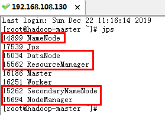
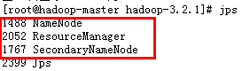
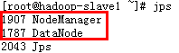

# CentOS下Hadoop3.2的伪分布式和集群安装

## 一.安装需求

[jdk-13.0.1_linux-x64_bin.tar.gz](https://download.oracle.com/otn-pub/java/jdk/13.0.1+9/cec27d702aa74d5a8630c65ae61e4305/jdk-13.0.1_linux-x64_bin.tar.gz)

[hadoop-3.2.1.tar.gz](https://www.apache.org/dyn/closer.cgi/hadoop/common/hadoop-3.2.1/hadoop-3.2.1.tar.gz)

## 二.环境准备

准备三台CentOS虚拟机，一台Master，两台Slave。

192.168.108.130 hadoop-master
192.168.108.131 hadoop-slave1
192.168.108.132 hadoop-slave2

**备注：如果是伪分布模式，我们只需要准备一台虚拟机就可以了，这里我们使用机器名为hadoop-master的虚拟机。**

#### 2.1 关闭防火墙

```sh
$ firewall-cmd --state
$ systemctl stop firewalld.service 
$ systemctl disable firewalld.service
```

#### 2.2 设置主机名

```sh
$ hostnamectl set-hostname hadoop-master
$ hostnamectl set-hostname hadoop-slave1
$ hostnamectl set-hostname hadoop-slave2
```

#### 2.3 修改三台虚拟机Host文件

```sh
$ vi /etc/hosts
```

192.168.108.130 hadoop-master
192.168.108.131 hadoop-slave1
192.168.108.132 hadoop-slave2

#### 2.4 免密码登录自身

```sh
$ ssh-keygen -t rsa -P '' -f ~/.ssh/id_rsa
$ cat ~/.ssh/id_rsa.pub >> ~/.ssh/authorized_keys
$ chmod 0600 ~/.ssh/authorized_keys
$ ssh localhost
```

#### 2.5 安装JDK，并配置环境变量

上传jdk-13.0.1_linux-x64_bin.tar.gz并解压到/usr/java/目录下，添加环境变量：

```sh
$ vi /etc/profile.d/jdk-13.0.1.sh
```

添加如下内容：

```sh
export JAVA_HOME=/usr/java/jdk-13.0.1
export CLASSPATH=.:${JAVA_HOME}/lib
export PATH=${JAVA_HOME}/bin:$PATH
```

执行如下命令，使环境变量生效：

```sh
$ source /etc/profile
```

## 三.Hadoop的伪分布式安装

#### 3.1 安装和配置Hadoop

上传hadoop-3.2.1.tar.gz并解压到/opt/hadoop/目录下，需要对/opt/hadoop/hadoop-3.2.1/etc/hadoop/下5个文件做配置：

1. 配置hadoop-env.sh，添加以下内容：

   ```sh
   export JAVA_HOME=/usr/java/jdk13.0.1
   export HDFS_NAMENODE_USER="root"
   export HDFS_DATANODE_USER="root"
   export HDFS_SECONDARYNAMENODE_USER="root"
   export YARN_RESOURCEMANAGER_USER="root"
   export YARN_NODEMANAGER_USER="root"
   ```

2. 配置core-site.xml，配置为：

   ```xml
   <configuration>
     <property>
         <name>fs.defaultFS</name>
         <value>hdfs://hadoop-master:9000</value>
     </property> 
   </configuration>
   ```

3. 配置hdfs-site.xml

   ```xml
   <configuration>
     <property>
       <name>dfs.permissions</name>
       <value>false</value>
     </property>
     <property>
       <name>dfs.replication</name>
       <value>1</value>
     </property>         	
   </configuration>
   ```

4. 配置yarn-site.xml

   ```xml
   <configuration>
     <property>
       <name>yarn.resourcemanager.hostname</name>
       <value>hadoop-master</value>
     </property>  
     <property>
       <name>yarn.nodemanager.aux-services</name>
       <value>mapreduce_shuffle</value>
     </property>
   </configuration>
   ```

5. 配置mapred-site.xml

   ```xml
   <configuration>
     <property>
       <name>mapreduce.framework.name</name>
       <value>yarn</value>
     </property>
   </configuration>
   ```

#### 3.2 配置Hadoop环境变量

```sh
$ vi /etc/profile.d/hadoop-3.2.1.sh
```

添加如下内容：

```sh
export HADOOP_HOME="/usr/hadoop/hadoop-3.2.1"
export PATH="$HADOOP_HOME/bin:$HADOOP_HOME/sbin:$PATH"
export HADOOP_CONF_DIR=$HADOOP_HOME/etc/hadoop
```

运行如下命令使环境变量生效：

```sh
$ source /etc/profile
```

#### 3.3 格式化HDFS和启动Hadoop

格式化HDFS，只有首次部署才可使用

```sh
$ hdfs namenode -format 
```

启动Hadoop，在Hadoop安装目录执行以下命令：

```sh
$ sbin/start-all.sh
```

#### 3.4 验证和测试

执行jps命令查看NameNode, DataNode, ResourceManager, SecondaryNameNode, NodeManager是否启动



在浏览器中访问ResourceManager: http://hadoop-master:8088/和NameNode：http://hadoop-master:9870/，看看是否能成功访问。

## 四.Hadoop的分布式安装

### 4.1 master免密码登录slave

```sh
$ ssh-copy-id -i ~/.ssh/id_rsa.pub hadoop-slave1
$ ssh-copy-id -i ~/.ssh/id_rsa.pub hadoop-slave2
```

注: 只需在master上执行

### 4.2 安装和配置Hadoop

请参照《3.1 安装和配置Hadoop》，其中 yarn-site.xml中的dfs.replication配置为2.

修改/opt/hadoop/hadoop-3.2.1/etc/hadoop/的works文件，内容如下：

```
hadoop-slave1
hadoop-slave2
```

注：三台机器都要配置，可以先配置Master，然后把6个配置文件Copy到Slave主机。

### 4.3 配置Hadoop环境变量

请参照《3.2 配置Hadoop环境变量》，三台机器都需要配置。

### 4.4. 格式化HDFS

```sh
$ hdfs namenode -format
```

 注：只有首次部署才可使用，只在Master上操作

### 4.5 启动Hadoop

在Master的Hadoop安装目录下执行以下命令：

```sh
$ sbin/start-all.sh
```

### 4.6 验证和测试

在Master执行jps命令，看看是否启动了NameNode, ResourceManager, SecondaryNameNode



在Slave执行jps命令，看看是否启动了DataNode, NodeManager



在浏览器中访问ResourceManager: http://hadoop-master:8088/和NameNode：http://hadoop-master:9870/，看看是否能成功访问。

## 五. 相关Issue解决

### 5.1 is running 503888384B beyond the 'VIRTUAL' memory limit

mapreduce.map.memory.mb 和 mapreduce.reduce.memory.mb默认值是1024，最小是1024，不接受小于1024的值，如果小于1024则使用默认值，必须是1024的整数倍。

遇到此问题，请在mapred-site.xml添加如下配置：

```xml
  <property>
      <name>mapreduce.map.memory.mb</name>
      <value>4096</value>
  </property>
  <property>
      <name>mapreduce.reduce.memory.mb</name>
      <value>8192</value>
  </property>
  <property>
      <name>mapreduce.map.java.opts</name>
      <value>-Xmx3072m</value>
  </property>
  <property>
      <name>mapreduce.reduce.java.opts</name>
      <value>-Xmx6144m</value>
  </property>
```

### 5.2 HDFS在安全模式无法启动

请允许以下命令停止安全模式：

```sh
$ hdfs dfsadmin -safemode leave
```

