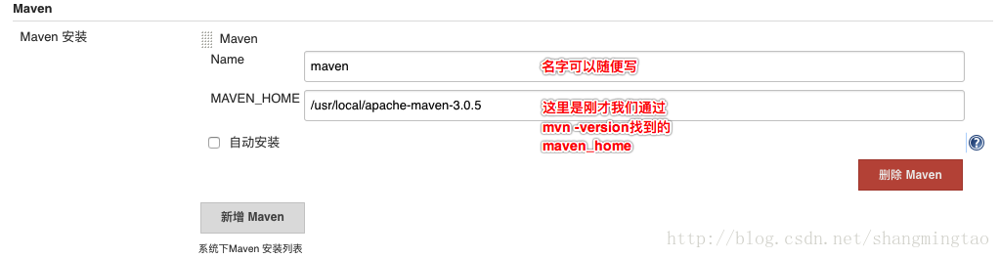

# DevOps介绍和Jenkins环境搭建

## 一. DevOps介绍


**持续开发:**

这是DevOps生命周期中软件不断开发的阶段。与瀑布模型不同的是，软件可交付成果被分解为短开发周期的多个任务节点，在很短的时间内开发并交付。

这个阶段包括编码和构建阶段，并使用Git和SVN等工具来维护不同版本的代码，以及Ant、Maven、Gradle等工具来构建/打包代码到可执行文件中，这些文件可以转发给自动化测试系统进行测试。

**持续测试：**

在这个阶段，开发的软件将被持续地测试bug。对于持续测试，使用自动化测试工具，如Selenium、TestNG、JUnit等。这些工具允许质量管理系统完全并行地测试多个代码库，以确保功能中没有缺陷。在这个阶段，使用Docker容器实时模拟“测试环境”也是首选。一旦代码测试通过，它就会不断地与现有代码集成。

**持续集成:**

这是支持新功能的代码与现有代码集成的阶段。由于软件在不断地开发，更新后的代码需要不断地集成，并顺利地与系统集成，以反映对最终用户的需求更改。更改后的代码，还应该确保运行时环境中没有错误，允许我们测试更改并检查它如何与其他更改发生反应。

Jenkins是一个非常流行的用于持续集成的工具。使用Jenkins，可以从git存储库提取最新的代码修订，并生成一个构建，最终可以部署到测试或生产服务器。可以将其设置为在git存储库中发生更改时自动触发新构建，也可以在单击按钮时手动触发。

**持续部署：**

它是将代码部署到生产环境的阶段。 在这里，我们确保在所有服务器上正确部署代码。 如果添加了任何功能或引入了新功能，那么应该准备好迎接更多的网站流量。 因此，系统运维人员还有责任扩展服务器以容纳更多用户。

由于新代码是连续部署的，因此配置管理工具可以快速，频繁地执行任务。 Puppet，Chef，SaltStack和Ansible是这个阶段使用的一些流行工具。

容器化工具在部署阶段也发挥着重要作用。 Docker和Vagrant是流行的工具，有助于在开发，测试，登台和生产环境中实现一致性。 除此之外，它们还有助于轻松扩展和缩小实例。

**持续监控：**

这是DevOps生命周期中非常关键的阶段，旨在通过监控软件的性能来提高软件的质量。这种做法涉及运营团队的参与，他们将监视用户活动中的错误/系统的任何不正当行为。这也可以通过使用专用监控工具来实现，该工具将持续监控应用程序性能并突出问题。

使用的一些流行工具是Splunk，ELK Stack，Nagios，NewRelic和Sensu。这些工具可帮助密切监视应用程序和服务器，以主动检查系统的运行状况。它们还可以提高生产率并提高系统的可靠性，从而降低IT支持成本。发现的任何重大问题都可以向开发团队报告，以便可以在持续开发阶段进行修复。

这些DevOps阶段连续循环进行，直到达到所需的产品质量。下面的图表将显示可以在DevOps生命周期的哪个阶段使用哪些工具。


## 二. GitHub+Maven+Jenkins持续集成

1. 安装Jdk, Maven, Git, Tomcat, Jenkins
2. 配置Jenkins的Global Tool Configuration


  

3. 安装Maven Integration Plugin这个插件

4. 添加Credential, 要配置github的ssh登录秘钥 


5. 创建Job

   

6. 配置SSH实现自动部署

   配置ssh要安装一个插件：Publish Over SSH ，然后在【系统管理】->【系统设置】配置ssh的服务器和密码及目录


start.sh 如下

```sh
NAME=dubbodemo-user-service-1.0-SNAPSHOT.jar
echo $NAME
ID=`ps -ef | grep "$NAME" | grep -v "grep" | awk '{print $2}'`
echo $ID
echo "---------------"
for id in $ID
do
kill -9 $id
echo "killed $id"
done
echo "---------------"

#这里建议配置下环境变量，以免执行java命令不成功
export JAVA_HOME=/usr/local/jdk1.8.0_144
export CLASSPATH=$JAVA_HOME/lib/
export PATH=$PATH:$JAVA_HOME/bin

java -jar /usr/local/milo/csdndemo/dubbodemo-user-service-1.0-SNAPSHOT.jar > /usr/local/milo/csdndemo/my.log 2>&1 &

echo excute success from start.sh
```

