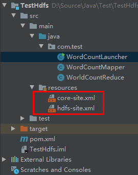

# Java操作HDFS的文件和文件夹实例

## 一.准备工作

1. 参照《[CentOS下Hadoop3.2的伪分布式和集群安装](https://onirri.github.io/CentOS下Hadoop3.2的伪分布式和集群安装.html)》安装好Hadoop
2. 安装Maven

## 二.测试代码

### 2.1 在Maven项目中添加依赖

```xml
        <dependency>
            <groupId>org.apache.hadoop</groupId>
            <artifactId>hadoop-client</artifactId>
            <version>3.2.1</version>
        </dependency>
        <dependency>
            <groupId>junit</groupId>
            <artifactId>junit</artifactId>
            <version>RELEASE</version>
            <scope>test</scope>
        </dependency>
```

### 2.2 添加Hadoop的配置文件

​    把Hadoop集群中Master的core-site.xml和hdfs-site.xml文件复制到Maven项目的resources目录下。



### 2.3 测试代码

```java
import org.apache.hadoop.conf.Configuration;
import org.apache.hadoop.fs.FSDataOutputStream;
import org.apache.hadoop.fs.FileStatus;
import org.apache.hadoop.fs.FileSystem;
import org.apache.hadoop.fs.Path;
import org.apache.hadoop.io.IOUtils;
import org.junit.After;
import org.junit.Before;
import org.junit.Test;

import java.io.InputStream;

public class TestHdfs {
    Configuration conf;
    FileSystem fs;

    @Before
    public void setUp() throws Exception {
        conf = new Configuration();
    }

    @After
    public void tearDown() throws Exception {
    }

    @Test
    public void getFileList() throws Exception {
        fs = FileSystem.get(conf);
        Path path = new Path("/input");
        if (fs.exists(path) && fs.isDirectory(path)) {
            FileStatus[] fileStatuses = fs.listStatus(path);
            for (FileStatus fileStatus : fileStatuses) {
                System.out.println(fileStatus.getPath().toString());
            }
        }
    }

    @Test
    public void downloadFile() throws Exception {
        fs = FileSystem.get(conf);
        fs.copyToLocalFile(false, new Path("/input/test.txt"), new Path("d:/download/"), true);
        fs.close();
    }

    @Test
    public void createFile() throws Exception{
        Path destPath = new Path("/input/test2.txt");
        fs = destPath.getFileSystem(conf);
        FSDataOutputStream fsDataOutputStream = fs.create(destPath);
        fsDataOutputStream.writeChars("test2test2");
        fsDataOutputStream.close();
        System.out.println("create file test2.txt success");
    }

    @Test
    public void deleteFile() throws Exception {
        Path path = new Path("/input/test2.txt");
        fs = path.getFileSystem(conf);
        boolean isOk = fs.deleteOnExit(path);
        if(isOk){
            System.out.println("delete file test2.txt success.");
        }else{
            System.out.println("delete file test2.txt failed.");
        }
    }

    @Test
    public void mkdir() throws Exception{
        Path path = new Path("/input/java/");
        fs = path.getFileSystem(conf);
        boolean isOk = fs.mkdirs(path);
        if(isOk){
            System.out.println("mkdir /input/java success.");
        }else{
            System.out.println("mkdir /input/java failed.");
        }
    }

    @Test
    public void readFile() throws Exception {
        Path srcPath = new Path("/input/test.txt");
        fs = srcPath.getFileSystem(conf);
        InputStream in = null;
        try{
            in = fs.open(srcPath);
            IOUtils.copyBytes(in, System.out, 4096, false);
        }finally {
            IOUtils.closeStream(in);
        }
    }

    @Test
    public void uploadFile() throws Exception {
        fs = FileSystem.get(conf);
        fs.copyFromLocalFile(new Path("d:/download/test.txt"), new Path("/input/test3.txt"));
        fs.close();
        System.out.println("upload file success.");
    }

}
```

## 三.Issue分析

### 3.1 java.io.FileNotFoundException: HADOOP_HOME and hadoop.home.dir are unset.

错误原因分析：在Windows中的IDEA运行测试代码发现这个异常是因为Windows中没有设置HADOOP_HOME环境变量。

解决方法：从Hadoop官方网站下载Hadoop编译好的二进制包，解压到Windows的某个目录。然后设置环境变量HADOOP_HOME为Hadoop的解压目录，把%HADOOP_HOME%/bin路径添加到Path环境变量中。

如果下载的Hadoop包的bin目录中没有hadoop.dll和winutils.exe文件，请从如下地址（https://github.com/cdarlint/winutils）下载相应的版本的文件放到%HADOOP_HOME%/bin目录中。

配置完后需要重启IDEA。

