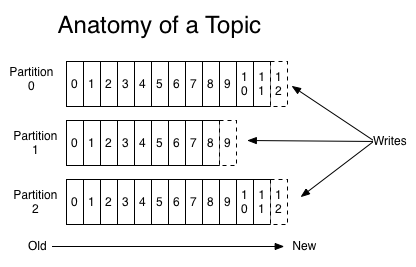

# Kafka简介、安装和SpringBoot整合使用

# 一. Kafka简介

## 1.Kafka Topic&Partition

消息发送时都被发送到一个topic，其本质就是一个目录，而topic由是由一些Partition Logs(分区日志)组成,其组织结构如下图所示：

​                                                     

​    我们可以看到，每个Partition中的消息都是有序的，生产的消息被不断追加到Partition log上，其中的每一个消息都被赋予了一个唯一的offset值。

​    Kafka集群会保存所有的消息，不管消息有没有被消费；我们可以设定消息的过期时间，只有过期的数据才会被自动清除以释放磁盘空间。比如我们设置消息过期时间为2天，那么这2天内的所有消息都会被保存到集群中，数据只有超过了两天才会被清除。

​     Kafka需要维持的元数据只有一个–消费消息在Partition中的offset值，Consumer每消费一个消息，offset就会加1。其实消息的状态完全是由Consumer控制的，Consumer可以跟踪和重设这个offset值，这样的话Consumer就可以读取任意位置的消息。

​    把消息日志以Partition的形式存放有多重考虑，第一，方便在集群中扩展，每个Partition可以通过调整以适应它所在的机器，而一个topic又可以有多个Partition组成，因此整个集群就可以适应任意大小的数据了；第二就是可以提高并发，因为可以以Partition为单位读写了。

## 2.Replications、Partitions 和Leaders组件

​    通过上面介绍的我们可以知道，kafka中的数据是持久化的并且能够容错的。Kafka允许用户为每个topic设置副本数量，副本数量决定了有几个broker来存放写入的数据。如果你的副本数量设置为3，那么一份数据就会被存放在3台不同的机器上，那么就允许有2个机器失败。一般推荐副本数量至少为2，这样就可以保证增减、重启机器时不会影响到数据消费。如果对数据持久化有更高的要求，可以把副本数量设置为3或者更多。

​    Kafka中的topic是以partition的形式存放的，每一个topic都可以设置它的partition数量，Partition的数量决定了组成topic的log的数量。Producer在生产数据时，会按照一定规则（这个规则是可以自定义的）把消息发布到topic的各个partition中。上面将的副本都是以partition为单位的，不过只有一个partition的副本会被选举成leader作为读写用。

​    关于如何设置partition值需要考虑的因素。一个partition只能被一个消费者消费（一个消费者可以同时消费多个partition），因此，如果设置的partition的数量小于consumer的数量，就会有消费者消费不到数据。所以，推荐partition的数量一定要大于同时运行的consumer的数量。另外一方面，建议partition的数量大于集群broker的数量，这样leader partition就可以均匀的分布在各个broker中，最终使得集群负载均衡。在Cloudera,每个topic都有上百个partition。需要注意的是，kafka需要为每个partition分配一些内存来缓存消息数据，如果partition数量越大，就要为kafka分配更大的heap space。

# 二. Kafka下载与安装使用

​    在Kafka项目下载页面（http://kafka.apache.org/downloads）下载Binary版本，直接解压即可，也可以使用Docker安装。

## Windows下的使用
启动zookeeper（启动前需要修改zookeeper.properties中dataDir设置）
zookeeper-server-start.bat ../../config/zookeeper.properties

启动kafka Server（启动前需要修改server.properties中log.dirs设置）
kafka-server-start.bat ../../config/server.properties

**伪集群方式**
server.properties
       broker.id=0
       listeners=PLAINTEXT://:9092
       log.dirs=/tmp/kafka-logs-0

server_1.properties
       broker.id=1
       listeners=PLAINTEXT://:9093
       log.dirs=/tmp/kafka-logs-1


server_2.properties
       broker.id=2
       listeners=PLAINTEXT://:9094
       log.dirs=/tmp/kafka-logs-2

kafka-server-start.bat ../../config/server.properties
kafka-server-start.bat ../../config/server1.properties
kafka-server-start.bat ../../config/server2.properties

**集群方式**
zookeeper.properties
    maxClientCnxns=100
    tickTime=2000
    initLimit=5
    syncLimit=2
    server.1=192.168.220.128:2888:3888
    server.2=192.168.220.129:2888:3888
    server.3=192.168.220.130:2888:3888
分别启动三台机器的zookeeper-server,修改server.properties的broker.id，然后启动kafka-server

**创建一个nginxlog的topic**
kafka-topics.bat --create --topic nginxlog --partitions 1 --replication-factor 1 --zookeeper localhost:2181

**查看topic**
kafka-topics.bat --describe --topic nginxlog --zookeeper localhost:2181 

**启动消息生产者，将消息发送到kafka的topic上**
kafka-console-producer.bat --broker-list localhost:9092 --topic nginxlog

**启动消息消费者**
kafka-console-consumer.bat --bootstrap-server localhost:9092 --topic nginxlog --from-beginning

**Linux下的使用**
把相应命令的.bat改成.sh运行即可

# 三.SpringBoot整合Kafka

**准备工作**

1. 提前启动zk，kafka，并且创建一个Topic

2. SpringBoot项目中添加Maven依赖

```xml
<dependency>
	<groupId>org.springframework.kafka</groupId>
	<artifactId>spring-kafka</artifactId>
</dependency>
```

**具体实现**

    为了更加体现实际开发需求，一般生产者都是在调用某些接口的服务处理完逻辑之后然后往kafka里面扔数据，然后有一个消费者不停的监控这个Topic，然后处理数据，所以这里把生产者作为一个接口，消费者放到kafka这个目录下，注意@Component注解，不然扫描不到@KafkaListener

SpringBoot配置文件(application.yml)

```yaml
spring:
  kafka:
    bootstrap-servers: 192.168.0.102:9092
    producer:
      key-serializer: org.apache.kafka.common.serialization.StringSerializer
      value-serializer: org.apache.kafka.common.serialization.StringSerializer
    consumer:
      group-id: test
      enable-auto-commit: true
      auto-commit-interval: 1000
      key-deserializer: org.apache.kafka.common.serialization.StringDeserializer
      value-deserializer: org.apache.kafka.common.serialization.StringDeserializer
```

**生成者**

```java
package com.sxsoft.testkafka.controller;

import org.springframework.beans.factory.annotation.Autowired;
import org.springframework.kafka.core.KafkaTemplate;
import org.springframework.web.bind.annotation.RequestMapping;
import org.springframework.web.bind.annotation.RestController;

/**

 * 测试kafka生产者
   */
   @RestController
   @RequestMapping("kafka")
   public class TestKafkaProducerController {

   @Autowired
   private KafkaTemplate<String, String> kafkaTemplate;

   @RequestMapping("send")
   public String send(String msg){
       kafkaTemplate.send("nginxlog", msg);
       return "success";
   }

}
```

**消费者**

```java
package com.sxsoft.testkafka;

import org.apache.kafka.clients.consumer.ConsumerRecord;
import org.springframework.kafka.annotation.KafkaListener;
import org.springframework.stereotype.Component;

@Component
public class TestConsumer {

    @KafkaListener(topics = "nginxlog")
    public void listen (ConsumerRecord<?, ?> record) throws Exception {
        System.out.printf("topic = %s, offset = %d, value = %s \n", record.topic(), record.offset(), record.value());
    }

}
```


**测试**

运行项目，执行：http://localhost:8080/kafka/send?msg=hello

控制台输出：

topic = nginxlog, offset = 19, value = hello
