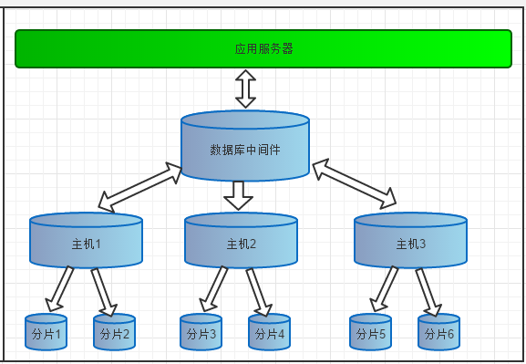
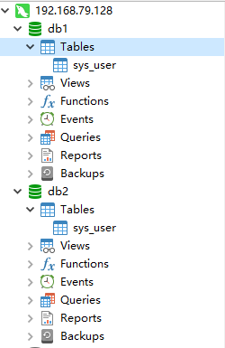
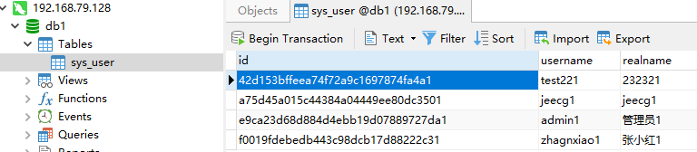
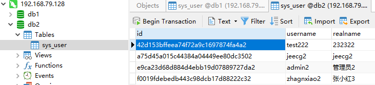
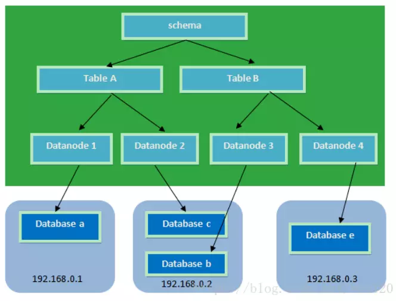
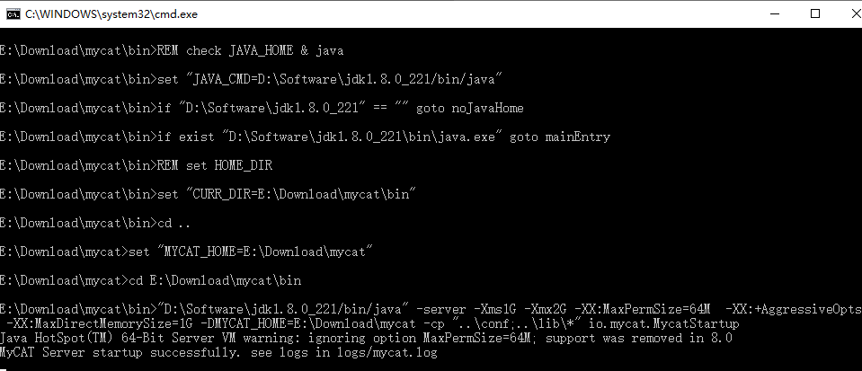
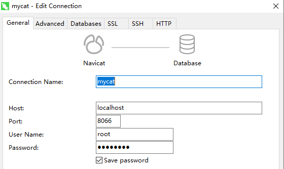
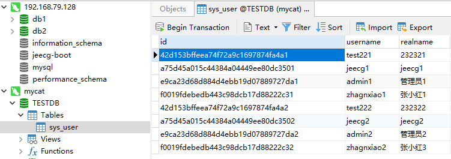

# Mycat数据库中间件介绍和安装使用

## 一. Mycat数据库中间件的介绍

  什么是Mycat，Mycat的官方介绍是：

- 一个彻底开源的，面向企业应用开发的大数据库集群
- 支持事务、ACID、可以替代MySQL的加强版数据库
- 一个可以视为MySQL集群的企业级数据库，用来替代昂贵的Oracle集群
- 一个融合内存缓存技术、NoSQL技术、HDFS大数据的新型SQL Server
- 结合传统数据库和新型分布式数据仓库的新一代企业级数据库产品
- 一个新颖的数据库中间件产品

​    其实Mycat就是一个分库分表的数据库中间件，它的核心功能是把一个大表通过水平切分成若干小表，然后分别把若干小表存储到后端的物理数据库中。Mycat后端支持的数据库有MySQL，Oracle，SQL Server，DB2，PostgreSQL等主流数据库，还支持MongoDB等NoSQL存储。
​    无论后端采用什么数据存储方式，对于开发人员和数据库维护人员来讲，Mycat都是一个传统的数据库表，支持标准的SQL语句对数据库进行操作，这样屏蔽了后端数据存储的复杂性。

​     下面我们来看看MyCat的系统部署图，数据表被水平切分成6个分片，分别存储在3台主机上，对应用服务器上的应用来说，应用只看到的是一张表。不会关心不同主机数据的聚合，数据源的切换和事务的处理。



## 二. Mycat的安装和配置

​     请到Mycat的官方网站http://www.mycat.io/下载server的release版本，我测试使用的Mycat Server 1.6.7.3的Windows版本，具体下载地址为：http://dl.mycat.io/1.6.7.3/20190927161129/Mycat-server-1.6.7.3-release-20190927161129-win.tar.gz。

​    下载后直接解压，然后运行解压目录下的 bin/startup_nowrap.bat即可。

​     在运行Mycat之前我们先要做一些准备工作和配置。

### **1. 后台数据库的准备**

​    这里后台数据库我使用MySQL，当然后台数据库还可以使用Oracle，SQL Server，DB2。我在一台主机上添加了db1和db2两个数据库，每个数据库下都有一张sys_user。

​    

​    db1数据库表的数据如下：

​    

​    db2数据库表的数据如下：



### **2. Mycat的配置**

#### 2.1 Mycat的系统结构和组件介绍



1. schema：逻辑库，与MySQL中的Database（数据库）对应，一个逻辑库中定义了所包括的Table。 

2. table：逻辑表，即物理数据库中存储的某一张表，与传统数据库不同，这里的表格需要声明其所存储的逻辑数据节点DataNode。在此可以指定表的分片规则。 

3. dataNode：分片节点，是存放table的具体物理节点，通过dataHost和database来关联到后端某个具体数据库上 。

4. dataHost：主机节点，定义某个物理库的所在主机，用于捆绑到Datanode上。这里可以配置最大和最小连接数，负载均衡，数据库类型和数据库驱动等。

#### 2.2 Mycat的几个主要配置文件

1. server.xml 是 Mycat 服务器参数调整和用户授权的配置文件。

2. schema.xml 是逻辑库定义和表以及分片定义的配置文件。

3. rule.xml 是分片规则的配置文件。

#### 2.3 Mycat的配置

1.    在server.xml配置配置数据库用户，这里我们配置一个root用户和密码，可以访问TESTDB逻辑库。


   ```xml
   <user name="root" defaultAccount="true">
   	<property name="password">123456</property>
   	<property name="schemas">TESTDB</property>
   </user>
   ```
2. 在schema.xml中配置逻辑库，逻辑表，分片节点和主机节点。

```xml
<?xml version="1.0"?>
<!DOCTYPE mycat:schema SYSTEM "schema.dtd">
<mycat:schema xmlns:mycat="http://io.mycat/">

<schema name="TESTDB" checkSQLschema="true" sqlMaxLimit="100">
	<table name="sys_user" dataNode="dn1,dn2" rule="rule1" />
</schema>
    
<dataNode name="dn1" dataHost="localhost1" database="db1" />
<dataNode name="dn2" dataHost="localhost1" database="db2" />

<dataHost name="localhost1" maxCon="1000" minCon="10" balance="0"
		  writeType="0" dbType="mysql" dbDriver="native" switchType="1"  slaveThreshold="100">
	<heartbeat>select user()</heartbeat>
	<!-- can have multi write hosts -->
	<writeHost host="hostM1" url="192.168.79.128:3306" user="root" password="123456">
        <!-- can have multi read hosts -->
        <!-- <readHost host="hostS1" url="localhost:3306" user="root" password="123456"
/> -->
	</writeHost>
 </dataHost>
</mycat:schema>
```

​    首先在schema节点配置了一个TESTDB逻辑库，在逻辑库下配置了一张逻辑表sys_user，这张逻辑表有两个分片节点dn1和dn2，其中表的分片规则配置为rule1。

​    其次在datNode分别配置了dn1和dn2两个分片节点，分别连接到localhost1主机节点的db1和db2的数据库。

​    最后在dataHost节点配置localhost1主机节点。这两个标签都指定后端数据库的相关配置给 mycat，用于实例化后端连接池。唯一不同的是，writeHost 指定写实例、readHost 指定读实例。

**balance 属性：**

1. balance="0", 不开启读写分离机制，所有读操作都发送到当前可用的 writeHost 上。
2. balance="1"，全部的 readHost 与 stand by writeHost 参与 select 语句的负载均衡，简单的说，当双
主双从模式(M1->S1，M2->S2，并且 M1 与 M2 互为主备)，正常情况下，M2,S1,S2 都参与 select 语句的负载均衡。
3. balance="2"，所有读操作都随机的在 writeHost、readhost 上分发。
4. balance="3"，所有读请求随机的分发到 wiriterHost 对应的 readhost 执行，writerHost 不负担读压力。

**writeType 属性：**

1. writeType="0", 所有写操作发送到配置的第一个 writeHost，第一个挂了切到还生存的第二个 writeHost，
    重新启动后已切换后的为准，切换记录在配置文件中:dnindex.properties .

2. writeType="1"，所有写操作都随机的发送到配置的 writeHost，1.5 以后废弃不推荐。 

  **switchType 属性**

1. 默认值，自动切换

2. 基于 MySQL 主从同步的状态决定是否切换
   心跳语句为 show slave status

3. 基于 MySQL galary cluster 的切换机制（适合集群）
   心跳语句为 show status like ‘wsrep%

   
   
3. rule.xml中配置分片规则

      配置一个rule1为tableRule，分片的列为id，分片算法定义func1。
   
      由于sys_user的id的为32为字符串，所以func1的分片算法类为PartitionByString。
   
   ```xml
   <tableRule name="rule1">
   	<rule>
   		<columns>id</columns>
   		<algorithm>func1</algorithm>
   	</rule>
   </tableRule>
   <function name="func1" class="io.mycat.route.function.PartitionByString">
   	<property name="partitionCount">2</property>
   	<property name="partitionLength">512</property>
   </function>
   ```

## 三. 运行和测试

配置完后，点击bin/startup_nowrap.bat运行Mycat Server。运行如下：



使用Navicat测试，首先配置一个连接，端口号是8066，用户名和密码就是在server.xml中配置的用户名和密码。



连接TESTDB逻辑库，查询sys_user逻辑表，从这里可以看到逻辑表中包含了2个分片的数据。

