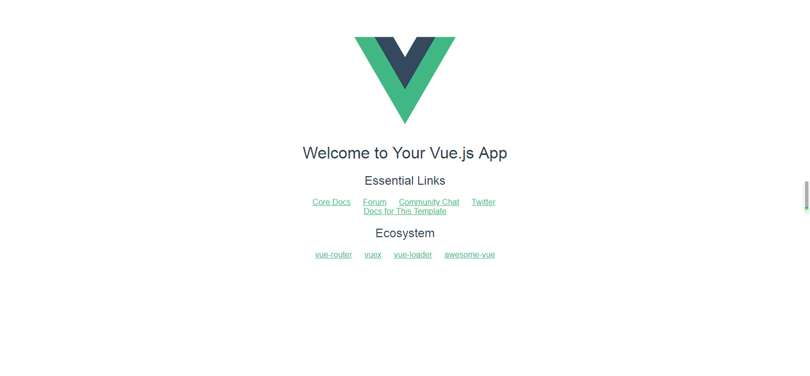

# Node.js的安装和使用NPM安装Vue.js

## 一.Node.js的安装配置

### 1.1 Node.js的下载和安装

在Node.js官网的首页（https://nodejs.org/en/）下载安装Windows 64位的安装包，下载完后双击安装文件，安装步骤中的选项都默认选择，一路点击下一步进行安装。

### 1.2 NPM国内镜像的配置

1、临时使用

```bash
npm --registry https://registry.npm.taobao.org install express
```

2、持久使用

```bash
npm config set registry https://registry.npm.taobao.org
// 配置后可通过下面方式来验证是否成功
npm config get registry
```

### 1.3 NPM配置全局路径及cache路径设置

（1）首先设置npm全局模块的存放路径以及cache的路径，例如希望将全局存放路径和cache路径分别放在nodejs主目录下，在nodejs路径下创建node_global 和 node_cache两个文件夹；

（2）cmd 命令，分别输入如下命令

```bash
npm config set prefix "D:\Software\nodejs\node_global"

npm config set cache "D:\Software\nodejs\node_cache"
```

建议将全局存放路径就设置为Node.js的安装路径，这样安装了第三方包（比如vue-cli）后，要运行第三方包的命令文件，不用添加系统的PATH路径。

```bash
npm config set prefix "D:\Software\nodejs"
```

（3）设置成功后，通过npm安装一个模块试一下目录结构是否安装有效，如下：

```bash
npm install express -g  
```

安装成功后，可以看到node_golbal文件中有相应的路径，则npm安装路径设置成功；

## 二. NPM安装Vue.js

```bash
# 全局安装 vue-cli
$ npm install --global vue-cli
# 创建一个基于 webpack 模板的新项目
$ vue init webpack my-project
# 这里需要进行一些配置，默认回车即可

? Project name testvue
? Project description A Vue.js project
? Author onirri <974873608@qq.com>
? Vue build standalone
? Install vue-router? Yes
? Use ESLint to lint your code? Yes
? Pick an ESLint preset Standard
? Set up unit tests No
? Setup e2e tests with Nightwatch? No
? Should we run `npm install` for you after the project has been created? (recommended) npm

   vue-cli · Generated "testvue".
```

进入项目，安装并运行：

```bash
$ cd testvue
$ npm install
$ npm run dev
  DONE  Compiled successfully in 5187ms                                                                                                                     
  Your application is running here: http://localhost:8080
```

