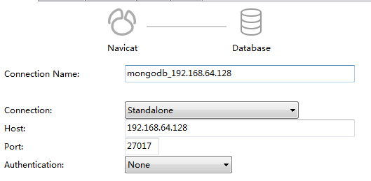

### CentOS安装MongoDB

#### 下载MongoDB

https://fastdl.mongodb.org/linux/mongodb-linux-x86_64-4.0.11.tgz 下载然后解压

#### 添加配置文件

在MongoDB的bin目录添加mongodb.conf

```properties
port=27017 #端口
dbpath=/root/mongodb/db #数据库存文件存放目录
logpath=/root/mongodb/log/mongodb.log #日志文件存放路径
logappend=true #使用追加的方式写日志
fork=true #以守护进程的方式运行，创建服务器进程
maxConns=100 #最大同时连接数
noauth=true #不启用验证
journal=true #每次写入会记录一条操作日志（通过journal可以重新构造出写入的数据）。
#即使宕机，启动时wiredtiger会先将数据恢复到最近一次的checkpoint点，然后重放后续的journal日志来恢复。
storageEngine=wiredTiger  #存储引擎有mmapv1、wiretiger、mongorocks
bind_ip=0.0.0.0  #这样就可外部访问了，例如从win10中去连虚拟机中的MongoDB
```

#### 启动

启动前先要创建dbpath和logpath

```shell
$ mongod -f mongodb.conf
```

#### 远程访问

需要先关闭防火墙或者开发27017端口，CentOS 7以后防火墙服务是firewalld，7以前是iptables.

```shell
systemctl status firewalld #查看防火墙状态
systemctl stop firewalld.service #关闭防火墙
systemctl disable firewalld.service #Disabe防火墙服务
firewall-cmd --zone=public --permanent --add-port=27017/tcp #开放5672端口
firewall-cmd --reload #重载入添加的端口
```

**客户端可以使用Navicat**



**SpringBoot集成MongoDB**

添加Maven依赖

```xml
    <dependency>
       <groupId>org.springframework.boot</groupId>
       <artifactId>spring-boot-starter-data-mongodb</artifactId>
    </dependency>
```
Service中注入MongoTemplate，使用MongoTemplate的find, insert, remove, update

```java
	@Autowired
	MongoTemplate mongoTemplate;

	public Drug getDrugById_Mongo(String id) {
		Query query = Query.query(Criteria.where("id").is(id));
		List<Drug> drugs = this.mongoTemplate.find(query, Drug.class);
		if(drugs.size() > 0) {
			return drugs.get(0);
		}else {
			return null;
		}
	}
	
	public Drug saveDrug_Mongo(Drug drug) {
		return this.mongoTemplate.insert(drug);
	}
	
	public boolean deleteDrug_Mongo(String id) {
		Query query = Query.query(Criteria.where("id").is(id));
		DeleteResult result = this.mongoTemplate.remove(query, Drug.class);
		return result.wasAcknowledged();
	}
	
	public boolean updateDrug_Mongo(Drug drug) {
		Query query = Query.query(Criteria.where("id").is(drug.getId()));
		Update update = new Update();
		update.set("pzwh", drug.getPzwh());
		update.set("cpmc", drug.getCpmc());
		UpdateResult result = this.mongoTemplate.updateFirst(query, update, Drug.class);
		return result.wasAcknowledged();
	}

```