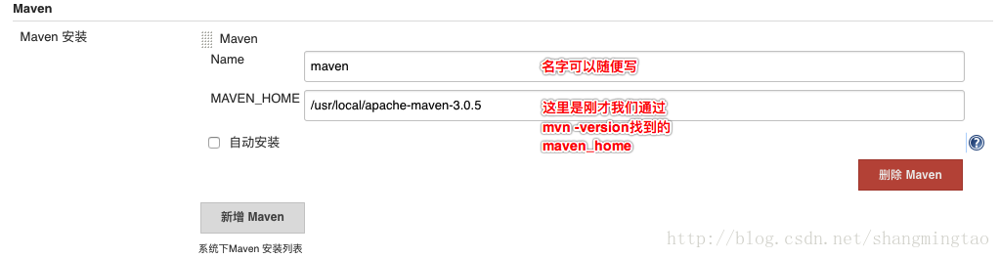
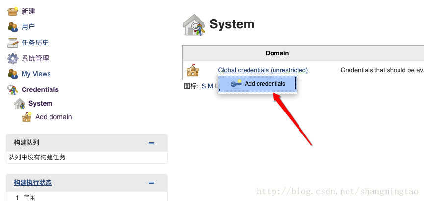
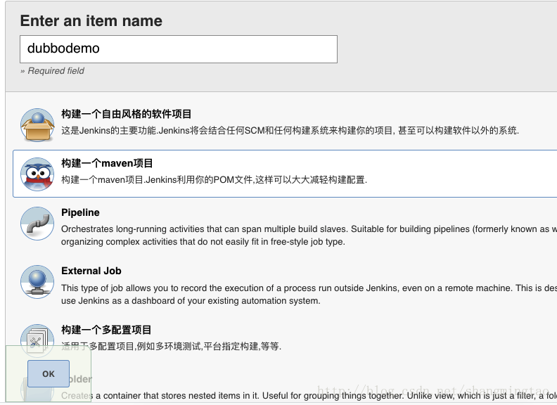
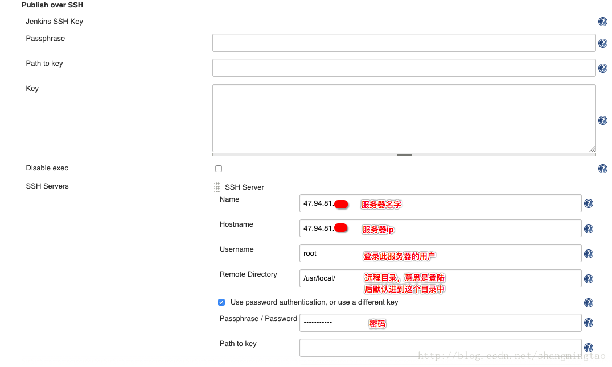
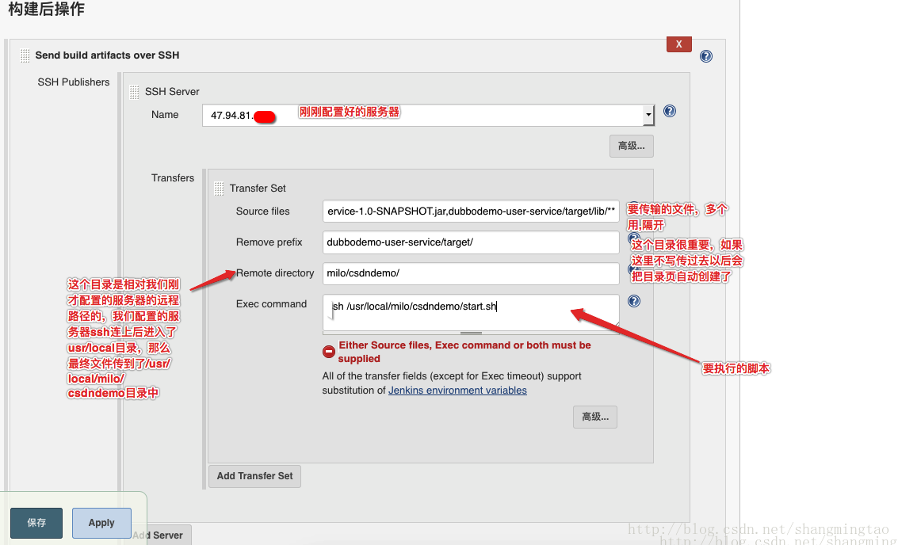

### GitHub+Maven+Jenkins持续集成

1. 安装Jdk, Maven, Git, Tomcat, Jenkins
2. 配置Jenkins的Global Tool Configuration


  

3. 安装Maven Integration Plugin这个插件

4. 添加Credential, 要配置github的ssh登录秘钥 



5. 创建Job

   

6. 配置SSH实现自动部署

   配置ssh要安装一个插件：Publish Over SSH ，然后在【系统管理】->【系统设置】配置ssh的服务器和密码及目录





start.sh 如下

```sh
NAME=dubbodemo-user-service-1.0-SNAPSHOT.jar
echo $NAME
ID=`ps -ef | grep "$NAME" | grep -v "grep" | awk '{print $2}'`
echo $ID
echo "---------------"
for id in $ID
do
kill -9 $id
echo "killed $id"
done
echo "---------------"

#这里建议配置下环境变量，以免执行java命令不成功
export JAVA_HOME=/usr/local/jdk1.8.0_144
export CLASSPATH=$JAVA_HOME/lib/
export PATH=$PATH:$JAVA_HOME/bin

java -jar /usr/local/milo/csdndemo/dubbodemo-user-service-1.0-SNAPSHOT.jar > /usr/local/milo/csdndemo/my.log 2>&1 &

echo excute success from start.sh
```

