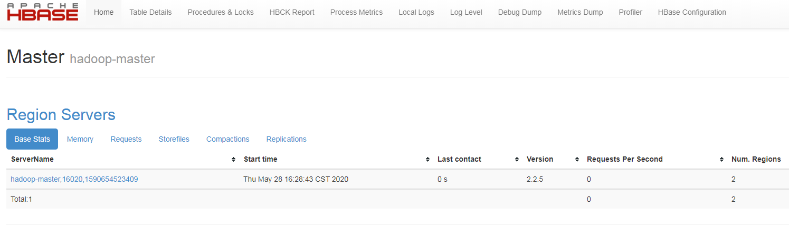

# CentOS下HBase的安装

## 1.前提条件

前提条件是：已经安装好hadoop

hadoop和hbase版本有对应关系，请根据hadoop版本下载响应的hbase版本。具体对应关系查看官方文档：http://hbase.apache.org/book.html#java，本文档使用hbase-2.2.5，下载地址：https://hbase.apache.org/downloads.html

## 2.安装步骤

2.1.首先解压

```shell
tar -zxvf hbase-2.2.5-bin.tar.gz
```

2.2.配置Hbase环境变量

```shell
vi /etc/profile.d/hbase-2.2.5.sh

export HBASE_HOME=/root/hbase-2.2.5
export PATH=$PATH:$HBASE_HOME/bin

source /etc/profile
```

2.3.修改 hbase-site.xml
编辑hbase-site.xml 文件，在添加如下配置

单机模式

```xml
<configuration>
    <property>
    <name>hbase.cluster.distributed</name>
    <value>false</value>
  </property>
  <property>
    <name>hbase.tmp.dir</name>
    <value>./tmp</value>
  </property>
  <property>
    <name>hbase.unsafe.stream.capability.enforce</name>
    <value>false</value>
  </property>
  <property>
    <name>hbase.zookeeper.quorum</name>
    <value>hadoop-master</value>
    <description>The directory shared by RegionServers.
    </description>
  </property>
  <property>
    <name>hbase.zookeeper.property.dataDir</name>
    <value>/root/zookeeper</value>
    <description>Property from ZooKeeper config zoo.cfg.The directory where the snapshot is stored.
    </description>
  </property>
  <property>
    <name>hbase.rootdir</name>
    <value>hdfs://hadoop-master:9000/hbase</value>
    <description>The directory shared by RegionServers.
    </description>
  </property>  
</configuration>
```

分布式

```xml
<configuration>
  <property>
    <name>hbase.zookeeper.quorum</name>
    <value>hadoop1,hadoop2,hadoop3</value>
    <description>The directory shared by RegionServers.
    </description>
  </property>
  <property>
    <name>hbase.rootdir</name>
    <value>hdfs://hadoop1:9000/hbase</value>
    <description>The directory shared by RegionServers.
    </description>
  </property>
  <property>
    <name>hbase.cluster.distributed</name>
    <value>true</value>
    <description>The mode the cluster will be in. Possible values are
      false: standalone and pseudo-distributed setups with managed ZooKeeper
      true: fully-distributed with unmanaged ZooKeeper Quorum (see hbase-env.sh)
    </description>
  </property>
  <property>
    <name>hbase.unsafe.stream.capability.enforce</name>
    <value>false</value>
  </property>  
</configuration>
```

2. 5启动和测试

   启动HBase: start-hbase.sh

   启动thrift服务器：hbase thrift start &

   http://hadoop-master:16010/

   

## 3.Issue

1.java.lang.NoClassDefFoundError: org/apache/htrace/SamplerBuilder
解决方案：/root/hbase-2.2.5/lib/client-facing-thirdparty/htrace-core-3.1.0-incubating.jar 拷贝到/usr/hadoop/hbase-2.2.5/lib

## 4.参考文献

1. 官方文档：http://hbase.apache.org/book.html