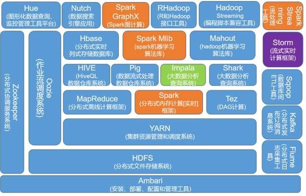

# Hadoop的生态系统介绍

## 一. Hadoop生态系统架构

## 二. 生态系统介绍

### 2.1 HDFS（分布式文件存储系统）

Hadoop分布式文件系统是Hadoop项目的两大核心之一，是针对谷歌文件系统（GoogleFileSystem,GFS)的开源实现。是Hadoop体系中数据存储管理的基础。它是一个高度容错的系统，能检测和应对硬件故障，用于在低成本的通用硬件上运行。HDFS简化了文件的一致性模型，通过流式数据访问，提供高吞吐量应用程序数据访问功能，适合带有大型数据集的应用程序。

### 2.2 Yarn（集群资源管理和调度系统）

YARN （Yet Another Resource Negotiator，另一种资源协调者）是一种新的 Hadoop 资源管理器，它是一个通用资源管理系统，可为上层应用提供统一的资源管理和调度，它的引入为集群在利用率、资源统一管理和数据共享等方面带来了巨大好处。

YARN的基本思想是将JobTracker的两个主要功能（资源管理和作业调度/监控）分离，主要方法是创建一个全局的ResourceManager（RM）和若干个针对应用程序的ApplicationMaster（AM）。这里的应用程序是指传统的MapReduce作业或作业的DAG（有向无环图）。

该框架主要有ResourceManager，Applicationmatser，NodeManager：

- ResourceManager：全局的资源管理器, 整个集群只有一个, 负责集群资源的统一管理和调度分配。
- ApplicationMaster：在yarn上运行的应用程序实例对象,负责管理此应用程序的执行。
- Nodemanager：整个集群有多个, 负责本节点的资源管理和使用, NodeManager管理抽象容器container。

在Yarn平台上可以运行多个计算框架，如：MR，Tez，Storm，Spark等计算框架。

### 2.3 MapReduce（分布式离线计算框架）

MapReduce是针对谷歌MapReduce的开源实现。MapReduce是一种编程模型，用于大规模数据集（大于1TB)的并行运算，它将复杂的、运行于大规模集群上的并行计算过程高度地抽象到了两个函数一一Map和Reduce上，并且允许用户在不了解分布式系统底层细节的情况下开发并行应用程序，并将其运行于廉价计算机集群上，完成海量数据的处理。通俗地说MapReduce的核心思想就是“分而治之”。

### 2.4 Spark（分布式内存计算[实时]框架）

Spark 是专为大规模数据处理而设计的快速通用的计算引擎。Spark是UC Berkeley AMP lab (加州大学伯克利分校的AMP实验室)所开源的类Hadoop MapReduce的通用并行框架，Spark拥有Hadoop MapReduce所具有的优点；但不同于MapReduce的是——Job中间输出结果可以保存在内存中，从而不再需要读写HDFS，因此Spark能更好地适用于数据挖掘与机器学习等需要迭代的MapReduce的算法。

### 2.5 Tez（DAG计算）

Tez是一个针对Hadoop数据处理应用程序的新分布式执行框架。Tez是Apache最新的支持DAG作业的开源计算框架，它可以将多个有依赖的作业转换为一个作业从而大幅提升DAG作业的性能。Tez并不直接面向最终用户——事实上它允许开发者为最终用户构建性能更快、扩展性更好的应用程序。Hadoop传统上是一个大量数据批处理平台。但是，有很多用例需要近乎实时的查询处理性能。还有一些工作则不太适合MapReduce，例如机器学习。Tez的目的就是帮助Hadoop处理这些用例场景。
Tez项目的目标是支持高度定制化，这样它就能够满足各种用例的需要，让人们不必借助其他的外部方式就能完成自己的工作，如果 Hive和 Pig 这样的项目使用Tez而不是MapReduce作为其数据处理的骨干，那么将会显著提升它们的响应时间。Tez构建在YARN之上，后者是Hadoop所使用的新资源管理框架。

### 2.6 Hive（HiveQL数据仓库系统）

由facebook开源，最初用于解决海量结构化的日志数据统计问题。 
Hive定义了一种类似SQL的查询语言(HQL),将SQL转化为MapReduce任务在Hadoop上执行。通常用于离线分析。

### 2.7 Pig（数据流式处理数据仓库系统）

由yahoo!开源，设计动机是提供一种基于MapReduce的ad-hoc(计算在query时发生)数据分析工具。
定义了一种数据流语言—Pig Latin，将脚本转换为MapReduce任务在Hadoop上执行。通常用于进行离线分析。

### 2.8 Impala（大数据分析查询系统）

Impala是Cloudera公司主导开发的新型查询系统，它提供SQL语义，能查询存储在Hadoop的HDFS和HBase中的PB级大数据。已有的Hive系统虽然也提供了SQL语义，但由于Hive底层执行使用的是MapReduce引擎，仍然是一个批处理过程，难以满足查询的交互性。相比之下，Impala的最大特点也是最大卖点就是它的快速。

1. Impala不需要把中间结果写入磁盘，省掉了大量的I/O开销。
2. 省掉了MapReduce作业启动的开销。MapReduce启动task的速度很慢（默认每个心跳间隔是3秒钟），Impala直接通过相应的服务进程来进行作业调度，速度快了很多。
3. Impala完全抛弃了MapReduce这个不太适合做SQL查询的范式，而是像Dremel一样借鉴了MPP并行数据库的思想另起炉灶，因此可做更多的查询优化，从而省掉不必要的shuffle、sort等开销。
4. 通过使用LLVM来统一编译运行时代码，避免了为支持通用编译而带来的不必要开销。
5. 用C++实现，做了很多有针对性的硬件优化，例如使用SSE指令。
6. 使用了支持Data locality的I/O调度机制，尽可能地将数据和计算分配在同一台机器上进行，减少了网络开销。

### 2.9 Shark（大数据分析查询系统）

Shark是一个新的数据分析系统，在集群上进行查询处理和复杂分析。Shark使用一种新的分布式内存抽象，为SQL查询和复杂分析函数提供了统一的运行引擎，并能够有效的容错。这种新的分布式内存抽象使得shark执行SQL查询的速度比Hive快100倍，执行机器学习算法比Hadoop快100倍。与之前的系统不同，shark在取得如此良好性能的同时尽可能的保留了类似于mapreduce的执行框架，以及细粒度的容错特性。为了有效的执行SQL查询，shark提供了面向列存储，查询中重计划等机制。Shark在速度上能够与MPP分析数据库相当，同时又具有MPP分析数据库不具备的容错和复杂分析的能力。

Shark基本上就是在Spark的框架基础上提供和Hive一样的HiveQL命令接口，为了最大程度的保持和Hive的兼容性，Shark使用了Hive的API来实现query Parsing和Logic Plan generation，最后的PhysicalPlan  execution阶段用Spark代替Hadoop MapReduce。通过配置Shark参数，Shark可以自动在内存中缓存特定的RDD，实现数据重用，进而加快特定数据集的检索。同时，Shark通过UDF用户自定义函数实现特定的数据分析学习算法，使得SQL数据查询和运算分析能结合在一起，最大化RDD的重复使用。

### 2.10 Hbase（分布式实时列式存储数据库）

HBase是一个分布式的、面向列的开源数据库，该技术来源于 Fay Chang 所撰写的Google论文“Bigtable：一个结构化数据的分布式存储系统”。就像Bigtable利用了Google文件系统（File System）所提供的分布式数据存储一样，HBase在Hadoop之上提供了类似于Bigtable的能力。HBase不同于一般的关系数据库，它是一个适合于非结构化数据存储的数据库。另一个不同的是HBase基于列的而不是基于行的模式。

### 2.11 Spark Mlib（Spark机器学习算法库）

MLlib是Spark的机器学习（Machine Learning）库，旨在简化机器学习的工程实践工作，并方便扩展到更大规模。MLlib由一些通用的学习算法和工具组成，包括分类、回归、聚类、协同过滤、降维等，同时还包括底层的优化原语和高层的管道API。

### 2.12 Mahout（数据挖掘算法库）

提供一些可扩展的机器学习领域经典算法的实现，旨在帮助开发人员更加方便快捷地创建智能应用程序。Mahout包含许多实现，包括聚类、分类、推荐过滤、频繁子项挖掘。除了算法，Mahout还包含数据的输入/输出工具、与其他存储系统（如数据库、MongoDB 或Cassandra）集成等数据挖掘支持架构。 此外，通过使用 Apache Hadoop 库，Mahout 可以有效地扩展到云中。

### 2.13 Hue（图形化数据查询、监控管理工具平台）

Hue是cdh专门的一套web管理器，它包括3个部分hue ui，hue server，hue db。hue提供所有的cdh组件的shell界面的接口。你可以在hue编写mr，查看修改hdfs的文件，管理hive的元数据，运行Sqoop，编写Oozie工作流等大量工作。

### 2.14 Nutch（数据搜索引擎应用）

Nutch 是一个开源Java实现的搜索引擎。它提供了我们运行自己的搜索引擎所需的全部工具。包括全文搜索和Web爬虫。

### 2.15 Spark GraphX（Spark图计算）

graphx是一个图计算引擎，而不是一个图数据库，它可以处理像倒排索引，推荐系统，最短路径，群体检测等等。

### 2.16 RHadoop（R和Hadoop接口工具）

RHadoop是由Revolution Analytics发起的一个开源项目，它可以将统计语言R与Hadoop结合起来。目前该项目包括三个R packages，分别为支持用R来编写MapReduce应用的rmr、用于R语言访问HDFS的rhdfs以及用于R语言访问HBASE的rhbase。

### 2.17 Hadoop Streaming（编程脚步兼容工具）

Hadoop Streaming是Hadoop提供的一个编程工具，它允许用户使用任何可执行文件或者脚本文件作为Mapper和Reducer。

### 2.18 Flume（分布式日志采集工具）

Cloudera开源的日志收集系统，具有分布式、高可靠、高容错、易于定制和扩展的特点。 

它将数据从产生、传输、处理并最终写入目标的路径的过程抽象为数据流，在具体的数据流中，数据源支持在Flume中定制数据发送方，从而支持收集各种不同协议数据。同时，Flume数据流提供对日志数据进行简单处理的能力，如过滤、格式转换等。此外，Flume还具有能够将日志写往各种数据目标（可定制）的能力。总的来说，Flume是一个可扩展、适合复杂环境的海量日志收集系统。

### 2.19 Kafka（分布式发布订阅消息系统）

Kafka是最初由Linkedin公司开发，是一个分布式、分区的、多副本的、多订阅者，基于zookeeper协调的分布式日志系统（也可以当做MQ系统），常见可以用于web/nginx日志、访问日志，消息服务等等，主要应用场景是：日志收集系统和消息系统。

### 2.20 Sqoop（数据库间ETL工具）

Sqoop是SQL-to-Hadoop的缩写，主要用来在Hadoop和关系数据库之间交换数据的互操作性。通过Sqoop可以方便地将数据从MySQL、Oracle、PostgreSQL等关系数据库中导入到Hadoop（HDFS、HBase或Hive），或者将数据从Hadoop导出到关系数据库，使得传统关系数据库和Hadoop之间的数据迁移变得非常方便。Sqoop主要通过JDBC与关系数据库进行交互，理论上支持JDBC的关系数据库都可以使Sqoop和Hadoop进行数据交互。Sqoop是专门为大数据集设计的，支持增量更新。

### 2.21 Storm（流式实时计算框架）

Storm是Twitter开源的分布式实时大数据处理框架，被业界称为实时版Hadoop。随着越来越多的场景对Hadoop的MapReduce高延迟无法容忍，比如网站统计、推荐系统、预警系统、金融系统(高频交易、股票)等等，大数据实时处理解决方案（流计算）的应用日趋广泛，目前已是分布式技术领域最新爆发点，而Storm更是流计算技术中的佼佼者和主流。

### 2.22 Spark Streaming（流处理工具）

Spark流是对于Spark核心API的拓展，从而支持对于实时数据流的可拓展，高吞吐量和容错性流处理。数据可以由多个源取得，例如：Kafka，Flume，Twitter，ZeroMQ，Kinesis或者TCP接口，同时可以使用由如map，reduce，join和window这样的高层接口描述的复杂算法进行处理。最终，处理过的数据可以被推送到文件系统，数据库和HDFS。

### 2.23 Oozie（作业流调度系统）

Oozie是一个用于管理Apache Hadoop作业的工作流调度程序系统。

Oozie Workflow job是由多个Action组成的有向无环图（DAG）。

Oozie Coordinator job是根据时间（频率）和数据可用性触发的可重复执行的Oozie Workflow job（简单讲就是根据时间或数据条件，规划workflow的执行）。

Oozie与Hadoop技术栈的项目集成，支持多种类型的Hadoop作业（例如Java map-reduce，Streaming map-reduce，Pig，Hive，Sqoop和Spark）以及系统特定的工作（例如Java程序和shell脚本）。

### 2.24 Zookeeper（分布式协调服务系统）

ZooKeeper是一个开放源码的分布式协调服务，它是集群的管理者，监视着集群中各个节点的状态根据节点提交的反馈进行下一步合理操作。最终，将简单易用的接口和性能高效、功能稳定的系统提供给用户。

分布式应用程序可以基于Zookeeper实现诸如数据发布/订阅、负载均衡、命名服务、分布式协调/通知、集群管理、Master选举、分布式锁和分布式队列等功能。

### 2.25 Ambari（安装、部署、配置和管理工具）

Ambari是一种基于Web的工具，支持Hadoop集群的安装、部署、配置和管理。Ambari目前已支持大多数Hadoop组件，包括HDFS、MapReduce、Hive、Pig、HBase、Zookeeper、Sqoop等。

