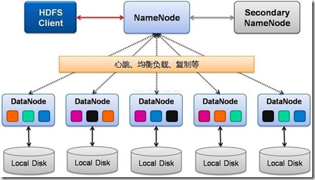
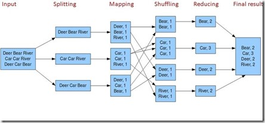
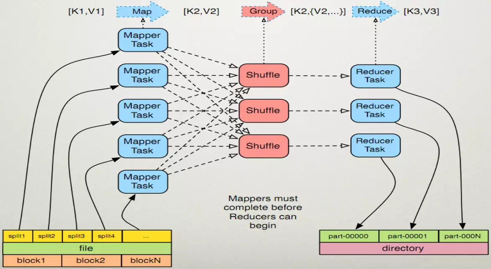
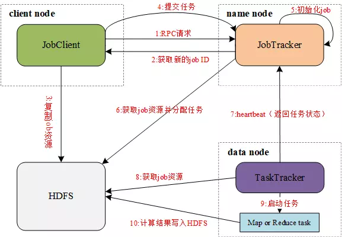

# Hadoop简介和架构分析

## 一.Hadoop简介

hadoop是一个具有分布式存储和分布式计算能力的分布式软件系统

**hadoop基本特点**

- 可靠性(数据冗余)
- 成本低(把数据存储在普通的计算机上)
- 效率高(把计算分发到多个节点)
- 可扩容(根据需求, 动态的调整节点集群的大小)

**解决的问题**

- 海量数据可靠存储
- 海量数据分析与计算

## 二.Hadoop架构分析

hadoop主要有三个模块：HDFS（Hadoop分布式文件系统），Yarn（集群资源管理和调度系统）和MapReduce（分布式离线计算框架）组成，下面我们主要分析这三个模块的架构。

### 2.1 HDFS架构

Namenode：主 Master（只有一个），管理 HDFS 的名称空间，管理数据块映射信息；配置副本策略；处理客户端读写请求

Secondary NameNode：NameNode 的热备；定期合并 fsimage 和 fsedits，推送给 NameNode；当NameNode 出现故障时，快速切换为新的 Active NameNode。

Datanode：Slave（有多个）；存储实际的数据块；执行数据块读 / 写

Client：与 NameNode 交互，获取文件位置信息；与 DataNode 交互，读取或者写入数据；管理 HDFS、访问 HDFS。

**数据复制**

HDFS被设计成能够在一个大集群中跨机器可靠地存储超大文件。它将每个文件存储成一系列的数据块，除了最后一个，所有的数据块都是同样大小的。为了容错，文件的所有数据块都会有副本。每个文件的数据块大小和副本系数都是可配置的。应用程序可以指定某个文件的副本数目。副本系数可以在文件创建的时候指定，也可以在之后改变。HDFS中的文件都是一次性写入的，并且严格要求在任何时候只能有一个写入者。

Namenode全权管理数据块的复制，它周期性地从集群中的每个Datanode接收心跳信号和块状态报告(Blockreport)。接收到心跳信号意味着该Datanode节点工作正常。块状态报告包含了一个该Datanode上所有数据块的列表。

**存放时副本选择**

在大多数情况下，副本系数是3，HDFS的存放策略是将一个副本存放在本地机架的节点上，一个副本放在同一机架的另一个节点上，最后一个副本放在不同机架的节点上。这种策略减少了机架间的数据传输，这就提高了写操作的效率。机架的错误远远比节点的错误少，所以这个策略不会影响到数据的可靠性和可用性。于此同时，因为数据块只放在两个（不是三个）不同的机架上，所以此策略减少了读取数据时需要的网络传输总带宽。在这种策略下，副本并不是均匀分布在不同的机架上。三分之一的副本在一个节点上，三分之二的副本在一个机架上，其他副本均匀分布在剩下的机架中，这一策略在不损害数据可靠性和读取性能的情况下改进了写的性能。

**读取时副本选择**

为了降低整体的带宽消耗和读取延时，HDFS会尽量让读取程序读取离它最近的副本。如果在读取程序的同一个机架上有一个副本，那么就读取该副本。如果一个HDFS集群跨越多个数据中心，那么客户端也将首先读本地数据中心的副本。

**数据块**

HDFS被设计成支持大文件，适用HDFS的是那些需要处理大规模的数据集的应用。这些应用都是只写入数据一次，但却读取一次或多次，并且读取速度应能满足流式读取的需要。HDFS支持文件的“一次写入多次读取”语义。一个典型的数据块大小是64MB。因而，HDFS中的文件总是按照64M被切分成不同的块，每个块尽可能地存储于不同的Datanode中。

### 2.2 Yarn架构

ResourceManager：资源管理器，全局只有一个。

NodeManager：节点管理器,，每个节点对应一个，向ResourceManager同步节点信息(CPU、内存等等)。

Application Master：应用管理器，负责处理节点内部的任务的分配。

Container：资源的抽象, Application Master负责分配自己所在节点的资源给某个task(任务)，这组资源就被抽象为Container。

客户端提交任务到ResourceManager, 然后ResourceManager进行资源分配，数据节点之间使用RPC通信，比如Container处理后的数据传递给其他节点的Application Master。

### 2.3 MapReduce

**Map任务处理**

1. 读取HDFS中的文件。每一行解析成一个<k,v>。每一个键值对调用一次map函数
1. 重写map()，对第一步产生的<k,v>进行处理，转换为新的<k,v>输出
1. 对输出的key、value进行分区
1. 对不同分区的数据，按照key进行排序、分组。相同key的value放到一个集合中
1. (可选) 对分组后的数据进行归约

**Reduce任务处理**

多个map任务的输出，按照不同的分区，通过网络复制到不同的reduce节点上

对多个map的输出进行合并、排序。

重写reduce函数实现自己的逻辑，对输入的key、value处理，转换成新的key、value输出

把reduce的输出保存到文件中

**模块组成**

1. JobClient：运行于client node，负责将MapReduce程序打成Jar包存储到HDFS，并把Jar包的路径提交到Jobtracker，由Jobtracker进行任务的分配和监控。
2. JobTracker：运行于name node，负责接收JobClient提交的Job，调度Job的每一个子task运行于TaskTracker上，并监控它们，如果发现有失败的task就重新运行它。
3. TaskTracker：运行于data node，负责主动与JobTracker通信，接收作业，并直接执行每一个任务。
4. HDFS：用来与其它实体间共享作业文件。

**执行过程**

1. JobClient通过RPC协议向JobTracker请求一个新应用的ID，用于MapReduce作业的ID
1. JobTracker检查作业的输出说明。例如，如果没有指定输出目录或目录已存在，作业就不提交，错误抛回给JobClient，否则，返回新的作业ID给JobClient
1. JobClient将作业所需的资源（包括作业JAR文件、配置文件和计算所得得输入分片）复制到以作业ID命名的HDFS文件夹中
1. JobClient通过submitApplication()提交作业
1. JobTracker收到调用它的submitApplication()消息后，进行任务初始化
1. JobTracker读取HDFS上的要处理的文件，开始计算输入分片，每一个分片对应一个TaskTracker
1. TaskTracker通过心跳机制领取任务（任务的描述信息）
1. TaskTracker读取HDFS上的作业资源（JAR包、配置文件等）
1. TaskTracker启动一个java child子进程，用来执行具体的任务（MapperTask或ReducerTask）
1. TaskTracker将Reduce结果写入到HDFS当中

