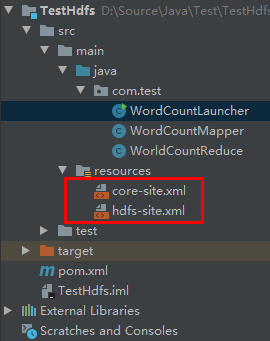

# Java编写MapReduce实例

## 一.准备工作

1. 参照《[CentOS下Hadoop3.2的伪分布式和集群安装](https://onirri.github.io/CentOS下Hadoop3.2的伪分布式和集群安装.html)》安装好Hadoop
2. 安装Maven

## 二.测试代码

### 2.1 在Maven项目中添加依赖

```xml
        <dependency>
            <groupId>org.apache.hadoop</groupId>
            <artifactId>hadoop-client</artifactId>
            <version>3.2.1</version>
        </dependency>
```

### 2.2 添加Hadoop的配置文件

​    把Hadoop集群中Master的core-site.xml和hdfs-site.xml文件复制到Maven项目的resources目录下。



### 2.3 测试代码

#### 2.3.1 编写Mapper类

```java
import org.apache.hadoop.io.IntWritable;
import org.apache.hadoop.io.LongWritable;
import org.apache.hadoop.io.Text;
import org.apache.hadoop.mapreduce.Mapper;
import org.apache.hadoop.util.StringUtils;

import java.io.IOException;

public class WordCountMapper extends Mapper<LongWritable, Text, Text, IntWritable> {
    @Override
    protected void map(LongWritable key, Text value, Context context) throws IOException, InterruptedException {
        String[] words = StringUtils.split(value.toString(), ' ');
        for(String word : words){
            context.write(new Text(word), new IntWritable(1));
        }
    }
}
```

#### 2.3.2 编写Reducer类

```java
import org.apache.hadoop.io.IntWritable;
import org.apache.hadoop.io.Text;
import org.apache.hadoop.mapreduce.Reducer;

import java.io.IOException;

public class WorldCountReduce extends Reducer<Text, IntWritable, Text, IntWritable> {
    @Override
    protected void reduce(Text key, Iterable<IntWritable> values, Context context) throws IOException, InterruptedException {
        int sum = 0;
        for(IntWritable i : values){
            sum += i.get();
        }
        context.write(key, new IntWritable(sum));
    }
}
```

#### 2.3.3 编写启动类

```java
import org.apache.hadoop.conf.Configuration;
import org.apache.hadoop.fs.FileSystem;
import org.apache.hadoop.fs.Path;
import org.apache.hadoop.io.IntWritable;
import org.apache.hadoop.io.Text;
import org.apache.hadoop.mapreduce.Job;
import org.apache.hadoop.mapreduce.lib.input.FileInputFormat;
import org.apache.hadoop.mapreduce.lib.output.FileOutputFormat;

public class WordCountLauncher {
    public static void main(String[] args){
        Configuration conf = new Configuration();
        try{
            FileSystem fs = FileSystem.get(conf);
            Job job = Job.getInstance(conf);
            job.setJarByClass(WordCountLauncher.class);
            job.setJobName("wc");
            job.setMapperClass(WordCountMapper.class);
            job.setReducerClass(WorldCountReduce.class);
            job.setMapOutputKeyClass(Text.class);
            job.setMapOutputValueClass(IntWritable.class);
            FileInputFormat.setInputPaths(job, new Path("/input/test.txt"));
            Path output = new Path("/output/wc");
            fs.deleteOnExit(output);
            FileOutputFormat.setOutputPath(job, output);
            boolean f = job.waitForCompletion(true);
            if(f){
                System.out.println("execute job successfully.");
            }
        }catch (Exception e){
            e.printStackTrace();
        }
    }
}
```

#### 2.4 运行测试

​    在运行WordCountLauncher启动类之前，我们先在HDFS的目录/input下上传一个test.txt文件，然后直接在IDEA中运行WordCountLauncher类，运行完成后通过浏览器访问http://hadoop-master:9870/查看part-r-00000文件。


## 三.Issue分析

### 3.1 java.io.FileNotFoundException: HADOOP_HOME and hadoop.home.dir are unset.

错误原因分析：在Windows中的IDEA运行测试代码发现这个异常是因为Windows中没有设置HADOOP_HOME环境变量。

解决方法：从Hadoop官方网站下载Hadoop编译好的二进制包，解压到Windows的某个目录。然后设置环境变量HADOOP_HOME为Hadoop的解压目录，把%HADOOP_HOME%/bin路径添加到Path环境变量中。

如果下载的Hadoop包的bin目录中没有hadoop.dll和winutils.exe文件，请从如下地址（https://github.com/cdarlint/winutils）下载相应的版本的文件放到%HADOOP_HOME%/bin目录中。

配置完后需要重启IDEA。