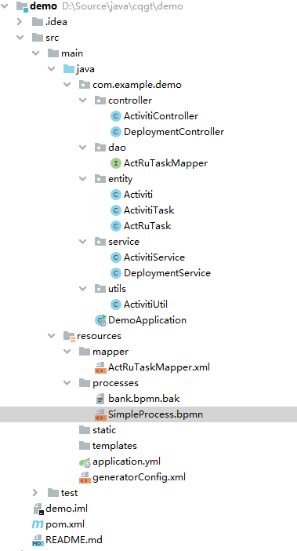
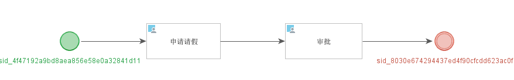
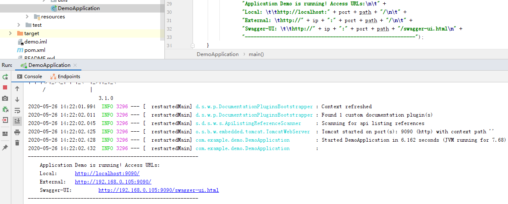
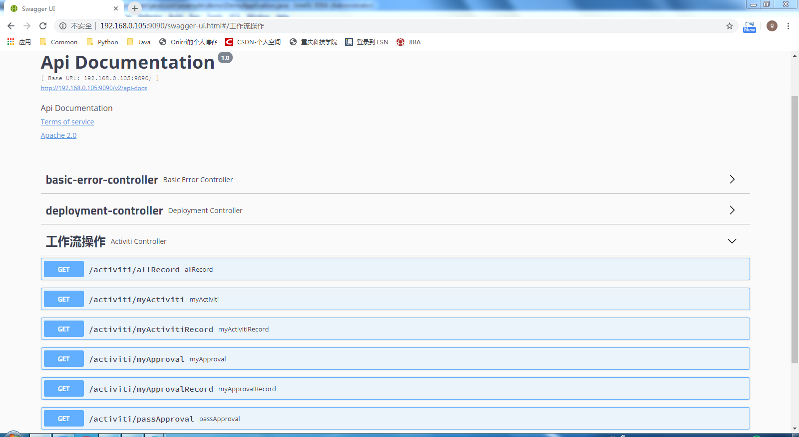

# SpringBoot+Activiti+Oracle11g实现简单的工作流

## 1.后台系统

### 1.1 项目结构

controller：控制器

dao：数据访问层，放置Mapper

entity：实体

service：服务层

utils：工具包



### 1.2 Maven依赖

```xml
<?xml version="1.0" encoding="UTF-8"?>
<project xmlns="http://maven.apache.org/POM/4.0.0" xmlns:xsi="http://www.w3.org/2001/XMLSchema-instance"
         xsi:schemaLocation="http://maven.apache.org/POM/4.0.0 http://maven.apache.org/xsd/maven-4.0.0.xsd">
    <modelVersion>4.0.0</modelVersion>
    <parent>
        <groupId>org.springframework.boot</groupId>
        <artifactId>spring-boot-starter-parent</artifactId>
        <version>2.1.6.RELEASE</version>
        <relativePath/> <!-- lookup parent from repository -->
    </parent>
    <groupId>com.example</groupId>
    <artifactId>demo</artifactId>
    <version>0.0.1</version>
    <packaging>war</packaging>
    <name>demo</name>
    <description>测试用项目</description>

    <properties>
        <project.build.sourceEncoding>UTF-8</project.build.sourceEncoding>
        <project.reporting.outputEncoding>UTF-8</project.reporting.outputEncoding>
        <java.version>1.8</java.version>
    </properties>

    <dependencies>
        <dependency>
            <groupId>org.springframework.boot</groupId>
            <artifactId>spring-boot-starter-web</artifactId>
        </dependency>
        <dependency>
            <groupId>org.springframework.boot</groupId>
            <artifactId>spring-boot-starter-test</artifactId>
            <scope>test</scope>
        </dependency>
        <dependency>
            <groupId>org.springframework.boot</groupId>
            <artifactId>spring-boot-starter-tomcat</artifactId>
            <scope>provided</scope>
        </dependency>
        <dependency>
            <groupId>org.springframework.boot</groupId>
            <artifactId>spring-boot-devtools</artifactId>
            <optional>true</optional>
        </dependency>
        <dependency>
            <groupId>org.projectlombok</groupId>
            <artifactId>lombok</artifactId>
        </dependency>
    </dependencies>
    <build>
        <plugins>
            <plugin>
                <groupId>org.apache.maven.plugins</groupId>
                <artifactId>maven-compiler-plugin</artifactId>
                <configuration>
                    <source>1.8</source>
                    <target>1.8</target>
                    <encoding>UTF-8</encoding>
                </configuration>
            </plugin>
            <!-- 打包跳过测试 -->
            <plugin>
                <groupId>org.apache.maven.plugins</groupId>
                <artifactId>maven-surefire-plugin</artifactId>
                <configuration>
                    <skipTests>true</skipTests>
                </configuration>
            </plugin>
            <plugin>
                <groupId>org.mybatis.generator</groupId>
                <artifactId>mybatis-generator-maven-plugin</artifactId>
                <version>1.3.5</version>
                <configuration>
                    <verbose>true</verbose>
                    <overwrite>true</overwrite>
                    <configurationFile>src/main/resources/generatorConfig.xml</configurationFile>
                </configuration>
                <dependencies>
                    <dependency>
                        <groupId>com.oracle</groupId>
                        <artifactId>ojdbc6</artifactId>
                        <version>11.2.0.3</version>
                    </dependency>
                </dependencies>
            </plugin>
        </plugins>
    </build>
</project>
```

注：Oracle11g的驱动ojdbc6对SpringBoot的版本有要求，只能使用2.1.X版本的，不支持最新的2.2.X和2.3.X版本。MySQL没有限制。

### 1.3 应用配置

```yml
server:
  port: 9090
  servlet:
    encoding:
      force-response: true

spring:
  autoconfigure:
    exclude: com.alibaba.druid.spring.boot.autoconfigure.DruidDataSourceAutoConfigure
  datasource:
    druid:
      stat-view-servlet:
        loginUsername: admin
        loginPassword: 123456
    dynamic:
      druid:
        minIdle: 5
        maxActive: 20
        filters: stat,wall
        stat:
          merge-sql: true
          log-slow-sql: true
      datasource:
        master:
          url: jdbc:oracle:thin:@//192.168.5.131:1521/xe
          username: BANKOA
          password: Zou.g123
          driver-class-name: oracle.jdbc.driver.OracleDriver

  activiti:
    database-schema-update: true
    history-level: full
    db-identity-used: false
    check-process-definitions: true
    process-definition-location-prefix: classpath:/processes/

  swagger:
    swagger-ui-open: true
```

mybatis-generator的配置generatorConfig.xml，放在resources目录下：

```xml
<?xml version="1.0" encoding="UTF-8"?>
<!DOCTYPE generatorConfiguration
        PUBLIC "-//mybatis.org//DTD MyBatis Generator Configuration 1.0//EN"
        "http://mybatis.org/dtd/mybatis-generator-config_1_0.dtd">
<generatorConfiguration>
    <!-- context 是逆向工程的主要配置信息 -->
    <!-- id：起个名字 -->
    <!-- targetRuntime：设置生成的文件适用于那个 mybatis 版本 -->
    <context id="default" targetRuntime="MyBatis3">
        <!--optional,指在创建class时，对注释进行控制-->
        <commentGenerator>
            <property name="suppressDate" value="true"/>
            <!-- 是否去除自动生成的注释 true：是 ： false:否 -->
            <property name="suppressAllComments" value="true"/>
        </commentGenerator>
        <!--jdbc的数据库连接 wg_insert 为数据库名字-->
        <jdbcConnection driverClass="oracle.jdbc.driver.OracleDriver"
                        connectionURL="jdbc:oracle:thin:@//192.168.5.131:1521/xe" userId="BANKOA"
                        password="Zou.g123"></jdbcConnection>
        <!--非必须，类型处理器，在数据库类型和java类型之间的转换控制-->
        <javaTypeResolver>
            <!-- 默认情况下数据库中的 decimal，bigInt 在 Java 对应是 sql 下的 BigDecimal 类 -->
            <!-- 不是 double 和 long 类型 -->
            <!-- 使用常用的基本类型代替 sql 包下的引用类型 -->
            <property name="forceBigDecimals" value="false"/>
        </javaTypeResolver>
        <!-- targetPackage：生成的实体类所在的包 -->
        <!-- targetProject：生成的实体类所在的硬盘位置 -->
        <javaModelGenerator targetPackage="com.example.demo.entity"
                            targetProject="src/main/java">
            <!-- 是否允许子包 -->
            <property name="enableSubPackages" value="false"/>
            <!-- 是否对modal添加构造函数 -->
            <property name="constructorBased" value="true"/>
            <!-- 是否清理从数据库中查询出的字符串左右两边的空白字符 -->
            <property name="trimStrings" value="true"/>
            <!-- 建立modal对象是否不可改变 即生成的modal对象不会有setter方法，只有构造方法 -->
            <property name="immutable" value="false"/>
        </javaModelGenerator>
        <!-- targetPackage 和 targetProject：生成的 mapper 文件的包和位置 -->
        <sqlMapGenerator targetPackage="mapper"
                         targetProject="src/main/resources">
            <!-- 针对数据库的一个配置，是否把 schema 作为字包名 -->
            <property name="enableSubPackages" value="false"/>
        </sqlMapGenerator>
        <!-- targetPackage 和 targetProject：生成的 interface 文件的包和位置 -->
        <javaClientGenerator type="XMLMAPPER"
                             targetPackage="com.example.demo.dao" targetProject="src/main/java">
            <!-- 针对 oracle 数据库的一个配置，是否把 schema 作为字包名 -->
            <property name="enableSubPackages" value="false"/>
        </javaClientGenerator>
        <!-- tableName是数据库中的表名，domainObjectName是生成的JAVA模型名，后面的参数不用改，要生成更多的表就在下面继续加table标签 -->
        <table tableName="ACT_RU_TASK" domainObjectName="ActRuTask"
               enableCountByExample="false" enableUpdateByExample="false"
               enableDeleteByExample="false" enableSelectByExample="false"
               selectByExampleQueryId="false"></table>
    </context>
</generatorConfiguration>
```

Actitivi流程文件，放在resources/processes目录下。



```xml
<?xml version="1.0" encoding="UTF-8"?>
<definitions xmlns="http://www.omg.org/spec/BPMN/20100524/MODEL"
             xmlns:xsi="http://www.w3.org/2001/XMLSchema-instance"
             xmlns:xsd="http://www.w3.org/2001/XMLSchema"
             xmlns:activiti="http://activiti.org/bpmn"
             xmlns:bpmndi="http://www.omg.org/spec/BPMN/20100524/DI"
             xmlns:omgdc="http://www.omg.org/spec/DD/20100524/DC"
             xmlns:omgdi="http://www.omg.org/spec/DD/20100524/DI"
             typeLanguage="http://www.w3.org/2001/XMLSchema"
             expressionLanguage="http://www.w3.org/1999/XPath"
             targetNamespace="http://www.activiti.org/processdef">
    <process  id="SimpleProcess" name="请假流程">
        <startEvent  id="sid_4f47192a9bd8aea856e58e0a32841d11" name="sid_4f47192a9bd8aea856e58e0a32841d11" activiti:initiator="_wf_default_v_applicant">
        </startEvent>
        <endEvent  id="sid_8030e674294437ed4f90cfcdd623ac0f" name="sid_8030e674294437ed4f90cfcdd623ac0f">
        </endEvent>
        <userTask  id="sid_63815964686e1b9cdb1758d37019b800" name="申请请假" >
        </userTask>
        <userTask  id="sid_95938a38a984f41aa4158f3003da52ec" name="审批" >
        </userTask>
        <sequenceFlow  id="sid_e62e136d87da9abb1df19cf4c5f1da95" name="sid_e62e136d87da9abb1df19cf4c5f1da95" sourceRef="sid_4f47192a9bd8aea856e58e0a32841d11" targetRef="sid_63815964686e1b9cdb1758d37019b800">
        </sequenceFlow>
        <sequenceFlow  id="sid_4fae91900064889aea42e8e496e85923" name="sid_4fae91900064889aea42e8e496e85923" sourceRef="sid_63815964686e1b9cdb1758d37019b800" targetRef="sid_95938a38a984f41aa4158f3003da52ec">
        </sequenceFlow>
        <sequenceFlow  id="sid_c290cd7daa53b374da734bb1428412cf" name="sid_c290cd7daa53b374da734bb1428412cf" sourceRef="sid_95938a38a984f41aa4158f3003da52ec" targetRef="sid_8030e674294437ed4f90cfcdd623ac0f">
        </sequenceFlow>
    </process>
    <bpmndi:BPMNDiagram id="BPMNDiagram_SimpleProcess">
        <bpmndi:BPMNPlane bpmnElement="SimpleProcess" id="BPMNPlane_SimpleProcess">
            <bpmndi:BPMNShape bpmnElement="sid_4f47192a9bd8aea856e58e0a32841d11" id="BPMNShape_sid_4f47192a9bd8aea856e58e0a32841d11">
                <omgdc:Bounds height="40" width="40" x="114" y="224"/>
            </bpmndi:BPMNShape>
            <bpmndi:BPMNShape bpmnElement="sid_8030e674294437ed4f90cfcdd623ac0f" id="BPMNShape_sid_8030e674294437ed4f90cfcdd623ac0f">
                <omgdc:Bounds height="40" width="40" x="754" y="224"/>
            </bpmndi:BPMNShape>
            <bpmndi:BPMNShape bpmnElement="sid_63815964686e1b9cdb1758d37019b800" id="BPMNShape_sid_63815964686e1b9cdb1758d37019b800">
                <omgdc:Bounds height="60" width="125" x="266" y="214"/>
            </bpmndi:BPMNShape>
            <bpmndi:BPMNShape bpmnElement="sid_95938a38a984f41aa4158f3003da52ec" id="BPMNShape_sid_95938a38a984f41aa4158f3003da52ec">
                <omgdc:Bounds height="60" width="130" x="503" y="214"/>
            </bpmndi:BPMNShape>
            <bpmndi:BPMNEdge bpmnElement="sid_e62e136d87da9abb1df19cf4c5f1da95" id="BPMNEdge_sid_e62e136d87da9abb1df19cf4c5f1da95">
                <omgdi:waypoint x="154" y="244"/>
                <omgdi:waypoint x="266" y="244"/>
            </bpmndi:BPMNEdge>
            <bpmndi:BPMNEdge bpmnElement="sid_4fae91900064889aea42e8e496e85923" id="BPMNEdge_sid_4fae91900064889aea42e8e496e85923">
                <omgdi:waypoint x="391" y="244"/>
                <omgdi:waypoint x="503" y="244"/>
            </bpmndi:BPMNEdge>
            <bpmndi:BPMNEdge bpmnElement="sid_c290cd7daa53b374da734bb1428412cf" id="BPMNEdge_sid_c290cd7daa53b374da734bb1428412cf">
                <omgdi:waypoint x="633" y="244"/>
                <omgdi:waypoint x="754" y="244"/>
            </bpmndi:BPMNEdge>
        </bpmndi:BPMNPlane>
    </bpmndi:BPMNDiagram>
</definitions>
```

### 1.4 代码编写

DemoApplication应用启动类：

```java
package com.example.demo;

import lombok.extern.slf4j.Slf4j;
import org.activiti.spring.boot.SecurityAutoConfiguration;
import org.springframework.boot.SpringApplication;
import org.springframework.boot.autoconfigure.SpringBootApplication;
import org.springframework.context.ConfigurableApplicationContext;
import org.springframework.context.annotation.ComponentScan;
import org.springframework.core.env.Environment;
import springfox.documentation.swagger2.annotations.EnableSwagger2;

import java.net.InetAddress;
import java.net.UnknownHostException;

@Slf4j
@EnableSwagger2
@SpringBootApplication(exclude = SecurityAutoConfiguration.class)
public class DemoApplication {

	public static void main(String[] args) throws UnknownHostException {
		ConfigurableApplicationContext application = SpringApplication.run(DemoApplication.class, args);
		Environment env = application.getEnvironment();
		String ip = InetAddress.getLocalHost().getHostAddress();
		String port = env.getProperty("server.port");
		String path = env.getProperty("server.servlet.context-path");
		path = path == null ? "" : path;
		
		log.info("\n----------------------------------------------------------\n\t" +
				"Application Demo is running! Access URLs:\n\t" +
				"Local: \t\thttp://localhost:" + port + path + "/\n\t" +
				"External: \thttp://" + ip + ":" + port + path + "/\n\t" +
				"Swagger-UI: \t\thttp://" + ip + ":" + port + path + "/swagger-ui.html\n" +
				"----------------------------------------------------------");
	}

}

```

ActivitiController控制类：

```java
package com.example.demo.controller;

import com.example.demo.entity.Activiti;
import com.example.demo.entity.ActivitiTask;
import com.example.demo.service.ActivitiService;
import io.swagger.annotations.Api;
import io.swagger.annotations.ApiOperation;
import io.swagger.annotations.ApiParam;
import org.springframework.beans.factory.annotation.Autowired;
import org.springframework.web.bind.annotation.*;

import java.util.HashMap;
import java.util.List;
import java.util.Map;

@RestController
@RequestMapping(value = "/activiti")
@Api(value = "/activiti", tags = {"工作流操作"})
public class ActivitiController {

    @Autowired
    private ActivitiService activitiService;

    @RequestMapping(value = "start", method = RequestMethod.GET)
    @ApiOperation(value = "start", httpMethod = "GET", notes = "启动请假流程")
    public boolean start(@ApiParam(value = "流程发起用户", required = true) @RequestParam(value = "userName") String userName,
                         @ApiParam(value = "流程分配用户", required = true) @RequestParam(value = "nextAssignee") String nextAssignee) {
        return activitiService.startActiviti(userName, nextAssignee);
    }

    @RequestMapping(value = "/allRecord", method = RequestMethod.GET)
    @ApiOperation(value = "allRecord", httpMethod = "GET", notes = "查询所有流程记录")
    public Object allRecord(@ApiParam(value = "用户名", required = true) @RequestParam(value = "userName") String userName) {
        Map result = new HashMap();
        //我正在申请的假
        List<Activiti> list = myActiviti(userName);
        result.put("list", list);
        //我申请过的假
        List<Activiti> list2 = myActivitiRecord(userName);
        result.put("list2", list2);
        //待我审核的请假
        List<ActivitiTask> list3 = myApproval(userName);
        result.put("list3", list3);
        //我的审核记录
        List<Activiti> list4 = myApprovalRecord(userName);
        result.put("list4", list4);
        return result;
    }

    //我正在申请的假
    @RequestMapping(value = "/myActiviti", method = RequestMethod.GET)
    @ApiOperation(value = "myActiviti", httpMethod = "GET", notes = "查询我正在申请的假")
    public List<Activiti> myActiviti(@ApiParam(value = "用户名", required = true) @RequestParam(value = "userName") String userName) {
        List<Activiti> list = activitiService.myActiviti(userName);
        return list;
    }

    //我申请过的假
    @RequestMapping(value = "/myActivitiRecord", method = RequestMethod.GET)
    @ApiOperation(value = "myActivitiRecord", httpMethod = "GET", notes = "查询我申请过的假")
    public List<Activiti> myActivitiRecord(@ApiParam(value = "用户名", required = true) @RequestParam(value = "userName") String userName) {
        List<Activiti> list2 = activitiService.myActivitiRecord(userName);
        return list2;
    }

    //待我审核的请假
    @RequestMapping(value = "/myApproval", method = RequestMethod.GET)
    @ApiOperation(value = "myApproval", httpMethod = "GET", notes = "查询待我审核的请假")
    public List<ActivitiTask> myApproval(@ApiParam(value = "用户名", required = true) @RequestParam(value = "userName") String userName) {
        List<ActivitiTask> list3 = activitiService.myApproval(userName);
        return list3;
    }

    //我的审核记录
    @RequestMapping(value = "/myApprovalRecord", method = RequestMethod.GET)
    @ApiOperation(value = "myApprovalRecord", httpMethod = "GET", notes = "查询我审核过记录")
    public List<Activiti> myApprovalRecord(@ApiParam(value = "用户名", required = true) @RequestParam(value = "userName") String userName) {
        List<Activiti> list4 = activitiService.myApprovalRecord(userName);
        return list4;
    }

    //审批操作
    @RequestMapping(value = "/passApproval", method = RequestMethod.GET)
    @ApiOperation(value = "passApproval", httpMethod = "GET", notes = "审批操作")
    public String passApproval(@ApiParam(value = "流程ID", required = true) @RequestParam(value = "id") String id,
                               @ApiParam(value = "审批结果", required = true) @RequestParam(value = "result") String result,
                               @ApiParam(value = "用户名", required = true) @RequestParam(value = "userName") String userName) {
        ActivitiTask activitiTask = new ActivitiTask();
        Activiti activiti = new Activiti();
        activitiTask.setId(id);
        activiti.setResult(result);
        activitiTask.setActiviti(activiti);
        activitiService.passApproval(userName, activitiTask);
        return "0";
    }
}
```

ActivitiService服务类：

```java
package com.example.demo.service;

import com.baomidou.dynamic.datasource.annotation.DS;
import com.example.demo.entity.Activiti;
import com.example.demo.entity.ActivitiTask;
import com.example.demo.utils.ActivitiUtil;
import org.activiti.engine.*;
import org.activiti.engine.history.HistoricProcessInstance;
import org.activiti.engine.history.HistoricVariableInstance;
import org.activiti.engine.runtime.ProcessInstance;
import org.activiti.engine.task.Task;
import org.slf4j.Logger;
import org.slf4j.LoggerFactory;
import org.springframework.stereotype.Service;

import javax.annotation.Resource;
import java.util.*;

/**
 * RepositoryService:  流程仓库Service，用于管理流程仓库，例如：部署，删除，读取流程资源
 * IdentityService：身份Service，可以管理，查询用户，组之间的关系
 * RuntimeService：运行时Service，可以处理所有正在运行状态的流程实例，任务等
 * TaskService：任务Service，用于管理，查询任务，例如：签收，办理，指派等
 * HistoryService：历史Service，可以查询所有历史数据，例如：流程实例，任务，活动，变量，附件等
 * FormService：表单Service，用于读取和流程，任务相关的表单数据
 * ManagementService：引擎管理Service，和具体业务无关，主要是可以查询引擎配置，数据库，作业等
 * DynamicBpmnService：一个新增的服务，用于动态修改流程中的一些参数信息等，是引擎中的一个辅助的服务
 */
@DS("master")
@Service
public class ActivitiService {
    private Logger logger = LoggerFactory.getLogger(ActivitiService.class);
    //所运行工作流的名字
    private static final String PROCESS_DEFINE_KEY = "SimpleProcess";
    @Resource
    private RuntimeService runtimeService;
    @Resource
    private IdentityService identityService;
    @Resource
    private TaskService taskService;
    @Resource
    private HistoryService historyService;
    @Resource
    private RepositoryService repositoryService;

    /**
     * 开始流程
     *
     * @param userName
     * @return
     */
    public Boolean startActiviti(String userName, String nextAssignee) {
        logger.info("method startActivityDemo begin....");
    /*认证用户的作用是设置流程发起人：在流程开始之前设置，会自动在表ACT_HI_PROCINST 中的START_USER_ID_中设置用户ID
    用来设置启动流程的人员ID，引擎会自动把用户ID保存到activiti:initiator中*/
        try {
            identityService.setAuthenticatedUserId(userName);
            // 开始流程
            ProcessInstance pi = runtimeService.startProcessInstanceByKey(PROCESS_DEFINE_KEY);
            String processId = pi.getId();
            logger.info("===============processId===================" + processId);

            // 查询当前任务
            Task currentTask = taskService.createTaskQuery().processInstanceId(pi.getId()).singleResult();
            String taskId1 = currentTask.getId();
            logger.info("===============taskId1===================" + taskId1);

            // 申明任务人
            //taskService.claim(currentTask.getId(), userName);
            taskService.setAssignee(taskId1, userName);
            Map<String, Object> vars = new HashMap(4);
            vars.put("applyUser", userName);
            vars.put("days", 1);
            vars.put("reason", "病假");
            //在此方法中，Vaction 是申请时的具体信息，在完成“申请请假”任务时，可以将这些信息设置成参数。
            //完成第一步申请
            taskService.complete(currentTask.getId(), vars);

            // 到了下一个任务， 应该在此处指派任务由谁来处理
            // 重新获取当前任务
            Task task = taskService.createTaskQuery().processInstanceId(processId).singleResult();
            String taskId2 = task.getId();
            logger.info("===============taskId2===================" + taskId2);
            taskService.setAssignee(taskId2, nextAssignee);
        } catch (Exception e) {
            e.printStackTrace();
        }
        return true;
    }

    public List<Activiti> myActiviti(String userName) {
        List<ProcessInstance> instanceList = runtimeService.createProcessInstanceQuery().startedBy(userName).list();
        List<Activiti> activitisList = new ArrayList();
        for (ProcessInstance instance : instanceList) {
            Activiti activiti = getActiviti(instance);
            activitisList.add(activiti);
        }
        return activitisList;
    }

    /**
     * 查询需要自己审批
     *
     * @param userName
     * @return
     */
    public List<ActivitiTask> myApproval(String userName) {
        List<Task> taskList = taskService.createTaskQuery().taskAssignee(userName).orderByTaskCreateTime().desc().list();
        List<ActivitiTask> activitiTaskList = new ArrayList();
        for (Task task : taskList) {
            ActivitiTask activitiTask = new ActivitiTask();
            activitiTask.setId(task.getId());
            activitiTask.setName(task.getName());
            activitiTask.setCreateTime(task.getCreateTime());
            String instanceId = task.getProcessInstanceId();
            ProcessInstance instance = runtimeService.createProcessInstanceQuery().processInstanceId(instanceId).singleResult();
            Activiti activiti = getActiviti(instance);
            activitiTask.setActiviti(activiti);
            activitiTaskList.add(activitiTask);
        }
        return activitiTaskList;
    }

    private Activiti getActiviti(ProcessInstance instance) {
        Integer days = runtimeService.getVariable(instance.getId(), "days", Integer.class);
        String reason = runtimeService.getVariable(instance.getId(), "reason", String.class);
        Activiti activiti = new Activiti();
        activiti.setApplyUser(instance.getStartUserId());
        activiti.setDays(days);
        activiti.setReason(reason);
        Date startTime = instance.getStartTime(); // activiti 6 才有
        activiti.setApplyTime(startTime);
        activiti.setApplyStatus(instance.isEnded() ? "申请结束" : "等待审批");
        return activiti;
    }

    /**
     * 审批操作
     *
     * @param userName
     * @param activitiTask
     * @return 同理，result是审批的结果，也是在完成审批任务时需要传入的参数；taskId是刚才老板查询到的当前需要自己完成的审批任务ID。
     * （如果流程在这里设置分支，可以通过判断result的值来跳转到不同的任务）
     **/
    public Boolean passApproval(String userName, ActivitiTask activitiTask) {
        String taskId = activitiTask.getId();
        String result = activitiTask.getActiviti().getResult();
        Map<String, Object> vars = new HashMap();
        vars.put("result", result);
        vars.put("auditor", userName);
        vars.put("auditTime", new Date());
        //taskService.claim(taskId, userName);
        taskService.setAssignee(taskId, userName);
        taskService.complete(taskId, vars);
        return true;
    }


    /**
     * 查询已完成的请假记录
     * 由于已完成的请假在数据库runtime表中查不到（runtime表只保存正在进行的流程示例信息），所以需要在history表中查询。
     *
     * @param userName
     * @return
     */
    public List<Activiti> myActivitiRecord(String userName) {
        List<HistoricProcessInstance> hisProInstance = historyService.createHistoricProcessInstanceQuery()
                .processDefinitionKey(PROCESS_DEFINE_KEY).startedBy(userName).finished()
                .orderByProcessInstanceEndTime().desc().list();

        List<Activiti> activitiList = new ArrayList();
        for (HistoricProcessInstance hisInstance : hisProInstance) {
            Activiti activiti = new Activiti();
            activiti.setApplyUser(hisInstance.getStartUserId());
            activiti.setApplyTime(hisInstance.getStartTime());
            activiti.setApplyStatus("申请结束");
            List<HistoricVariableInstance> varInstanceList = historyService.createHistoricVariableInstanceQuery()
                    .processInstanceId(hisInstance.getId()).list();
            ActivitiUtil.setVars(activiti, varInstanceList);
            activitiList.add(activiti);
        }
        return activitiList;
    }


    /**
     * 我审批的记录列表
     *
     * @param userName
     * @return
     */
    public List<Activiti> myApprovalRecord(String userName) {
        List<HistoricProcessInstance> hisProInstance = historyService.createHistoricProcessInstanceQuery()
                .processDefinitionKey(PROCESS_DEFINE_KEY).involvedUser(userName).finished()
                .orderByProcessInstanceEndTime().desc().list();

        List<Activiti> activitiList = new ArrayList();
        for (HistoricProcessInstance hisInstance : hisProInstance) {
            Activiti activiti = new Activiti();
            activiti.setApplyUser(hisInstance.getStartUserId());
            activiti.setApplyStatus("申请结束");
            activiti.setApplyTime(hisInstance.getStartTime());
            List<HistoricVariableInstance> varInstanceList = historyService.createHistoricVariableInstanceQuery()
                    .processInstanceId(hisInstance.getId()).list();
            ActivitiUtil.setVars(activiti, varInstanceList);
            activitiList.add(activiti);
        }
        return activitiList;
    }
}
```

ActivitiUtil工具类：

```java
package com.example.demo.utils;

import org.activiti.engine.history.HistoricVariableInstance;

import java.io.ByteArrayOutputStream;
import java.io.InputStream;
import java.lang.reflect.Field;
import java.util.List;

public class ActivitiUtil {

    public static String text(InputStream fin) {
        byte[] buf = new byte[512];
        ByteArrayOutputStream bout = new ByteArrayOutputStream();
        try {
            do {
                int size = fin.read(buf);
                if (size <= 0) {
                    break;
                }
                bout.write(buf, 0, size);
            } while (true);
            String text = new String(bout.toByteArray(), "UTF-8");
            bout.close();
            return text;
        } catch (Exception ex) {
            throw new RuntimeException("convert error");
        }
    }

    /**
     * 将历史参数列表设置到实体中去
     * @param entity 实体
     * @param varInstanceList 历史参数列表
     */
    public static <T> void setVars(T entity, List<HistoricVariableInstance> varInstanceList) {
        Class<?> tClass = entity.getClass();
        try {
            for (HistoricVariableInstance varInstance : varInstanceList) {
                Field field = tClass.getDeclaredField(varInstance.getVariableName());
                if (field == null) {
                    continue;
                }
                field.setAccessible(true);
                field.set(entity, varInstance.getValue());
            }
        } catch (Exception e) {
            e.printStackTrace();
        }
    }
}
```

Activiti实体类：

```java
package com.example.demo.entity;

import java.io.Serializable;
import java.util.Date;

public class Activiti implements Serializable{

    /**
     * 申请人
     */
    private String applyUser;
    private int days;
    private String reason;
    private Date applyTime;
    private String applyStatus;

    /**
     * 审核人
     */
    private String auditor;
    private String result;
    private Date auditTime;

    public String getApplyUser() {
        return applyUser;
    }

    public void setApplyUser(String applyUser) {
        this.applyUser = applyUser;
    }

    public int getDays() {
        return days;
    }

    public void setDays(int days) {
        this.days = days;
    }

    public String getReason() {
        return reason;
    }

    public void setReason(String reason) {
        this.reason = reason;
    }

    public Date getApplyTime() {
        return applyTime;
    }

    public void setApplyTime(Date applyTime) {
        this.applyTime = applyTime;
    }

    public String getApplyStatus() {
        return applyStatus;
    }

    public void setApplyStatus(String applyStatus) {
        this.applyStatus = applyStatus;
    }

    public String getAuditor() {
        return auditor;
    }

    public void setAuditor(String auditor) {
        this.auditor = auditor;
    }

    public String getResult() {
        return result;
    }

    public void setResult(String result) {
        this.result = result;
    }

    public Date getAuditTime() {
        return auditTime;
    }

    public void setAuditTime(Date auditTime) {
        this.auditTime = auditTime;
    }
}
```

ActivitiTask实体类：

```
package com.example.demo.entity;

import java.util.Date;

public class ActivitiTask {

    private String id;
    private String name;
    private Activiti activiti;
    private Date createTime;

    public String getId() {
        return id;
    }

    public void setId(String id) {
        this.id = id;
    }

    public Date getCreateTime() {
        return createTime;
    }

    public void setCreateTime(Date createTime) {
        this.createTime = createTime;
    }

    public String getName() {
        return name;
    }

    public void setName(String name) {
        this.name = name;
    }

    public Activiti getActiviti() {
        return activiti;
    }

    public void setActiviti(Activiti activiti) {
        this.activiti = activiti;
    }
}
```

### 1.5 测试

可以在IDE中直接运行DemoApplication启动类：





## 2.前端系统

