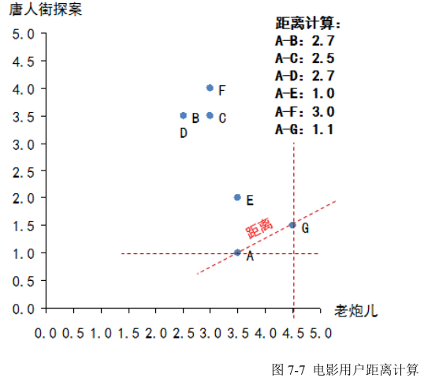

# 关联规则

**注：目前Scikit-learn中不提供关联规则算法：比如Apriori和FP-Growth算法**

## 1. 关联规则概念

### 1.1 关联规则概念

关联规则(Association Rules)是反映一个事物与其他事物之间的相互依存性和关联性，是数据挖掘的一个重要技术，用于从大量数据中挖掘出有价值的数据项之间的相关关系。

常见的购物篮分析：该过程通过发现顾客放人其购物篮中的不同商品之间的联系，分析顾客的购买习惯。通过了解哪些商品频繁地被顾客同时购买，这种关联的发现可以帮助零售商制定营销策略。其他的应用还包括价目表设计、商品促销、商品的排放和基于购买模式的顾客划分。

可从数据库中关联分析出形如“由于某些事件的发生而引起另外一些事件的发生”之类的规则。

### 1.2 关联规则定义

1、事务：每一条交易称为一个事务，例如示例1中的数据集就包含四个事务。

2、项：交易的每一个物品称为一个项，例如Cola、Egg等。　

3、项集：包含零个或多个项的集合叫做项集，例如{Cola, Egg, Ham}。

4、k−项集：包含k个项的项集叫做k-项集，例如{Cola}叫做1-项集，{Cola, Egg}叫做2-项集。

5、支持度计数：一个项集出现在几个事务当中，它的支持度计数就是几。例如{Diaper, Beer}出现在事务 002、003和004中，所以它的支持度计数是3。

6、支持度：支持度计数除于总的事务数。例如上例中总的事务数为4，{Diaper, Beer}的支持度计数为3，所以它的支持度是3÷4=75%，说明有75%的人同时买了Diaper和Beer。

关联规则A->B的支持度support=P(AB)，指的是事件A和事件B同时发生的概率。

7、频繁项集：支持度大于或等于某个阈值的项集就叫做频繁项集。例如阈值设为50%时，因为{Diaper, Beer}的支持度是75%，所以它是频繁项集。

8、前件和后件：对于规则{Diaper}→{Beer}，{Diaper}叫做前件，{Beer}叫做后件。

9、置信度：对于规则{Diaper}→{Beer}，{Diaper, Beer}的支持度计数除于{Diaper}的支持度计数，为这个规则的置信度。例如规则{Diaper}→{Beer}的置信度为3÷3=100%。说明买了Diaper的人100%也买了Beer。 

置信度confidence=P(B|A)=P(AB)/P(A),指的是发生事件A的基础上发生事件B的概率。

10、强关联规则：大于或等于最小支持度阈值和最小置信度阈值的规则叫做强关联规则。

关联分析的最终目标就是要找出强关联规则。

### 1.3 关联规则的挖掘过程

关联规则挖掘过程主要包含两个阶段：

第一阶段必须先从资料集合中找出所有的高频项目组(Frequent Itemsets)，

第二阶段再由这些高频项目组中产生关联规则(Association Rules)。

## 2. Apriori算法

### 2.1 Apriori算法定义

关联规则中常用的一种算法是Apriori算法。该算法主要包含两个步骤：

首先找出数据集中所有的频繁项集，这些项集出现的频繁性要大于或等于最小支持度

然后根据频繁项集产生强关联规则，这些规则必须满足最小支持度和最小置信度。

上面提到了最小支持度和最小置信度，事实上，在关联规则中用于度量规则质量的两个主要指标即为支持度和置信度。那么，什么是支持度和置信度呢？接下来进行讲解。


### 2.2 Apriori实现原理


### 2.3 Apriori算法缺点

虽然 Apriori 算法看似很完美，但其有一些难以克服的缺点：

（1）对数据库的扫描次数过多。

（2）Apriori 算法会产生大量的中间项集。

（3）采用唯一支持度。

（4）算法的适应面窄。

### 2.4 Apriori算法Python实现


```python
def load_data_set():
    """
    Load a sample data set (From Data Mining: Concepts and Techniques, 3th Edition)
    Returns:
    A data set: A list of transactions. Each transaction contains several items.
    """
    data_set = [['l1', 'l2', 'l5'],
                ['l2', 'l4'],
                ['l2', 'l3'],
                ['l1', 'l2', 'l4'],
                ['l1', 'l3'],
                ['l2', 'l3'],
                ['l1', 'l3'],
                ['l1', 'l2', 'l3', 'l5'],
                ['l1', 'l2', 'l3']]
    return data_set


def create_C1(data_set):
    """
    Create frequent candidate 1-itemset C1 by scaning data set.
    Args:
    data_set: A list of transactions. Each transaction contains several items.
    Returns:
    C1: A set which contains all frequent candidate 1-itemsets
    """
    C1 = set()
    for t in data_set:
        for item in t:
            item_set = frozenset([item])
            C1.add(item_set)
    return C1


def is_apriori(Ck_item, Lksub1):
    """
    Judge whether a frequent candidate k-itemset satisfy Apriori property.
    Args:
    Ck_item: a frequent candidate k-itemset in Ck which contains all frequent
    candidate k-itemsets.
    Lksub1: Lk-1, a set which contains all frequent candidate (k-1)-itemsets.
    Returns:
    True: satisfying Apriori property.
    False: Not satisfying Apriori property.
    """
    for item in Ck_item:
        sub_Ck = Ck_item - frozenset([item])
        if sub_Ck not in Lksub1:
            return False
    return True


def create_Ck(Lksub1, k):
    """
    Create Ck, a set which contains all all frequent candidate k-itemsets
    by Lk-1's own connection operation.
    Args:
    Lksub1: Lk-1, a set which contains all frequent candidate (k-1)-itemsets.
    126
    k: the item number of a frequent itemset.
    Return:
    Ck: a set which contains all all frequent candidate k-itemsets.
    """
    Ck = set()
    len_Lksub1 = len(Lksub1)
    list_Lksub1 = list(Lksub1)
    for i in range(len_Lksub1):
        for j in range(1, len_Lksub1):
            l1 = list(list_Lksub1[i])
            l2 = list(list_Lksub1[j])
            l1.sort()
            l2.sort()
            if l1[0:k - 2] == l2[0:k - 2]:
                Ck_item = list_Lksub1[i] | list_Lksub1[j]
                # pruning
                if is_apriori(Ck_item, Lksub1):
                    Ck.add(Ck_item)
    return Ck


def generate_Lk_by_Ck(data_set, Ck, min_support, support_data):
    """
    Generate Lk by executing a pruning policy from Ck.
    Args:
    data_set: A list of transactions. Each transaction contains several items.
    Ck: A set which contains all all frequent candidate k-itemsets.
    min_support: The minimum support.
    support_data: A dictionary. The key is frequent itemset and the value is support.
    Returns:
    Lk: A set which contains all all frequent k-itemsets.
    """
    Lk = set()
    item_count = {}
    for t in data_set:
        for item in Ck:
            if item.issubset(t):
                if item not in item_count:
                    item_count[item] = 1
                else:
                    item_count[item] += 1

    t_num = float(len(data_set))
    for item in item_count:
        if (item_count[item] / t_num) >= min_support:
            Lk.add(item)
            support_data[item] = item_count[item] / t_num

    return Lk


def generate_L(data_set, k, min_support):
    """
    Generate all frequent itemsets.
    Args:
    data_set: A list of transactions. Each transaction contains several items.
    k: Maximum number of items for all frequent itemsets.
    min_support: The minimum support.
    Returns:
    L: The list of Lk.
    support_data: A dictionary. The key is frequent itemset and the value is support.
    """
    support_data = {}
    C1 = create_C1(data_set)
    L1 = generate_Lk_by_Ck(data_set, C1, min_support, support_data)
    Lksub1 = L1.copy()
    L = []
    L.append(Lksub1)
    for i in range(2, k + 1):
        Ci = create_Ck(Lksub1, i)
        Li = generate_Lk_by_Ck(data_set, Ci, min_support, support_data)
        Lksub1 = Li.copy()
        L.append(Lksub1)
    return L, support_data


def generate_big_rules(L, support_data, min_conf):
    """
    Generate big rules from frequent itemsets.
    Args:
    L: The list of Lk.
    support_data: A dictionary. The key is frequent itemset and the value is support.
    min_conf: Minimal confidence.
    Returns:
    big_rule_list: A list which contains all big rules. Each big rule is represented
    as a 3-tuple.
    """
    big_rule_list = []
    sub_set_list = []
    for i in range(0, len(L)):
        for freq_set in L[i]:
            for sub_set in sub_set_list:
                if sub_set.issubset(freq_set):
                    conf = support_data[freq_set] / support_data[freq_set - sub_set]
                    big_rule = (freq_set - sub_set, sub_set, conf)
                    if conf >= min_conf and big_rule not in big_rule_list:
                        # print freq_set-sub_set, " => ", sub_set, "conf: ", conf
                        big_rule_list.append(big_rule)
            sub_set_list.append(freq_set)
    return big_rule_list


if __name__ == "__main__":
    """
    Test
    """
    data_set = load_data_set()
    L, support_data = generate_L(data_set, k=3, min_support=0.2)
    big_rules_list = generate_big_rules(L, support_data, min_conf=0.7)
    for Lk in L:
        print("=" * 50)
        print("frequent " + str(len(list(Lk)[0])) + "-itemsets\t\tsupport")
        print("=" * 50)
        for freq_set in Lk:
            print(freq_set, support_data[freq_set])

    print("Big Rules")
    for item in big_rules_list:
        print(item[0], "=>", item[1], "conf: ", item[2])
```

## 3.协同过滤

### 3.1协同过滤概念

什么是协同过滤？协同过滤是利用集体智慧的一个典型方法。要理解什么是协同过滤(Collaborative Filtering, 简称 CF)，首先想一个简单的问题，如果你现在想看个电影，但你不知道具体看哪部，你会怎么做？大部分的人会问问周围的朋友，看看最近有什么好看的电影推荐，而我们一般更倾向于从口味比较类似的朋友那里得到推荐。这就是协同过滤的核心思想。

### 3.2 协同过滤分类

协同过滤推荐算法分为两类，分别是基于用户的协同过滤算法(user-basedcollaboratIve filtering)，和基于物品的协同过滤算法(item-based collaborative filtering)。简单的说就是：人以类聚，物以群分。

两种协同过滤方式的选择：
基于物品的过滤方式推荐结果更加个性化，反映用户自己的兴趣传承，对于稀疏数据集在精准度上更优，而且针对大数据集生成推荐列表时明显更快，不过有维护物品相似度的额外开销。
基于用户的过滤方法更易于实现，推荐结果着重于反应和用户兴趣相似的小群体的热点，着重于维系用户的历史兴趣，更适合于规模较小的变化非常频繁的内存数据集，或者有推荐相近偏好用户给指定用户的需求。

### 3.3 协同过滤的基本流程

首先，要实现协同过滤，需要以下几个步骤
（1）收集用户偏好
（2）找到相似的用户或物品
（3）计算推荐

### 3.4 协同过滤案例（基于用户）—欧几里德距离


协同过滤的整体思路只有两步，非常简单：寻找相似用户，推荐电影。
（1）寻找相似用户：所谓相似，其实是对于电影品味的相似，也就是说需要将 A 与其他几位用户做比较，判断是不是品味相似。有很多种方法可以用来判断相似性，在本章中我们使用“欧几里德距离”来做相似性判定。当把每一部电影看成 N 维空间中的一个维度，这样每个用户对于电影的评分相当于维度的坐标，那么每一个用户的所有评分，相当于就把用户固定在这个 N 维空间的一个点上，然后利用欧几里德距离计算 N 维空间两点的距离。距离越短说明品味越接近。


本例中 A 只看过两部电影（《老炮儿》和《唐人街探案》），因此只能通过这两部电影来判断品味了，那么计算 A 和其他几位用户的距离，如图 7-7 所示：



算法结果需要做一个变换，变换方法为：相似性= 1/(1+欧几里德距离)，这个相似性会落在（0，1）区间内，1 表示完全品味一样，0 表示完全品味不一样。这时就可以找到哪些人的品味和 A 最为接近了，计算后如下：

得到全部相似性：B-0.27，C-0.28，D-0.27，E-0.50，F-0.25，G-0.47，可见，E 的口味与 A 最为接近，其次是 G。

（2）推荐电影：
要做电影加权评分推荐。意思是说，品味相近的人对于电影的评价对 A 选择电影来说更加重要，具体做法可以列一个表，计算加权分，如图 7-8 所示：


把相似性和对于每个电影的实际评分相乘，就是电影的加权分，如图 7-9 所示：


加权后，还要做少量的计算：总分是每个电影加权分的总和，总相似度是对这个电影有评分的人的相似性综合，推荐度是总分/总相似性，目的是排除看电影人数对于总分的影响。结论在最终一行，就是电影的推荐度（因为是根据品味相同的人打分加权算出的分，可以近似认为如果 A看了这部电影，预期的评分会是多少）。
有了电影的加权得分，通常做法还要设定一个阈值，如果超过了阈值再给用户推荐，要不怎么推荐都是烂片，如果这里我们设置阈值为 4，那么最终推荐给 A 的电影就是《寻龙诀》。

### 3.5 协同过滤案例（基于用户）—皮尔逊相关度


公式看起来复杂，其实可以分成 6 个部分分别计算就好了，我们选《寻龙诀》（X）和《小门神》（Y）作为例子，来算一下相似度，则：
X=（3.5，5.0，3.0）
Y=（3.0，3.5，2.0）

数字就是评分，因为只有三个人同时看了这两个电影，所以 X，Y 两个向量都只有三个元素。按
照公式逐步计算：
（1）x 和 y 的乘积再求和：3.5×3.0+5.0×3.5+3.0×2.0 = 34
（2）x 求和乘以 y 求和，再除以个数：（（3.5+5.0+3.0）×（3.0+3.5+2.0））/ 3 = 32.58
（3）x 的平方和：3.5^2+5.0^2+3.0^2 = 46.25
（4）x 和的平方除以个数：（（3.5+5.0+3.0）^2））/ 3 = 44.08
（5）y 的平方和：3.0^2+3.5^2+2.0^2 = 25.25
（6）y 和的平方除以个数：（（3.0+3.5+2.0）^2））/ 3 = 24.08
最终把这几块的结果带入到整体的公式中：得出相关系数为 0.89。按照这种方法，需要两两计算电影的相似性，最终结果如下图 7-11 所示：


相关系数取值为（-1，1），1 表示完全相似，0 表示没关系，-1 表示完全相反。结合到电影偏好上，如果相关系数为负数，比如《老炮儿》和《唐人街探案》，意思是说，喜欢《老炮儿》的人，存在厌恶《唐人街探案》的倾向。然后就可以为 A 推荐电影了，思路是：A 只看过两个电影，然后看根据其他电影与这两个电影的相似程度，进行加权评分，得出应该推荐给 A 的电影具体方法可以列一个图 7-12：


用 A 看过的电影的评分，和其他电影的相似度相乘，然后再把相乘后的结果加和，得出最后的推荐度。

### 3.6 实验实现协同过滤算法

```python
# A dictionary of movie critics and their ratings of a small#
# 电影用户评分数据
critics = {
    'Lisa Rose': {'Lady in the Water': 2.5, 'Snakes on a Plane': 3.5,
                  'Just My Luck': 3.0, 'Superman Returns': 3.5, 'You, Me and Dupree': 2.5,
                  'The Night Listener': 3.0},
    'Gene Seymour': {'Lady in the Water': 3.0, 'Snakes on a Plane': 3.5,
                     'Just My Luck': 1.5, 'Superman Returns': 5.0, 'The Night Listener': 3.0,
                     'You, Me and Dupree': 3.5},
    'Michael Phillips': {'Lady in the Water': 2.5, 'Snakes on a Plane': 3.0,
                         'Superman Returns': 3.5, 'The Night Listener': 4.0},
    'Claudia Puig': {'Snakes on a Plane': 3.5, 'Just My Luck': 3.0,
                     'The Night Listener': 4.5, 'Superman Returns': 4.0,
                     'You, Me and Dupree': 2.5},
    'Mick LaSalle': {'Lady in the Water': 3.0, 'Snakes on a Plane': 4.0,
                     'Just My Luck': 2.0, 'Superman Returns': 3.0, 'The Night Listener': 3.0,
                     'You, Me and Dupree': 2.0},
    'Jack Matthews': {'Lady in the Water': 3.0, 'Snakes on a Plane': 4.0,
                      'The Night Listener': 3.0, 'Superman Returns': 5.0, 'You, Me and Dupree': 3.5},
    'Toby': {'Snakes on a Plane': 4.5, 'You, Me and Dupree': 1.0, 'Superman Returns': 4.0}}

# 打印Lisa Rose用户对Snakes on a Plane电影评分数据
print(critics['Lisa Rose']['Snakes on a Plane'])

from math import sqrt


# Returns a distance-based similarity score for person1 and person2
# 欧几里德距离算法
def sim_distance(prefs, person1, person2):
    # Get the list of shared_items
    si = {}
    for item in prefs[person1]:
        if item in prefs[person2]: si[item] = 1
    # if they have no ratings in common, return 0
    if len(si) == 0: return 0
    # Add up the squares of all the differences
    sum_of_squares = sum([pow(prefs[person1][item] - prefs[person2][item], 2) for item in prefs[person1] if item in prefs[person2]])
    return 1 / (1 + sum_of_squares)


# 计算用户Lisa Rose和Gene Seymour的欧几里德距离
print(sim_distance(critics, 'Lisa Rose', 'Gene Seymour'))


# Returns the Pearson correlation coefficient for p1 and p2
# 皮尔逊相关度算法
def sim_pearson(prefs, p1, p2):
    # Get the list of mutually rated items
    si = {}
    for item in prefs[p1]:
        if item in prefs[p2]: si[item] = 1
    # if they are no ratings in common, return 0
    if len(si) == 0: return 0
    # Sum calculations
    n = len(si)
    # Sums of all the preferences
    sum1 = sum([prefs[p1][it] for it in si])
    sum2 = sum([prefs[p2][it] for it in si])
    # Sums of the squares
    sum1Sq = sum([pow(prefs[p1][it], 2) for it in si])
    sum2Sq = sum([pow(prefs[p2][it], 2) for it in si])
    # Sum of the products
    pSum = sum([prefs[p1][it] * prefs[p2][it] for it in si])
    # Calculate r (Pearson score)
    num = pSum - (sum1 * sum2 / n)
    den = sqrt((sum1Sq - pow(sum1, 2) / n) * (sum2Sq - pow(sum2, 2) / n))
    if den == 0: return 0
    r = num / den
    return r

# 计算用户Lisa Rose和Gene Seymour的皮尔逊相关度
print(sim_pearson(critics, 'Lisa Rose', 'Gene Seymour'))


# Returns the best matches for person from the prefs dictionary.
# Number of results and similarity function are optional params.
# 返回最相似用户：从反映偏好的字典中返回最为匹配者，返回结果的个数和相似度函数均为可选参数，对列表进行排序，评价值最高者排在最前面，从而为评论者打分。
def topMatches(prefs, person, n=5, similarity=sim_pearson):
    scores = [(similarity(prefs, person, other), other) for other in prefs if other != person]
    scores.sort()
    scores.reverse()
    return scores[0:n]

# 返回用户Toby相似度评价值的用户列表
print(topMatches(critics, 'Toby', n=4))


# Gets recommendations for a person by using a weighted average
# of every other user's rankings
# 为影片打分：通过一个经过加权的评价值来为影片打分，返回所有他人评价值的加权平均、归一及排序后的列表，并推荐给对应的影评者
def getRecommendations(prefs, person, similarity=sim_pearson):
    totals = {}
    simSums = {}
    for other in prefs:
        # don't compare me to myself
        if other == person: continue
        sim = similarity(prefs, person, other)
        # ignore scores of zero or lower
        if sim <= 0: continue
        for item in prefs[other]:
            # only score movies I haven't seen yet
            if item not in prefs[person] or prefs[person][item] == 0:
                # Similarity * Score
                totals.setdefault(item, 0)
                totals[item] += prefs[other][item] * sim
                # Sum of similarities
                simSums.setdefault(item, 0)
                simSums[item] += sim
    # Create the normalized list
    rankings = [(total / simSums[item], item) for item, total in totals.items()]
    # Return the sorted list
    rankings.sort()
    rankings.reverse()
    return rankings


# 用户Toby对每部影片的推荐程度情况，使用皮尔逊相关度
print(getRecommendations(critics, 'Toby'))

# 用户Toby对每部影片的推荐程度情况，使用欧几里德距离
print(getRecommendations(critics, 'Toby', similarity=sim_distance))

# 基于物品的协同过滤算法
# 将之前字典里的人员与物品进行对换
def transformPrefs(prefs):
    result = {}
    for person in prefs:
        for item in prefs[person]:
            result.setdefault(item, {})
            # Flip item and person
            result[item][person] = prefs[person][item]
    return result


movies = transformPrefs(critics)
# print(movies)

# 得到一组与《The Night Listener》最为相近的影片列表
print(topMatches(movies, 'The Night Listener'))

# 得到为《You, Me and  Dupree》推荐合乎该品味的用户
print(getRecommendations(movies, 'You, Me and Dupree'))
```

## 4.参考文献

1. 推荐算法-关联分析（关联规则） https://www.jianshu.com/p/469dff109fae
2. 关联规则（Association Rules）学习 https://blog.csdn.net/weixin_40042143/article/details/82691106
3. Apriori算法原理总结 https://www.cnblogs.com/pinard/p/6293298.html
4. 协同过滤推荐算法的原理及实现 https://blog.csdn.net/yimingsilence/article/details/54934302
5. 协同过滤算法以及Python实现 https://blog.csdn.net/slx_share/article/details/80241764

