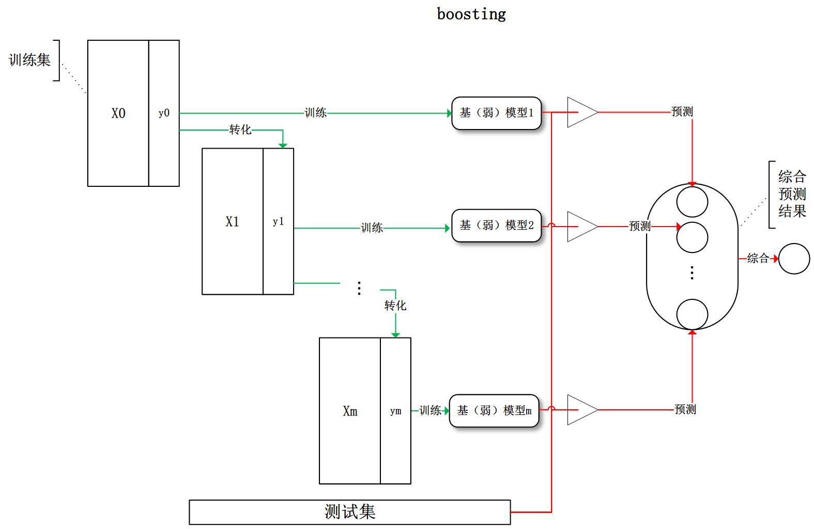
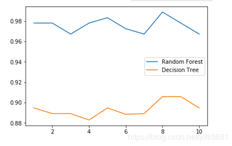
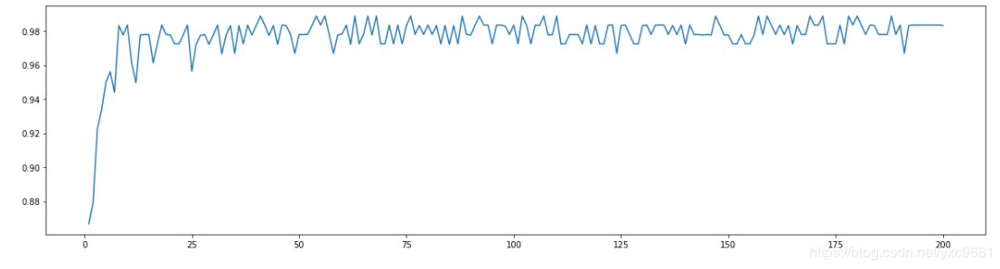
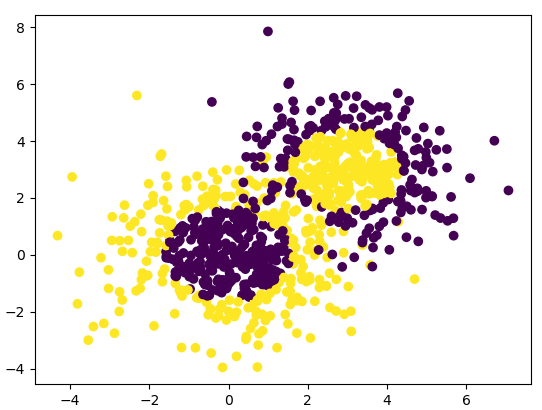
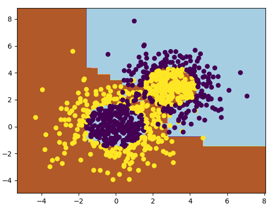

# Scikit-Learn集成学习

## 1.前言

　　很多人在竞赛（Kaggle，天池等）或工程实践中使用了集成学习（例如，RF、GTB等），确实也取得了不错的效果，在保证准确度的同时也提升了模型防止过拟合的能力。但是，我们真的用对了集成学习吗？

　　sklearn提供了sklearn.ensemble库，支持众多集成学习算法和模型。恐怕大多数人使用这些工具时，要么使用默认参数，要么根据模型在测试集上的性能试探性地进行调参（当然，完全不懂的参数还是不动算了），要么将调参的工作丢给调参算法（网格搜索等）。这样并不能真正地称为“会”用sklearn进行集成学习。

　　我认为，学会调参是进行集成学习工作的前提。然而，第一次遇到这些算法和模型时，肯定会被其丰富的参数所吓到，要知道，教材上教的伪代码可没这么多参数啊！！！没关系，暂时，我们只要记住一句话：参数可分为两种，一种是影响模型在训练集上的准确度或影响防止过拟合能力的参数；另一种不影响这两者的其他参数。模型在样本总体上的准确度（后简称准确度）由其在训练集上的准确度及其防止过拟合的能力所共同决定，所以在调参时，我们主要对第一种参数进行调整，最终达到的效果是：模型在训练集上的准确度和防止过拟合能力的大和谐！

------

##  2.集成学习是什么？

　　集成学习（ensemble learning）是时下非常流行的机器学习算法，它本身不是一个单独的机器学习算法，而是通过在数据上构建多个模型，集成所有模型的建模结果。基本上所有的机器学习领域都可以看到集成学习的身影，在现实中集成学习也有相当大的作用，它可以用来做市场营销模拟的建模，统计客户来源，保留和流失，也可用来预测疾病的风险和病患者的易感性。在现在的各种算法竞赛中，随机森林，梯度提升树（GBDT），Xgboost等集成算法的身影也随处可见，可见其效果之好，应用之广。

　　目前，有三种常见的集成学习框架：bagging，boosting和stacking。国内，南京大学的周志华教授对集成学习有很深入的研究，其在09年发表的一篇概述性论文[《](http://cs.nju.edu.cn/zhouzh/zhouzh.files/publication/springerEBR09.pdf)[Ensemble Learning》](http://cs.nju.edu.cn/zhouzh/zhouzh.files/publication/springerEBR09.pdf)对这三种集成学习框架有了明确的定义，概括如下：

 　bagging：从训练集从进行子抽样组成每个基模型所需要的子训练集，对所有基模型预测的结果进行综合产生最终的预测结果：


　　boosting：训练过程为阶梯状，基模型按次序一一进行训练（实现上可以做到并行），基模型的训练集按照某种策略每次都进行一定的转化。对所有基模型预测的结果进行线性综合产生最终的预测结果：



　　有了这些基本概念之后，直觉将告诉我们，由于不再是单一的模型进行预测，所以模型有了“集思广益”的能力，也就不容易产生过拟合现象。但是，直觉是不可靠的，接下来我们将从模型的偏差和方差入手，彻底搞清楚这一问题。

## 3.随机森林RandomForestClassifier

### 3.1 概念

机器学习中，随机森林是一个包含多个决策树的分类器， 并且其输出的类别是由个别树输出的类别的众数而定，这意味着通过在分类器构造中引入随机性来创建一组不同的分类器。
对集合的预测给出了个体分类器的平均预测。

- 随机森林一般是用bagging方法进行训练，每个决策树中使用的样本数都是全部的子训练集，RandomForestClassifier中的参数与决策树基本一致，都是对决策树的形状等性质做一些规定
- 相比于Bagging方法，随机森林引入了一些额外的随机性，因为它不是在所有的特征中选择最好的分类特征用于分离一个节点，而是在随机的一些特征中选择最优的节点分割方法。这会增大模型的偏差，但是减小了模型的方差。
- 如果在bagging方法中设置模型随机选择特征进行基学习器的训练，那么它与随机森林等价(其他参数相同的情况下)
  

### 3.2 步骤

1.从样本集中通过重采样的方式产生n个样本
2.假设样本特征数目为a，对n个样本选择a中的k个特征，用建立决策树的方式获得最佳分割点
3.重复m次，产生m棵决策树
4.多数投票机制来进行预测

### 3.3 优势

随机森林算法几乎不需要输入的准备。它们不需要测算就能够处理二分特征、分类特征、数值特征的数据。随机森林算法能完成隐含特征的选择，并且提供一个很好的特征重要度的选择指标。
随机森林算法训练速度快。性能优化过程刚好又提高了模型的准确性

### 3.4 实践

**参数 n_estimators**
这是森林中树木的数量，即基评估器的数量。这个参数对随机森林模型的精确性影响是单调的，n_estimators越大，模型的效果往往越好。但是相应的，任何模型都有决策边界，n_estimators达到一定的程度之后，随机森林的精确性往往不在上升或开始波动，并且，n_estimators越大，需要的计算量和内存也越大，训练的时间也会越来越长。对于这个参数，我们是渴望在训练难度和模型效果之间取得平衡。n_estimators的默认值在现有版本的sklearn中是10，但是在即将更新的0.22版本中，这个默认值会被修正为100。这个修正显示出了使用者的调参倾向：要更大的n_estimators。
树模型的优点是简单易懂，可视化之后的树人人都能够看懂，可惜随机森林是无法被可视化的。所以为了更加直观地让大家体会随机森林的效果，我们来进行一个随机森林和单个决策树效益的对比。我们依然使用红酒数据集。

1. **导入我们需要的包**

   ```python
   from sklearn.tree import DecisionTreeClassifier
   from sklearn.ensemble import RandomForestClassifier
   from sklearn.datasets import load_wine
   ```

   

2. **导入需要的数据集**

   ```python
   wine = load_wine()
   wine.data
   wine.target
   ```

   

3. **复习:sklearn建模的基本流程**

   ```python
   from sklearn.model_selection import train_test_split
   Xtrain, Xtest, Ytrain, Ytest = train_test_split(wine.data,wine.target,test_size=0.3)
   clf = DecisionTreeClassifier(random_state=0)
   rfc = RandomForestClassifier(random_state=0)
   clf = clf.fit(Xtrain,Ytrain)
   rfc = rfc.fit(Xtrain,Ytrain)
   score_c = clf.score(Xtest,Ytest)
   score_r = rfc.score(Xtest,Ytest)
   print("Single Tree:{}".format(score_c)
     ,"Random Forest:{}".format(score_r)
     )
   #带大家复习一下交叉验证
   #交叉验证：是数据集划分为n分，依次取每一份做测试集，每n-1份做训练集，多次训练模型以观测模型稳定性的方法
   rfc_l = []
   clf_l = []
   for i in range(10):
     rfc = RandomForestClassifier(n_estimators=25)
     rfc_s = cross_val_score(rfc,wine.data,wine.target,cv=10).mean()
     rfc_l.append(rfc_s)
     clf = DecisionTreeClassifier()
     clf_s = cross_val_score(clf,wine.data,wine.target,cv=10).mean()
     clf_l.append(clf_s)
   ```

   

4. **画出随机森林和决策树在十组交叉验证下的效果对比**

   ```python
   #带大家复习一下交叉验证
   #交叉验证：是数据集划分为n分，依次取每一份做测试集，每n-1份做训练集，多次训练模型以观测模型稳定性的方法
   rfc_l = []
   clf_l = []
   for i in range(10):
     rfc = RandomForestClassifier(n_estimators=25)
     rfc_s = cross_val_score(rfc,wine.data,wine.target,cv=10).mean()
     rfc_l.append(rfc_s)
     clf = DecisionTreeClassifier()
     clf_s = cross_val_score(clf,wine.data,wine.target,cv=10).mean()
     clf_l.append(clf_s)
   plt.plot(range(1,11),rfc_l,label = "Random Forest")
   plt.plot(range(1,11),clf_l,label = "Decision Tree")
   plt.legend()
   plt.show()
   #是否有注意到，单个决策树的波动轨迹和随机森林一致？
   #再次验证了我们之前提到的，单个决策树的准确率越高，随机森林的准确率也会越高
   ```

   

5. **n_estimators的学习曲线**
   
   ```python
   #####【TIME WARNING: 2mins 30 seconds】#####
   superpa = []
   for i in range(200):
     rfc = RandomForestClassifier(n_estimators=i+1,n_jobs=-1)
     rfc_s = cross_val_score(rfc,wine.data,wine.target,cv=10).mean()
     superpa.append(rfc_s)
   print(max(superpa),superpa.index(max(superpa)))
   plt.figure(figsize=[20,5])
   plt.plot(range(1,201),superpa)
   plt.show()
   ```
   
   
   
   

## 4.Adaboost算法

### 4.1 概念

Adaboost是一种迭代算法，其核心思想是针对同一个训练集训练不同的分类器(弱分类器)，然后把这些弱分类器集合起来，构成一个更强的最终分类器(强分类器)。

其算法本身是通过改变数据分布来实现的，它根据每次训练集之中每个样本的分类是否正确，以及上次的总体分类的准确率，来确定每个样本的权值。将修改过权值的新数据集送给下层分类器进行训练，最后将每次训练得到的分类器最后融合起来，作为最后的决策分类器。

每个连续的迭代，样本权重分别修改和学习算法重新的加权数据。在给定的步骤中，在前一步引起的增强模型错误地预测了那些训练实例，它们的权重增加，而正确预测的权重则降低。随着迭代的进行，难以预测的例子受到越来越多的影响。因此，每一个后继的弱学习者都必须集中精力于前面的序列中遗漏的例子。

### 4.2 步骤

1. 重复地从一个样本集合D中采样n个样本
2. 针对每次采样的子样本集，进行统计学习，获得假设Hi
3. 将若干个假设进行组合，形成最终的假设Hfinal
4. 将最终的假设用于具体的分类任务

### 4.3 实例

这里我们用一个具体的例子来讲解AdaBoostClassifier的使用。

完整代码参见github: https://github.com/ljpzzz/machinelearning/blob/master/ensemble-learning/adaboost-classifier.ipynb

首先我们载入需要的类库：

```python
import numpy as np
import matplotlib.pyplot as plt
from sklearn.ensemble import AdaBoostClassifier
from sklearn.tree import DecisionTreeClassifier
from sklearn.datasets import make_gaussian_quantiles
```

接着我们生成一些随机数据来做二元分类，如果对如何产生随机数据不熟悉，在另一篇文章[机器学习算法的随机数据生成](http://www.cnblogs.com/pinard/p/6047802.html)中有比较详细的介绍。

```python
# 生成2维正态分布，生成的数据按分位数分为两类，500个样本,2个样本特征，协方差系数为2
X1, y1 = make_gaussian_quantiles(cov=2.0,n_samples=500, n_features=2,n_classes=2, random_state=1)
# 生成2维正态分布，生成的数据按分位数分为两类，400个样本,2个样本特征均值都为3，协方差系数为2
X2, y2 = make_gaussian_quantiles(mean=(3, 3), cov=1.5,n_samples=400, n_features=2, n_classes=2, random_state=1)
#讲两组数据合成一组数据
X = np.concatenate((X1, X2))
y = np.concatenate((y1, - y2 + 1))
```

我们通过可视化看看我们的分类数据，它有两个特征，两个输出类别，用颜色区别。

```python
plt.scatter(X[:, 0], X[:, 1], marker='o', c=y)
```

输出为下图：



可以看到数据有些混杂，我们现在用基于决策树的Adaboost来做分类拟合。

```python
bdt = AdaBoostClassifier(DecisionTreeClassifier(max_depth=2, min_samples_split=20, min_samples_leaf=5),
                         algorithm="SAMME",
                         n_estimators=200, learning_rate=0.8)
bdt.fit(X, y)
```

这里我们选择了SAMME算法，最多200个弱分类器，步长0.8，在实际运用中你可能需要通过交叉验证调参而选择最好的参数。拟合完了后，我们用网格图来看看它拟合的区域。

```python
x_min, x_max = X[:, 0].min() - 1, X[:, 0].max() + 1
y_min, y_max = X[:, 1].min() - 1, X[:, 1].max() + 1
xx, yy = np.meshgrid(np.arange(x_min, x_max, 0.02),
                     np.arange(y_min, y_max, 0.02))

Z = bdt.predict(np.c_[xx.ravel(), yy.ravel()])
Z = Z.reshape(xx.shape)
cs = plt.contourf(xx, yy, Z, cmap=plt.cm.Paired)
plt.scatter(X[:, 0], X[:, 1], marker='o', c=y)
plt.show()
```

输出的图如下：



从图中可以看出，Adaboost的拟合效果还是不错的，现在我们看看拟合分数：

```python
print("Score:", bdt.score(X,y))
```

输出为：

```shell
Score: 0.913333333333
```

也就是说拟合训练集数据的分数还不错。当然分数高并不一定好，因为可能过拟合。

现在我们将最大弱分离器个数从200增加到300。再来看看拟合分数。

```python
bdt = AdaBoostClassifier(DecisionTreeClassifier(max_depth=2, min_samples_split=20, min_samples_leaf=5),
                         algorithm="SAMME",
                         n_estimators=300, learning_rate=0.8)
bdt.fit(X, y)
print("Score:", bdt.score(X,y))
```

此时的输出为：

```shell
Score: 0.962222222222
```

这印证了我们前面讲的，弱分离器个数越多，则拟合程度越好，当然也越容易过拟合。

现在我们降低步长，将步长从上面的0.8减少到0.5，再来看看拟合分数。

```python
bdt = AdaBoostClassifier(DecisionTreeClassifier(max_depth=2, min_samples_split=20, min_samples_leaf=5),
                         algorithm="SAMME",
                         n_estimators=300, learning_rate=0.5)
bdt.fit(X, y)
print("Score:", bdt.score(X,y))
```

此时的输出为：

```
Score: 0.894444444444
```

可见在同样的弱分类器的个数情况下，如果减少步长，拟合效果会下降。

最后我们看看当弱分类器个数为700，步长为0.7时候的情况：

```
bdt = AdaBoostClassifier(DecisionTreeClassifier(max_depth=2, min_samples_split=20, min_samples_leaf=5),
                         algorithm="SAMME",
                         n_estimators=600, learning_rate=0.7)
bdt.fit(X, y)
print "Score:", bdt.score(X,y)
```

此时的输出为：

```
Score: 0.961111111111
```

此时的拟合分数和我们最初的300弱分类器，0.8步长的拟合程度相当。也就是说，在我们这个例子中，如果步长从0.8降到0.7，则弱分类器个数要从300增加到700才能达到类似的拟合效果。

## 5. 投票分类器(Voting Classifiers)

定义：对于一个训练集，有很多分类器，比如说Logistic、KNN、SVM等。对于一个样本，我们给出所有分类器的分类结果，然后利用这个结果对样本的分类进行预测

- hard voting classifier ：不考虑分类器的差别，比如说他们的准确性等，直接取投票数最多的类别，将其作为我们最后的对于该样本的分类结果

- soft voting classifier：利用所有分类器给出的各个类别的概率，最后利用各个类别的概率之和进行预测，soft voting的准确率要略微高于hard voting，因为它考虑了每个模型的不同

在很多情况下，投票分类器的精度会比集合里最好的分类器的精度还要高(对于大多数测试集)，因为这种集成方法提高了模型的鲁棒性。
当集成方法中的基学习器之间互相独立时，集成方法的效果会更好

```python
from sklearn.ensemble import RandomForestClassifier
from sklearn.ensemble import VotingClassifier
from sklearn.linear_model import LogisticRegression
from sklearn.svm import SVC
from sklearn.model_selection import train_test_split
from sklearn.datasets import make_moons
from sklearn.metrics import accuracy_score

# 导入数据
X, y = make_moons(n_samples=500, noise=0.30, random_state=42)
X_train, X_test, y_train, y_test = train_test_split(X, y, random_state=42)

# 三个基学习器
log_clf = LogisticRegression()
rf_clf = RandomForestClassifier()
svm_clf = SVC()
# 投票分类器
voting_clf = VotingClassifier( estimators=[("lr", log_clf), ("rf", rf_clf), ("svc", svm_clf)], voting="hard" )
# voting_clf.fit( X_train, y_train )

for clf in ( log_clf, rf_clf, svm_clf, voting_clf ):
    clf.fit( X_train, y_train )
    y_pred = clf.predict( X_test )
    print( clf.__class__.__name__, accuracy_score(y_test, y_pred) )
```

输出：
```python
LogisticRegression 0.864
RandomForestClassifier 0.88
SVC 0.888
VotingClassifier 0.896
```


## 6.参考资料

1. 使用sklearn进行集成学习——理论 https://www.cnblogs.com/jasonfreak/p/5657196.html

2. 使用sklearn进行集成学习——实践 https://www.cnblogs.com/jasonfreak/p/5720137.html
3. sklearn集成学习：https://blog.csdn.net/qq_39751437/article/details/86566864

4. 随机森林：https://blog.csdn.net/yxc9681/article/details/88383974

