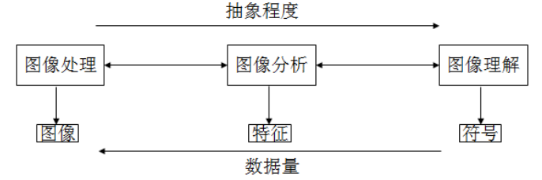
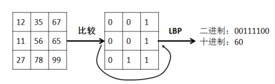

# 图像数据分析

## 1.图像数据

图像是对真实存在的或者人们想象的客观对象的一种表示方式，这种方式能被人的视觉系统感知。援引百度百科的介绍“广义上，图像就是所有具有视觉效果的画面，它包括：纸介质上的、底片或照片上的、电视、投影仪或计算机屏幕上的”。

由于成像原理、成像技术、存储方式等的不同，图像可分为不同的类型。

首先，根据记录方式的不同，图像可分为模拟图像和数字图像。

模拟图像：通过某种具有连续变化值的物理量（如光、电等的强弱）来记录图像亮度信息，在计算机和数码相机发明之前的电视、照相机等设备获取或展示的都是模拟图像。

数字图像：又称数码图像或数位图像，是由模拟图像数字化得到的、以像素为基本元素的、可以用数字计算机或数字电路存储和处理的图像，其光照位置和强度都是离散的。

像素（Pixel）：是数字图像的重要概念，又称为图像元素（Picture Element），是指图像的基本原色素及其灰度的基本编码，是构成数码影像的基本单元，通常以像素每英寸 PPI（Pixels Per Inch）为单位来表示影像分辨率的大小。

根据像素取值的不同，数字图像可以分为二值图像（由 1 位二进制存储，表示只有两种颜色）、8 位图像（由 8 位二进制表示像素值，可以表示 256 种颜色或亮度）、16 位图像（每个像素由 16 位二进制表示）等。

根据应用领域的不同，数字图像还可以分为医学图像、遥感图像、视频监控等。视频的每一帧可以看作单幅静态图像，因此，视频可以看作图像在时间维度的扩展。

根据存储格式的不同，数字图像还可以分为不同的文件类型：bmp、png、jpg 等。

此外，图像不仅仅限制人眼可以看到的可见光图像，成像设备几乎覆盖了全部电磁波谱，包括超声波、电子显微镜和计算机产生的图像等。

## 2.图像数据分析方法

广义的数字图像处理，又称为图像工程，是与图像有关的技术的总称，包括图像的采集、编码、传输、存储、生成、显示、输出、图像的变换、增强、恢复和重建、图像分割、目标检测、图像的表达和描述、特征提取、图像分类和识别、图像匹配、场景理解等。

（1）狭义的图像处理，包括图像采集和从图像到图像的变换，主要作用是改善图像视觉效果和为图像分析和理解作初步的处理，包括对比度调节、图像编码、去噪以及各种滤波技术的研究、图像恢复和重建等。

（2）图像分析，是指从图像中取出感兴趣的数据，以描述图像中目标的特点。该层级输入是图像，输出是从图像中提取的边缘、轮廓等特征属性。

（3）图像理解是在图像分析的基础上，利用模式识别和人工智能方法研究各目标的性质和相互关系，对图像中的目标进行分析、描述、分类和解释。一般输入为图像，输出为该图像的语义描述。



从技术的角度，图像数据分析的常用方法有：

1） 图像变换。由于图像矩阵一般具有很高的维度，直接在空间域中进行处理计算量很大。通常采用各种图像变换的方法，如傅立叶变换、沃尔什变换、离散余弦变换、小波变换等，将空间域的处理转换为变换域处理，不仅可减少计算量，而且往往对噪声更鲁棒。

2） 图像编码和压缩。编码是压缩技术中最重要的方法，它在图像处理技术中是发展最早且比较成熟的技术。图像编码压缩技术可减少描述图像的数据量（即比特数），以便节省图像传输、处理时间和减少所占用的存储器容量。压缩分为有损压缩和无损压缩，不失真的前提下获得图像是无损压缩，在允许的失真条件下获得图像是有损压缩，例如，一种常用的图像压缩技术是只保留图像变换后频域的大系数，采用对应的反变换得到恢复图像。
3） 图像增强和复原。客观世界是三维空间，但一般图像是定义在二维区域上的，图像在反映三维世界的过程中必然丢失了部分信息。即使是记录下来的信息也可能有失真，影响人的主观感受和物体识别等后续应用。因此，需要从成像机理出发，建立合适的数学模型，通过模型求解提高图像质量或从图像中恢复和重建信息。图像增强和复原的目的是为了提高图像的质量，如去除噪声，提高图像的清晰度等。图像增强不考虑图像降质的原因，突出图像中所感兴趣的部分。如强化图像高频分量，可使图像中物体轮廓清晰，细节明显；如强化低频分量可减少图像中噪声影响。图像复原要求对图像降质的原因有一定的了解，一般讲应根据降质过程建立“降质模型”，通过模型求解恢复或重建原来的图像，常用于图像去噪、插值、超分辨率等。
4） 图像分割。图像分割是数字图像处理中的关键技术之一。图像分割是提取图像中有意义的特征，包括图像中的边缘、区域等，这是进一步进行图像识别、分析和理解的基础。虽然目前已研究出不少边缘提取、区域分割的方法，但还没有一种普遍适用于各种图像的有效方法。因此，对图像分割的研究还在不断深入之中，是目前图像处理中研究的热点之一。
5） 图像描述和特征提取。图像描述是图像识别和理解的必要前提。作为最简单的二值图像可采用其几何特性描述物体的特性，一般图像的描述方法采用二维形状描述，它有边界描述和区域描述两类方法。对于特殊的纹理图像可采用二维纹理特征描述。随着图像处理研究的深入发展，已经开始进行三维物体描述的研究，提出了体积描述、表面描述、广义圆柱体描述等方法。
6） 图像分类（识别）。图像分类（识别）属于模式识别的范畴，其主要内容是图像经过某些预处理（增强、复原、压缩）后，进行图像分割和特征提取，从而进行判决分类。图像分类常采用经典的模式识别方法，有统计模式分类和句法（结构）模式分类，近年来新发展起来的模糊模式识别和人工神经网络模式分类在图像识别中也越来越受到重视。

## 3.图像数据分析案例

在本我们分析图像数据时，仍将使用到Python 程序模块，如 Numpy、SciPy、scikit-learn、matplotilib 等。此外，还需要 Python 图像处理类库（Python Imaging Library，PIL），它为 Python 解释器提供了大量的图像和图形处理功能，能够对图像数据进行缩放、裁剪、旋转、滤波、颜色空间转换、对比度增强等，该类库支持多种图像文件格式的读写。PIL 已经是 Python 平台事实上的图像处理标准库了 。PIL 功能非常强大，但 API 却非常简单易用。在进行图像数据分析时，我们需要对向量、矩阵进行操作，因此，PIL 模块结合 Numpy 模块提供的向量、矩阵等数组对象的处理方法和线性代数函数，以及 SciPy 提供的数值积分、优化、统计、信号处理、图像处理等高效操作，我们可以完成大多数的图像分析任务。

```shell
$pip install Pillow
```

 一些志愿者在 PIL 的基础上创建了兼容的版本，名字叫 Pillow，与 PIL 使用基本相同，支持最新 Python 3.x，又加入了许多新特性。此外，在 python 中进行图像处理，还可以使用 Pandas、OpenCV、 Tensorflow 等工具包。

### 3.1 PIL：Python 图像处理类库应用示例

#### 3.1.1 Image 模块

Image 模块中定义的 Image 类是 PIL 类库中最重要的类，实现了图像文件的读写、显示、颜色空间转换等方法。

```python
from PIL import Image

# 加载图像数据到 Image 对象（Image 对象的 open()方法可以根据文件扩展名判断图像的格式）
im = Image.open('datas/python.jpg')
# 利用 Image 对象的属性打印输出图像的类型、大小和模式
print(im.format, im.size, im.mode)
```

format 识别图像的源格式，如果该文件不是从文件中读取的，则被置为 None值；

size 是有两个元素的元组，其值为像素意义上的宽和高；

mode 表示颜色空间模式，定义了图像的类型和像素的位宽。

PIL 支持如下模式：
1：1 位像素，表示黑和白，但是存储的时候每个像素存储为 8bit。
L：8 位像素，对应灰度图像，可以表示 256 级灰度。
P：8 位像素，使用调色板映射到其他模式。
RGB：3x8 位像素，为真彩色。
RGBA：4x8 位像素，有透明通道的真彩色。
CMYK：4x8 位像素，颜色分离。
YCbCr：3x8 位像素，彩色视频格式。
I：32 位整型像素。
F：32 位浮点型像素。

读取的图像数据可以利用 Image 对象的 show()方法进行显示

```python
im.show()
```

图像颜色空间转换可以使用 convert()方法来实现，例如，将读取的 im 数据转换为灰度图像：

```python
im_gray=im.convert('L')
```

图像数据的保存使用 save()方法：

```python
# 将 im_gray 保存为 png 图像文件，文件名为 python_gray.png
im_gray.save('datas/python_gray.png')
```

Image 对象的 crop()方法可以从一副图像中裁剪指定的矩形区域，它接收包含四个元素的元组作为参数，各元素的值分别对应裁剪区域在原图像中的左上角和右下角位置的坐标，坐标系统的原点（0, 0）在图像的左上角：

```python
# 使用四元组(左，上，右，下)指定裁剪区域
box = (60, 60, 90, 90)
# 裁剪图像区域
region = im.crop(box)
region.show()
```

Image 对象的 transpose()方法通过传入参数 Image.ROTATE_#（#代表旋转的角度，可以是90°、180°、270°）可以将图像数据进行旋转；也可以传入参数 Image.FLIP_LEFT_RIGHT 将图像做水平翻转，传入参数 Image.FLIP_TOP_BOTTOM 做垂直翻转等：

```python
# 将图像数据 region 旋转 90°
im_90 = im.transpose(Image.ROTATE_90)
im_90.show()

# 将图像做水平翻转
im_flip = im.transpose(Image.FLIP_LEFT_RIGHT)
im_flip.show()
```

Image 对象的 rotate ()方法可以将图像数据进行任意角度的旋转：

```python
# 将图像数据 region 逆时针旋转 30°
im_30 = im.rotate(30)
im_30.show()
```

Image 对象的 paste ()方法可以为图像对象在特定位置粘贴图像数据：

```python
# 创建图像对象 im 的拷贝
im_paste = im
box = (60, 60, 90, 90)
region = im.crop(box)
region_90 = region.transpose(Image.ROTATE_90)
# 将 region_90 贴在图像对象 im_paste 中 box 对应的位置
im_paste.paste(region_90, box)
im_paste.show()  # 显示图像
```

需要注意的，粘贴的图像数据必须与粘贴区域具有相同的大小，但是，它们的颜色模式可以不同，paste()方法在粘贴之前自动将粘贴的图像数据转换为与被粘贴图像相同的颜色模式。

PIL 可以对多波段图像的每个波段分别处理。

Image 对象的 getbands()方法可以获得每个波段的名称

split()方法将多波段图像分解为多个单波段图像

merge()方法可以按照用户指定的颜色模式和单波段图像数据的顺序，将它们组合成新的图像

```python
# 显示每个波段的名称
print(im.getbands())

# 将 RGB 彩色图像对象 im 分解为三个单波段图像（红、绿、蓝）
r, g, b = im.split()
# 显示每个波段图像
r.show()
g.show()
b.show()
# 按照 RGB 颜色模式，并将波段按蓝、绿、红顺序组合生成新的图像
im_bgr = Image.merge("RGB", (b, g, r))
im_bgr.show()
```

Image 对象的 point()方法用于对图像每个像素的值进行数值运算，由此可以完成图像反色、线性拉伸、归一化等。

```python
im_gray = Image.open('datas/python_gray.png')
# 将图像数据 im_gray 进行反色处理
im_gray_inv = im_gray.point(lambda i: 255 - i)
im_gray_inv.show()
```

图像的直方图用来表征该图像的像素值的分布情况。Image 对象的 histogram()方法将像素值的范围分成一定数目的小区间，统计落入每个小区间的像素值数目。以下代码可以生成一副图像的直方图：

```python
import matplotlib.pyplot as plt

im_hist = im.histogram()  # 获得直方图数据
fig, ax = plt.subplots(1, 1)
ax.hist(im_hist, [0, 100, 150, 200, 250])
plt.show()
```

在某些情况下,一副图像中大部分像素的强度都集中在某一区域，而质量较高的图像，像素的强度应该均衡分布。直方图均衡化是指将表示像素强度的直方图进行拉伸,将其平坦化，使变换后的图像中每个灰度值的分布概率基本相同。在对图像做进一步处理之前，直方图均衡化可以增强图像的对比度，通常是对图像灰度值进行归一化的一个非常好的方法。

PIL 也可以用于处理序列图像，即我们常见到的动态图，最常见的后缀为.gif ，当我们打开这类图像文件时，PIL 自动载入图像的第一帧。我们可以使用 seek()和 tell()方法在各帧之间切换。

我们可以调用 Image 对象的 resize()方法调整一副图像的大小，该方法接受一个表示新图像大小的元组为参数，返回原图像缩放后的拷贝：

```python
# 将 im 调整为宽60和高45像素
im_half = im.resize((60, 45))
im_half.show()
```

#### 3.1.2 ImageFilter 模块

PIL 提供的 ImageFilter 模块包含一组预先定义的滤波器，可以结合 Image 对象的 filter()方法实现图像平滑和增强。目前，该模块支持 BLUR、CONTOUR、DETAIL、EDGE_ENHANCE、EDGE_ENHANCE_MORE、EMBOSS、FIND_EDGES、SMOOTH、SMOOTH_MORE、SHARPEN、GaussianBlur、RankFilter 等。

```python
from PIL import Image
from PIL import ImageFilter

boat = Image.open("datas/python.jpg")
boat_blur = boat.filter(ImageFilter.BLUR)  # 模糊滤波
boat_blur.show()

boat_edge = boat.filter(ImageFilter.FIND_EDGES)  # 边缘检测
boat_edge.show()

boat_contour = boat.filter(ImageFilter.CONTOUR)  # 找轮廓
boat_contour.show()

# 每个像素取值为它的 3*3 邻域中第三大的像素值
boat_rank = boat.filter(ImageFilter.RankFilter(9, 3))
boat_rank.show()
```

#### 3.1.3 ImageEnhance 模块

PIL 中更高级的图像增强可以借助 ImageEnhance 模块完成，例如：

ImageEnhance.Contrast()用于调整对比度

ImageEnhance.Sharpness()用于图像锐化

ImageEnhance.Color()用于图像颜色均衡

ImageEnhance.Brightness()用于调整图像亮度等等。

```python
from PIL import Image, ImageEnhance

im = Image.open('datas/python.jpg')
# 调整对比度
im_contrast = ImageEnhance.Contrast(im)
for i in [0.3, 1.5, 3]:
    temp = im_contrast.enhance(i)
    temp.show()
```

### 3.2 Numpy 图像数据分析示例

PIL 提供了大量基本的图像处理模块和方法，但当我们需要完成一些高级图像处理任务，或者自定义一组图像处理流程时，还需要借助于其他模块。首先可以考虑的就是提供了向量、矩阵、方程组等操作方法的 Numpy。

PIL 模块读取的图像数据不能直接与整型、浮点型等数据类型进行运算，我们可以通过 array()方法将图像数据转换成 Numpy 的数组对象，之后利用 Numpy 执行任意数学操作，完成一些复杂的图像处理流程。Numpy 处理后的数据想要调用 PIL 提供的方法时，再利用 Image 对象的fromarray()方法创建图像实例。

```python
from PIL import Image
from numpy import *

boat = array(Image.open('datas/python_gray.png'))
# 对图像像素值进行二次多项式变换
boat_new = 255.0 * (boat / 255.0) ** 2
# 由 boat_new 创建图像实例
im_boat_new = Image.fromarray(boat_new)
# 调研 Image 对象的 show()方法显示图像
im_boat_new.show()
```

上述方法利用简单的表达式进行图像处理，还可以通过组合 point()和 paste()还能选择性地处理图片的某一区域。

Numpy 的矩阵运算为图像处理带来很大的方便。例如，奇异值分解(Singular Value Decomposition，SVD)是将矩阵分解成三个矩阵 U，S，V 的乘积。其中，S 是由奇异值组成的对角矩阵，奇异值大小与重要性正相关，从左上角到右下角重要程度依次递减；U 和 V 分别表示左奇异向量和右奇异向量。在图像处理领域，SVD 分解经常应用于以下几个方面：

图像压缩（image compression）：多数情况下，数据的能量比较集中。部分奇异值和奇异向量就可以表达出图像的大部分信息，舍弃掉一部分奇异值可以实现压缩。
        图像降噪（image denoise）：由于能量集中，噪声一般存在于奇异值小的部分，将这部分奇异值置零，再进行 SVD 重构可以实现图像去噪。
        特征降维：与图像压缩类似，当样本数据具有高维特征时，数据量和运算量都较大，可以先用 SVD 提取主要成分，再进行距离计算、分类等。

我们来看一个对图像数据矩阵进行奇异值分解和重构的例子，需要使用的是 numpy库提供的linalg.svd()。

```python
# demo_image_svd.py
from PIL import Image
import numpy as np
import matplotlib.pyplot as plt

# 读取图像数据，并将其转换为 numpy 数组对象
img = np.array(Image.open('datas/python_gray.png'))
h, w = img.shape[:2]  # 查看图像大小

# 为图像数据添加标准差为 5 的高斯白噪声
img_noisy = img + 5.0 * np.random.randn(h, w)
Image.fromarray(img_noisy).convert('L').save('datas/python_gray_noisy.png')

# 利用 np.linalg.svd 进行奇异值分解
u, s, vt = np.linalg.svd(img_noisy)
plt.figure(1)  # 用于显示图像
plt.subplot(241);
plt.imshow(img, cmap='gray');
plt.xticks([]);
plt.yticks([]);
plt.subplot(242);
plt.imshow(img_noisy, cmap='gray');
plt.xticks([]);
plt.yticks([]);
plt_num = 2

# 分别取前 n(n=1,5,10,15)个奇异值和奇异向量重构图像:
for s_num in [1, 3, 5, 10, 15]:
    s1 = np.diag(s[:s_num], 0)  # 用 s_num 个奇异值生成新对角矩阵

    # 将 h-s_num 个左奇异向量置零
    u1 = np.zeros((h, s_num), float)
    u1[:, :] = u[:, :s_num]

    # 将 w-s_num 个右奇异向量置零
    vt1 = np.zeros((s_num, w), float)
    vt1[:, :] = vt[:s_num, :]

    # 重构图像
    svd_img = u1.dot(s1).dot(vt1)

    # 显示图像
    plt_num += 1
    plt.subplot(2, 4, plt_num)
    plt.imshow(svd_img, cmap='gray')
    plt.xticks([])
    plt.yticks([])

    # 保存图像
    Image.fromarray(svd_img).convert('L').save('datas/python_gray_' + str(s_num) + '.png')
plt.show()
```

以上代码中，我们对原始 boat 图像添加噪声，对含噪声图像进行奇异值分解，之后利用部分奇异值重构图像。可以看出，随着保留的主要奇异值个数的增加，重构图像与原始图像的接近程度越高，其所含的噪声也要比含噪声图像弱，但保留的奇异值个数超过某个值以后，重构图像所含噪声开始增加，越来越接近含噪声图像。

### 3.3 Scipy 图像数据分析示例

SciPy 是在 NumPy 基础上开发的用于数值运算的开源工具包。SciPy 提供很多高效的操作，可以实现数值积分、优化、统计、信号处理、图像处理功能。

Scipy 的 misc 模块提供了图像读写、缩放、旋转、显示的方法，还包含了两个示例图像。该模块依赖于 PIL，一些方法在 scipy1.1.0 版本中已不建议使用，并将在 1.2.0 版本中移除，这里只做简单介绍。方法名称和对应的功能如

```python
# demo_im_fft2.py
from PIL import Image
import numpy as np
from scipy.fftpack import fft2, ifft2  # 导入傅里叶变换模块

im = np.array(Image.open('datas/python_gray.png'))
im_fft = fft2(im)  # 二维傅里叶变换
fft_mag = np.abs(im_fft)  # 计算傅里叶变换系数的幅值

# 将幅值排序，保留最大的 20%，其它值置零
sort_fft_mag = np.sort(fft_mag.flatten())
thresh = sort_fft_mag[-np.int(sort_fft_mag.size * 0.2)]
fft_mag[fft_mag < thresh] = 0

# 显示阈值后的傅里叶系数幅值
im_fft_mag = Image.fromarray(np.uint8(fft_mag)).convert('L')
im_fft_mag.show()

# 阈值后的傅里叶系数
im_fft[fft_mag < thresh] = 0

# 傅里叶反变换重构图像
im_rec = ifft2(im_fft)
im_rec = Image.fromarray(np.uint8(im_rec)).convert('L')
im_rec.show()
```

上述代码对图像数据进行傅里叶变换，保留幅值最大的 20%变换系数，再进行反变换复原图像。可以看出，不同图像阈值后的傅里叶变换系数的形状和幅值是不同的，由此可以通过变换系数区分图像。在应用机器学习算法对图像数据进行分析（例如，图像识别等）任务时可以使用像素值也可以利用图像变换的方法。以上例子中全部或部分傅里叶变换系数就可以用来做图像的特征数据，结合机器学习算法用于图像分类或识别等任务。

### 3.4 scikit-image

scikit-image 也是用于图像处理的开源 Python 工具包，它包括颜色空间转换、滤波、图论、统计特征、形态学、图像恢复、分割、边缘/角点检测、几何变换等算法。特别是特征提取模块，使得从图像提取特征更方便。

```shell
$pip install scikit-image
```

本节主要介绍 scikit-image 的特征提取模块：

#### 3.4.1 局部二值模式（Local Binary Pattern，LBP）



LBP 的应用中，如纹理分类、人脸分析等，一般都不将 LBP 图谱作为特征向量用于分类识别，而是采用 LBP 特征谱的统计直方图作为特征向量用于分类识别。

```python
local_binary_pattern(image, P, R, method='default')
```


其中，image 为指定的图像数组；P 表示圆形对称邻域点的个数；R 表示圆形邻域的半径；method可以取'default'、'ror'、'uniform'、'nri_uniform'、'var'，其中，'default'对应原始的（灰度级别，不是旋转不变的），其它方法为原始算法的改进。

```python
from skimage.io import imread
from skimage.feature import local_binary_pattern
import matplotlib.pyplot as plt

image = imread('datas/python_gray.png')
plt.imshow(image)
plt.show()
radius = 1
n_points = radius * 8

lbp = local_binary_pattern(image, n_points, radius)
plt.imshow(lbp)
plt.show()
```

#### 3.4.2 梯度方向直方图（Histogram of Oriented Gradient，HOG）

HOG 的基本思想是梯度或边缘的方向密度分布可以很好地描述图像中局部目标的表现和形状。实际应用时，我们通常是选取一幅图像中的窗口区域提取 HOG 特征，首先用一个固定大小的窗口在图像上滑动，然后计算连通区域中各像素点的梯度或边缘的方向直方图，最后将这些直方图组合起来作为特征描述。

方法原型为：

```python
hog(image, orientations=9, pixels_per_cell=(8, 8), cells_per_block=(3, 3),
        block_norm='L2-Hys', visualize=False, transform_sqrt=False,
        feature_vector=True, multichannel=None)
```

主要参数有：

image：指定图像数据

orientations：梯度方向个数，默认为 9，即在一个单元格内统计 9 个方向的梯度直方图

pixels_per_cell：单元格大小，使用两个元素的元组表示每个单元格的宽度和高度

cells_per_block：每个区域的单元格数目

visualize：布尔值，如果为 True，则可有第二个返回值为 HOG 的图像显示

transform_sqrt：布尔值，指定提取 HOG 特征前，是否进行归一化

feature_vector：布尔值，指定是否将数据作为特征向量返回

normalise：保留参数，将被工具包弃用，建议使用 transform_sqrt

```python
from skimage.io import imread
from skimage.feature import hog
from skimage import exposure
import matplotlib.pyplot as plt

image = imread('datas/python_gray.png')
# 梯度方向直方图（Histogram of Oriented Gradient，HOG）
fd, hog_image = hog(image, orientations=8, pixels_per_cell=(16, 16), cells_per_block=(1, 1), visualize=True)
fig, (ax1, ax2) = plt.subplots(1, 2, figsize=(8, 4), sharex=True, sharey=True)
ax1.axis('off')
ax1.imshow(image, cmap=plt.cm.gray)
ax1.set_title('Input image')

# Rescale histogram for better display
hog_image_rescaled = exposure.rescale_intensity(hog_image, in_range=(0, 10))
ax2.axis('off')
ax2.imshow(hog_image_rescaled, cmap=plt.cm.gray)
ax2.set_title('Histogram of Oriented Gradients')
plt.show()
```

## 4.参考文献

1. Pillow英文官方文档：https://pillow.readthedocs.io/en/stable/
2. python pillow模块用法：https://www.cnblogs.com/linyouyi/p/11429511.html
3. python图像处理之scikit-image基本用法 https://blog.csdn.net/u012300744/article/details/80083282