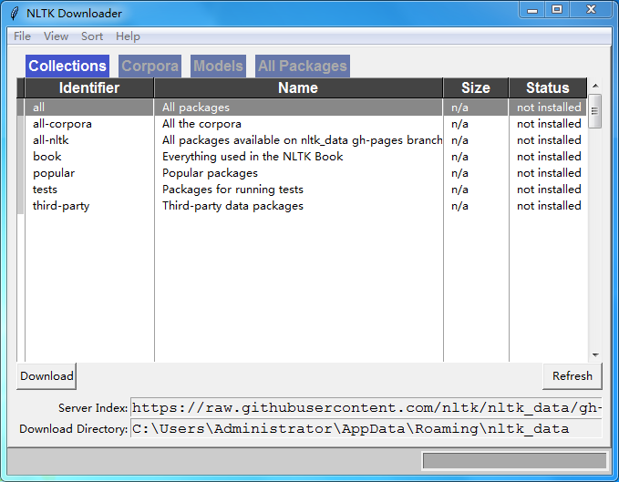
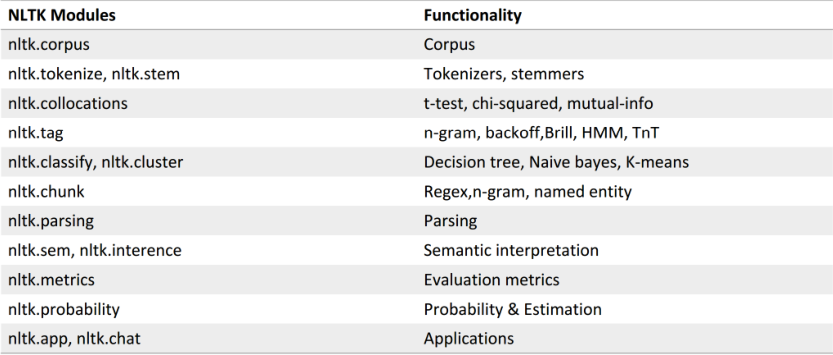
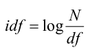

# 自然语言处理

## 1.自然语言处理概述

### 1.1 什么是自然语言处理

自然语言处理是计算机科学领域与人工智能领域中的一个重要方向。它研究如何能实现人与计算机之间用自然语言进行有效通信的各种理论和方法。
简单地说，自然语言处理（Natural Language Processing，简称 NLP）就是用计算机来处理、理解以及运用人类语言(如中文、英文等)，它属于人工智能的一个分支，是计算机科学与语言学的交叉学科。我们都知道，计算机是无法读懂我们人类的语言的，当我们把我们所谓的“自然语言”传输到计算机中，对计算器而言这或许是一系列的无意义的字符格式数据，而我们的自然语言处理技术目的就是将这些无意义数据变为计算机有意义并可以计算的数值型数据。

### 1.2 常用的自然语言处理技术

（1）词条化，即形态学分割。所谓的词条化简单的说就是把单词分成单个语素，并识别词素的种类。这项任务的难度很大程度上取决于所考虑语言的形态（即单词结构）的复杂性。英语具有相当简单的形态，尤其是屈折形态，因此常常可以简单地将单词的所有可能形式作为单独的单词进行建模。然而，在诸如土耳其语或美泰语这样的高度凝集的语言中，这种方法是不可行的，因为每一个字的词条都有成千上万个可能的词形。

（2）词性标注，即给定一个句子，确定每个单词的词性。在自然语言中有很多词，尤其是普通词，是会存在多种词性的。例如，英语中“book”可以是名词或动词（“预订”）；“SET”可以是名词、动词或形容词；“OUT”可以是至少五个不同的词类中的任何一个。有些语言比
其他语言有更多的歧义。例如具有屈折形态的语言，如英语，尤其容易产生歧义。汉语的口语是一种音调语言，也十分容易产生歧义现象。这种变形不容易通过正字法中使用的实体来传达意图的含义。

（3）词干还原是将不同词形的单词还原成其原型，在处理英文文档时，文档中经常会使用一些单词的不同形态，例如单词“observe”，可能以“observe”，“observers”，“observed”，“observer”出现，但是他们都是具有相同或相似意义的单词族，因此我们希望将这些不同的词形转换为其原型“observe”。在自然语言处理中，提取这些单词的原型在我们进行文本信息统计的时候是非常有帮助的。

（4）词型归并和词干还原的目的一样，都是将单词的不同词性转换为其原型，但是当词干还原算法简单粗略的去掉“小尾巴”这样的时候，经常会得到一些无意义的结果，例如“wolves”被还原成“wolv”，而词形归并指的是利用词汇表以及词形分析方法返回词的原型的过程。既归并变形词的结尾，例如“ing”或者“es”，然后获得单词的原型，例如对单词“wolves”进行词形归并，将得到“wolf”输出。

（5）句法分析，确定给定句子的句法树（语法分析）。自然语言的语法是模糊的，一个普通的句子可能会有多种不同的解读结果。而目前主流的句法分析技术有两种主要的分析方法即依赖分析和选区分析。依赖句法分析致力于分析句子中的单词之间的关系（标记诸如主语和谓词之间的关系），而选区句法分析则侧重于使用概率来构造解析树。

（6）断句，给定一大块文本，找出句子的边界。句子边界通常用句点或其他标点符号来标记，但这些相同的字符特殊情况下也会用于其他目的。

## 2.NLTK 入门基础

### 2.1 NLTK简介和安装

为了解决人与计算机之间用自然语言无法有效通信的问题，基于机器学习的自然语言处理技术算法应运而生。其目标是开发出一组算法，以便可以用简单的英文和计算机交流。这些算法通常挖掘文本数据的模式，以便可以从中得到了解文本内所蕴含的信息。人工智能公司大量地使用自然语言处理技术和文本分析来推送相关结果。自然语言处理技术最常用的领域包括搜索引擎、情感分析、主题建模、词性标注、实体识别等。

本文将主要介绍文本分析，以及如何从文本数据中提取有意义的信息，将用到 Python 中的 NLTK( Natural Language Toolkit)模块，NLTK 模块是自然语言处理领域中，最常使用的模块，其处理的语言多为英文，因此案例采用英文作为案例。

NLTK 是构建 Python 程序以处理人类语言数据的领先平台。它为超过 50 个语料库和词汇资源（如 WordNet）提供了易于使用的接口，并提供了一套用于分类、标记化、词干、标注、解析和语义推理的文本处理库。

```shell
pip install nltk
```

一旦你安装了 NLTK，你可以运行下面的代码来安装 NLTK 包：

```python
import nltk
nltk.download()
```

这将打开 NLTK 下载器来选择需要安装的软件包，你可以选择安装所有的软件包，也可以选择其中要使用到的包进行安装。



NLTK模块：



### 2.2 NLTK词条化

在我们人为定义好文档的词条单位后，所谓的词条化是将给定的文档拆分为一系列最小单位的子序列过程，其中的每一个子序列我们称为词条（token）。例如，当我们把文档的词条单位定义为词汇或者句子的时候，我们可以将一篇文档分割为一系列的句子序列以及词汇序列，下文我们将使用 NLTK 模块实现词条化，在此我们将会使用到 sent_tokenize()，word_tokenize()，WordPunctTokenizer()三种不同的词条化方法，输出的结果为包含多个词条的列表：

```python
import nltk

# 由于要使用到punkt包，如果前面没有下载安装先要下载安装
nltk.download('punkt')

# 创建一个text字符串，作为样例的文本：
text = "Are you curious about tokenization? Let's see how it works! We need to analyze a couple of sentences with punctuations to see it in action."

from nltk.tokenize import sent_tokenize

# 调用NLTK模块的sent_tokenize()方法，对text文本进行词条化，sent_tokenize()方法是以句子为分割单位的词条化方法
sent_tokenize_list = sent_tokenize(text)
print("\nSentence tokenizer:")
print(sent_tokenize_list)

from nltk.tokenize import word_tokenize

print("\nWord tokenizer:")
# 调用NLTK模块的word_tokenize()方法，对text文本进行词条化，word_tokenize()方法是以单词为分割单位的词条化方法
print(word_tokenize(text))

from nltk.tokenize import WordPunctTokenizer

# 最后一种比较常用的单词的词条化方法是WordPunctTokenizer()，使用这种方法我们将会把标点作为保留对象
word_punct_tokenizer = WordPunctTokenizer()
print("\nWord punct tokenizer:")
print(word_punct_tokenizer.tokenize(text))
```

### 2.3 NLTK词干还原

词干还原是将不同词形的单词还原成其原型，在处理英文文档时，文档中经常会使用一些单词的不同形态，例如单词“observe”，可能以“observe”，“observers”，“observed”，“observer”出现，但是他们都是具有相同或相似意义的单词族，因此我们希望将这些不同的词形转换为其原型“observe”。

```python
from nltk.stem.porter import PorterStemmer
from nltk.stem.lancaster import LancasterStemmer
from nltk.stem.snowball import SnowballStemmer

words = ['table', 'probably', 'wolves', 'playing', 'is', 'dog', 'the', 'beaches', 'grounded', 'dreamt', 'envision']

stemmer_porter = PorterStemmer()
stemmer_lancaster = LancasterStemmer()
stemmer_snowball = SnowballStemmer('english')

stemmers = ['PORTER', 'LANCASTER', 'SNOWBALL']

# {:>16}右对齐，宽度是16
formatted_row = '{:>16}' * (len(stemmers) + 1)
print('\n', formatted_row.format('WORD', *stemmers), '\n')

for word in words:
    stemmed_words = [stemmer_porter.stem(word), stemmer_lancaster.stem(word), stemmer_snowball.stem(word)]
    print(formatted_row.format(word, *stemmed_words))
```

上文中调用到的这三种词干还原算法本质目标都是为了还原出词干，消除词型的影响。而其启发式处理方法是去掉单词的“小尾巴”，以达到获取单词原型的目的。不同之处在于算法的严格程度不同，我们可以从结果中发现，Lancaster 的输出结果不同于另两种算法的输出，它比另两种算法更严格，而从严格程度来判断，Porter 则最为轻松的，在严格度高的算法下，我们获得的词干往往比较模糊。

### 2.4 NLTK词型归并

词型归并和词干还原的目的一样，都是将单词的不同词性转换为其原型，但是当词干还原算法简单粗略的去掉“小尾巴”这样的时候，经常会得到一些无意义的结果，例如“wolves”被还原成“wolv”，而词形归并指的是利用词汇表以及词形分析方法返回词的原型的过程。既归并变形词的结尾，例如“ing”或者“es”，然后获得单词的原型，例如对单词“wolves”进行词形归并，将得到“wolf”输出。

```python
import nltk

# 需要下载安装wordnet包
nltk.download('wordnet')

from nltk.stem import WordNetLemmatizer

words = ['table', 'probably', 'wolves', 'playing', 'is', 'dog', 'the', 'beaches', 'grounded', 'dreamt', 'envision']
lemmatizer_wordnet = WordNetLemmatizer()

lemmatizers = ['NOUN LEMMATIZER', 'VERB LEMMATIZER']

# {:>24}右对齐，宽度是24
formatted_row = '{:>24}' * (len(lemmatizers) + 1)
print('\n', formatted_row.format('WORD', *lemmatizers), '\n')

for word in words:
    # pos='n'是名词归并，pos='v'是动词归并
    lemmatized_words = [lemmatizer_wordnet.lemmatize(word, pos='n'), lemmatizer_wordnet.lemmatize(word, pos='v')]
    print(formatted_row.format(word, *lemmatized_words))
```

### 2.5 NLTK文本划分

依据特定的条件将文本划分为块，当我们在处理非常庞大的文本数据的时候，我们需要将文本进行分块，以便进一步的分析，分块后的文本中，每一块的文本数据都包含数目相同的词汇：

```python
import nltk

# 下载brown语料库
nltk.download('brown')

from nltk.corpus import brown


def splitter(data, num_words):
    words = data.split(' ')
    output = []
    cur_count = 0
    cur_words = []
    for word in words:
        cur_words.append(word)
        cur_count += 1
        if cur_count == num_words:
            output.append(' '.join(cur_words))
            cur_words = []
            cur_count = 0
    output.append(' '.join(cur_words))
    return output


if __name__ == '__main__':
    # 在布朗语料库中加载前10000个单词数据
    data = ' '.join(brown.words()[:10000])
    num_words = 1700
    chunks = []
    counter = 0
    text_chunks = splitter(data, num_words)
    print("Number of text chunks =", len(text_chunks))
```

### 2.6 数值型数据的转换

前文我们已经了解到自然语言处理的目的是将自然语言转化成为某种数值表示的形式，这样我们的机器就能用这些转化后的数值来学习算法，某些算法是需要数值数据作为输入的，这样便可以输出有用的信息了。下面我们观看一个基于单词出现频率的统计方法实现转换的例子，考虑下列句子：
Sentence 1: The brown dog is running.
Sentence 2: The black dog is in the black room.
Sentence 3: Running in the room is forbidden.
以上的三个句子是由下列 9 个单词组成的：
the
brown
dog
is
running
black
in
room
forbidden

我们按照上述单词出现的先后创建字典，其中字典的键保存的是出现在文本文档中单词，而值保存的是该单词在文本中出现的次数，因此中上述例子中我们可以将句子转化为：
Sentence 1: [1, 1, 1, 1, 1, 0, 0, 0, 0]
Sentence 2: [2, 0, 1, 1, 0, 2, 1, 1, 0]
Sentence 3: [0, 0, 0, 1, 1, 0, 1, 1, 1]
当我们将文本型数据转化为这样的数值型数据后，就可以对文本文档进行分析了。

```python
# 实验实现数值型数据的转换
import numpy as np
from nltk.corpus import brown


def splitter(data, num_words):
    words = data.split(' ')
    output = []
    cur_count = 0
    cur_words = []
    for word in words:
        cur_words.append(word)
        cur_count += 1
        if cur_count == num_words:
            output.append(' '.join(cur_words))
            cur_words = []
            cur_count = 0
    output.append(' '.join(cur_words))
    return output


# 加载布朗语料库
data = ' '.join(brown.words()[:10000])

# 将文本分块
num_words = 2000
chunks = []
counter = 0
text_chunks = splitter(data, num_words)

# 对每一块的文本数据创建字典
for text in text_chunks:
    chunk = {'index': counter, 'text': text}
    chunks.append(chunk)
    counter += 1

# 通过单词出现的频率将文本数据转化为数值数据，在这里使用到了scikit-learn模块来实现
from sklearn.feature_extraction.text import CountVectorizer

vectorizer = CountVectorizer(min_df=5, max_df=.95)
doc_term_matrix = vectorizer.fit_transform([chunk['text'] for chunk in chunks])

# 输出结果
vocab = np.array(vectorizer.get_feature_names())
print("\nVocabulary:")
print(vocab)
print("\nDocument term matrix:")
chunk_names = ['Chunk-0', 'Chunk-1', 'Chunk-2', 'Chunk-3', 'Chunk-4']

#右对齐，每列宽度为12
formatted_row = '{:>12}' * (len(chunk_names) + 1)
print('\n', formatted_row.format('Word', *chunk_names), '\n')
for word, item in zip(vocab, doc_term_matrix.T):
    output = [str(x) for x in item.data]
    print(formatted_row.format(word, *output))
```

## 3.NLTK 文本分析实例

### 3.1 实验实现文本分类器

创建文本分类器目的是将文档集中的多个文本文档划分为不同的类别，文本分类在自然语言处理中是很重要的一种分析手段，为实现文本的分类，我们将使用另一种统计数据方法 tf-idf（词频-逆文档频率）， tf-idf 方法与基于单词出现频率的统计方法一样，都是将一个文档数据转化为数值型数据的一种方法。
tf-idf 技术经常被用于信息检索领域，其目的是分析出每一个单词在文档中的重要性。我们知道当一个词多次出现在一篇文档中，代表着这个词在文档当中有着重要的意义。我们不仅仅需要提高这种多次在文档中出现的单词的重要性。同时，英文中一些频繁出现的单词如“is”和“be”我们更应减低其重要性。因为这些词往往无法体现文档的本质内容。所以我们需要获取那些真正的有意义的单词。而 tf-idf 技术就为我们实现了这样的功能。
其中 tf 指的是词频（The term frequency），表示的是某个特定的单词在给定的文档中出现的次数，而 idf 指的是逆文档频率（inverse document frequency），其计算公式为：

df 表示的是在文档集中出现过某个单词的文档数目，N 为所有文档的数目。

```python
from sklearn.datasets import fetch_20newsgroups

# 创建字典，定义分类类型的列表
category_map = {'misc.forsale': 'Sales', 'rec.motorcycles': 'Motorcycles', 'rec.sport.baseball': 'Baseball', 'sci.crypt': 'Cryptography', 'sci.space': 'Space'}

# 加载训练数据
training_data = fetch_20newsgroups(subset='train', categories=category_map.keys(), shuffle=True, random_state=7)

# 特征提取
from sklearn.feature_extraction.text import CountVectorizer

vectorizer = CountVectorizer()
X_train_termcounts = vectorizer.fit_transform(training_data.data)
print("\nDimensions of training data:", X_train_termcounts.shape)

# 导入分类器模型
from sklearn.naive_bayes import MultinomialNB
from sklearn.feature_extraction.text import TfidfTransformer

# 使用 tf-idf 算法实现数值型数据的转化以及训练
tfidf_transformer = TfidfTransformer()
X_train_tfidf = tfidf_transformer.fit_transform(X_train_termcounts)
classifier = MultinomialNB().fit(X_train_tfidf, training_data.target)

# 创建验证样例
input_data = ["The curveballs of right handed pitchers tend to curve to the left",
              "Caesar cipher is an ancient form of encryption",
              "This two-wheeler is really good on slippery roads"]

# 转换为tfidf数值矩阵
X_input_termcounts = vectorizer.transform(input_data)
X_input_tfidf = tfidf_transformer.transform(X_input_termcounts)

# 预测验证样例并输出预测结果
predicted_categories = classifier.predict(X_input_tfidf)
for sentence, category in zip(input_data, predicted_categories):
    print('\nInput:', sentence, '\nPredicted category:', category_map[training_data.target_names[category]])
```

### 3.2 实验实现性别判断

在自然语言处理中通过姓名识别性别是一项有趣的事情。我们算法是通过名字中的最后几个字符以确定其性别。例如，如果名字中的最后几个字符是“la”，它很可能是一名女性的名字，如“Angela”或“Layla”。相反的，如果名字中的最后几个字符是“im”，最有可能的是男性名字，比如“Tim”或“Jim”。

```python
import nltk
import random
from nltk.corpus import names
from nltk import NaiveBayesClassifier
from nltk.classify import accuracy as nltk_accuracy

# 下载names资源包
nltk.download('names')


# 定义函数获取性别
def gender_features(word, num_letters=2):
    return {'feature': word[-num_letters:].lower()}


# 加载数据
labeled_names = ([(name, 'male') for name in names.words('male.txt')] + [(name, 'female') for name in names.words('female.txt')])
random.seed(7)
random.shuffle(labeled_names)
input_names = ['Leonardo', 'Amy', 'Sam']

for i in range(1, 5):
    print('\nNumber of letters:', i)
    featuresets = [(gender_features(n, i), gender) for (n, gender) in labeled_names]
    # 划分训练数据和测试数据
    train_set, test_set = featuresets[500:], featuresets[:500]
    # 分类实现
    classifier = NaiveBayesClassifier.train(train_set)

    # 评测分类效果
    print('Accuracy ==>', str(100 * nltk_accuracy(classifier, test_set)) + str('%'))
    for name in input_names:
        print(name, '==>', classifier.classify(gender_features(name, i)))
```

### 3.3 实验实现情感分析

自然语言处理（NLP）中一个很重要的研究方向就是语义的情感分析（Sentiment Analysis），情感分析是指通过对给定文本的词性分析从而判断该文本是消极的还是积极的过程，当然，在有些特定场景中，我们也会加入中性这个选项。

情感分析的应用场景也非常广泛，在亚马逊网站或者推特网站中，人们会发表评论，谈论某个商品、事件或人物。商家可以利用情感分析工具知道用户对自己的产品的使用体验和评价。当需要大规模的情感分析时，肉眼的处理能力就变得十分有限了。情感分析的本质就是根据已知的文字和情感符号，推测文字是正面的还是负面的。处理好了情感分析，可以大大提升人们对于事物的理解效率，也可以利用情感分析的结论为其他人或事物服务，比如不少基金公司利用人们对于某家公司、某个行业、某件事情的看法态度来预测未来股票的涨跌。

```python
import nltk

# 下载NLTK的movie_reviews资源包
nltk.download('movie_reviews')

import nltk.classify.util
from nltk.classify import NaiveBayesClassifier
from nltk.corpus import movie_reviews


# 定义函数获取情感数据
def extract_features(word_list):
    return dict([(word, True) for word in word_list])


# 加载数据，使用NLTK库中的电影评价数据
positive_fileids = movie_reviews.fileids('pos')
negative_fileids = movie_reviews.fileids('neg')

# 将加载的数据划分为消极和积极
features_positive = [(extract_features(movie_reviews.words(fileids=[f])), 'Positive') for f in positive_fileids]
features_negative = [(extract_features(movie_reviews.words(fileids=[f])), 'Negative') for f in negative_fileids]

# 将数据划分为训练数据和测试数据
threshold_factor = 0.8
threshold_positive = int(threshold_factor * len(features_positive))
threshold_negative = int(threshold_factor * len(features_negative))

# 提取特征：
features_train = features_positive[:threshold_positive] + features_negative[:threshold_negative]
features_test = features_positive[threshold_positive:] + features_negative[threshold_negative:]
print("\nNumber of training datapoints:", len(features_train))
print("\nNumber of test datapoints:", len(features_test))

# 调用朴素贝叶斯分类器训练并预测
classifier = NaiveBayesClassifier.train(features_train)
print("\nAccuracy of the classifier:", nltk.classify.util.accuracy(classifier, features_test))

# 输出前10最有信息价值的词汇
print("\nTop 10 most informative words:")
for item in classifier.most_informative_features()[:10]:
    print(item[0])

# 测试用的电影评价数据
input_reviews = ["It is an amazing movie",
                 "This is a dull movie. I would never recommend it to anyone.",
                 "The cinematography is pretty great in this movie",
                 "The direction was terrible and the story was all over the place"]

# 输出预测结果
print("\nPredictions:")
for review in input_reviews:
    print("\nReview:", review)
    probdist = classifier.prob_classify(extract_features(review.split()))
    pred_sentiment = probdist.max()
    print("Predicted sentiment:", pred_sentiment)
    print("Probability:", round(probdist.prob(pred_sentiment), 2))
```

## 4.参考资料

2. Python NLTK 自然语言处理入门与例程：https://blog.csdn.net/hzp666/article/details/79373720
2. Python入门：NLTK（一）安装和Tokenizer：https://www.jianshu.com/p/a738fa6ee40e

