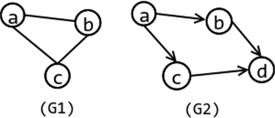
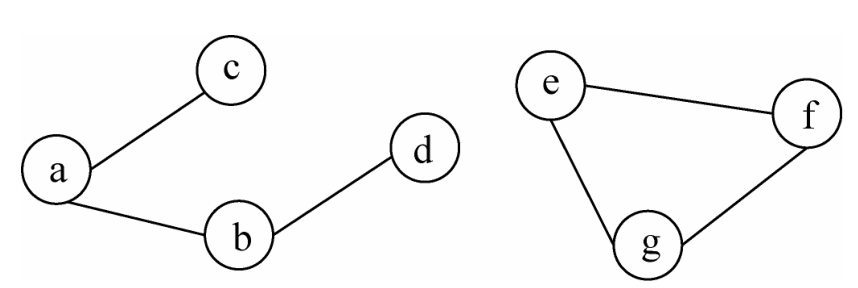
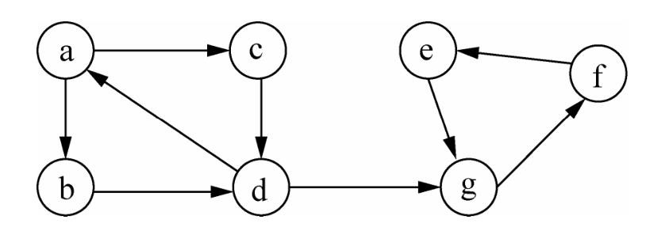
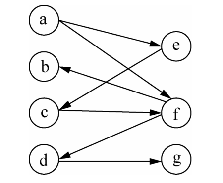
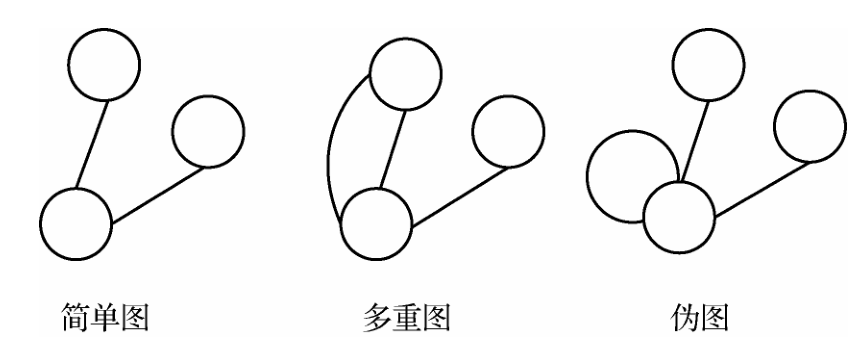
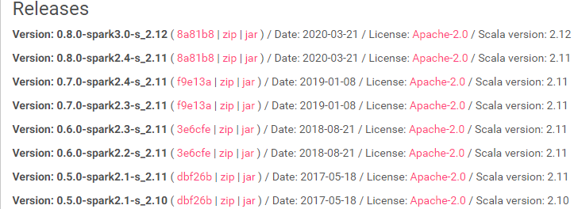
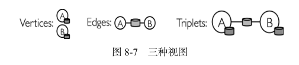

# Spark GraphFrames图计算

## 1. 图的概念

在计算机科学中，图是一种重要的数据结构，它具有强大的表达能力，广泛应用于通信网络、搜索引擎、社交网络及自然语言处理等领域。GraphFrames 是关于图的计算框架，理解图的概念对学习和掌握 GraphFrames 的相关内容是非常重要的。由于数据结构的书籍都有对图的详细介绍，因此这里仅回顾一些重要概念，为讲解后面内容提供基础。



一般地，图（Graph）是由顶点的非空有限集和边的有限集构成的，记作 G=<V,E>，其中 G表示一个图，V 表示图 G 中顶点（vertices）的集合，E 表示是图 G 中边（edges）的集合，E 中的边连接 V 中的两个顶点。

无向图 G1，顶点集 V={a,b,c}，边集 E={(a,b),(a,c),(b,c)}；有向图 G2 的顶点集 V={a,b,c,d}，边集 E={<a,b>,<a,c>,<c,b>,<c,d>,<b,d>}。

**度**：对于无向图，顶点的度（degree）是指邻接于该顶点的边的总和。对于有向图，顶点的度分为出度（out-degree）和入度（in-degree），出度是指离开顶点的有向边的条数，入度是指进入该顶点的有向边的条数。

**路径**：一个连接两个不同顶点的序列 v 0 e 0 ...v i e j ...e k - 1 v k ，其中 v i ∈V，0<i<k；e j ∈E，0<j<k-1，e j 与 v i 、v i+1 关联，且序列中的顶点（内部顶点）各不相同。其中 k 称为路径 P 的长度。

**环**：若路径的起点和终点相同则称路径 P 为环。长度为 1 的圈称为自环（loop），即边的起点和终点为同一顶点。



**连通**：若两顶点之间存在路径，则称两个顶点连通（connected）

**连通图和强连通图**：若图 G 中任意两个顶点均连通，则称 G 是连通图。若 G 是有向的，则称 G 是强连通图。

**连通分量（Connected Component，CC）**：无向图 G 的极大连通子图称为 G 的连通分量。连通图的连通分量只有一个，即是其自身，非连通的无向图有多个连通分量。



**强连通分量（Strongly Connected Component，SCC）**：有向图 G 的极大强连通子图称为 G 的强连通分量，连通图也只有一个强连通分量，即是其自身。非强连通的有向图有多个强连通分量。



**二分图**：设 G=(V,E)是一个无向图，V=V 1 ∪V 2 且 V 1 ∩V 2 =∅，∀e∈E，e 关联的顶点 v i 和 v j ，有 v i ∈V 1 ，v j ∈V 2 ，则称图 G 为一个二分图（bipartite graph）。简单地说，一个图的顶点可以被分成了两部分，相同的部分的顶点不相邻，那这个图就是二分图。



**多重图**：一般把含有平行边的图称为多重图

**伪图**：把含有自环的称为伪图

**简单图**：既不含平行边也不含自环的图称为简单图

## 2. GraphFrames 库

### 2.1 GraphFrames介绍

GraphFrames 库是 Databricks 公司发布的基于 Spark 平台的并行图计算库，与来自加利福尼亚伯克利分校（UCB）和麻省理工学院（MIT）的开发人员共同合作完成，目前项目托管在 Github上。它基于 DataFrames 构建，受益于 DataFrames 的高性能和可拓展性，相对其他框架，它具有以下优点：
**多语言支持**：GraphFrames 同时提供 Python、Java 和 Scala 三种通用的 API 接口。GraphFrame支持通用的图处理，部分算法是通过封装 GraphX 库的相关算法实现的。因此通过它，在 GraphX中实现的算法也都能在 Python 和 Java 中使用。
**强大的查询能力**：GraphFrames 允许用于使用简短的查询，和 Spark SQL 和 DataFrame 一样具有强大的查询语句能力。
**保存和载入图模型**：GraphFrames 支持 DataFrame 结构的数据源，允许使用流行的 Parquet、JSON 和 CSV 等数据格式读写图数据。

### 2.2 使用 GraphFrames 库

使用pip安装graphframes库：

```shell
$pip install graphframes
```

**注：注意graphframes的版本，python3.7安装的graphframes为0.6.0。在下面应用jar包时要根据graphframes，spark和scala的版本选择对应的版本。**

版本路径：https://spark-packages.org/package/graphframes/graphframes



目前 GraphFrames 库还没有并入 Spark 项目中，在使用该库时，需要安装 GraphFrames 包。如果使用 pyspark 或 spark-submit 命令，在命令后添加参数--packages，如下代码所示。

由于ivy2官方提供的下载路径已经不能使用，请从下面的下载路径：https://repos.spark-packages.org/graphframes/graphframes/0.6.0-spark2.3-s_2.11/graphframes-0.6.0-spark2.3-s_2.11.jar下载。

下载后放到Spark的安装路径下的jars目录中。

### 2.3 GraphFrames实例

```python
from graphframes import GraphFrame
from pyspark.shell import spark

vertices = spark.createDataFrame([("a", "Alice", 34), ("b", "Bob", 36), ("e", "Leo", 35), ("c", "Tom", 12), ("d", "Jack", 13)], ["id", "name", "age"])
edges = spark.createDataFrame([("a", "b", "friend"), ("a", "e", "friend"), ("b", "e", "friend"), ("b", "c", "father"), ("c", "d", "classmate")], ["src", "dst", "relationship"])

graph = GraphFrame(vertices, edges)
```

### 2.4 视图和图操作

GraphFrame 提供四种视图：顶点表视图、边表视图、三元组视图以及模式视图，四个视图返回类型都是 DataFrame。顶点表和边表视图等同于构建图时使用的顶点和边 DataFrame，三元组视图包含了一条边及其关联的两个顶点的所有属性，这三种视图如下图 8-7 所示。



```python
graph.vertices.show()
graph.edges.show()
graph.triplets.show()
```

另外，通过 GraphFrame 提供的三个属性：degrees、inDegrees 和 outDegrees 可以获得，顶点的度、入度和出度，如下所示。

```python
graph.degrees.show()
graph.inDegrees.show()
graph.outDegrees.show()
```

### 2.5 模式发现

除了三个基本视图，GraphFrame 通过 find 方法提供了类似与 Neo4j 的 Cypher 查询的模式查询功能，其返回的 DataFrame 类型的结果称为模式视图。它使用一种简单的 DSL 语言用来实现图的结构化查询，采用形如“(a)-[e]->(b)”的模式来描述一条有向边，其中(a)、(b)表示顶点，a 和 b 为顶点名，[e]表示边，e 为边名，->表示有向边的方向。顶点名和边名会作为搜索结果的列名，如果结果中不需要该项，可在模式中省略该名称。另外，模式中有多条边时，需要用分号“;”拼接，例如：“(a)-[e]->(b);(b)-[e2]->(c)”表示一条从 a 到 b，然后从 b 到 c 的路径。如果要表示不包含某条边，可以在表示边的模式前面加上“！”，例如：“(a)-[e]->(b);！(b)-[e2]->(a)”，表示不选取包含重边的边。

```python
motifs = graph.find("(a)-[e]->(b)")
motifs.show()
```

模式视图是 DataFrame 类型的，同样可以进一步进行查询、过滤和统计操作。

```
motifs.filter("b.age > 40").show()
```

### 2.6 图加载和保存

```python
graph.vertices.write.parquet('graph/vertices')
graph.edges.write.parquet('graph/edges')

v = spark.read.parquet('graph/vertices')
e = spark.read.parquet('graph/edges')
newGraph = GraphFrame(v, e)
newGraph.vertices.show()
```

## 3. GraphFrames 实现的算法

### 3.1 广度优先搜索

```
bfs(fromExpr, toExpr, edgeFilter=None, maxPathLength=10)
```

其中，参数 fromExpr 表示 Spark SQL 表达式，指定搜索起点； toExpr 表示 Spark SQL 表达式，指定搜索终点；edgeFilter 指定搜索过程需要忽略的边，也是 Spark SQL 表达式；maxPathLength表示路径的最大长度，若搜索结果路径长度超过该值，则算法终止。

```python
paths = graph.bfs("name='Alice'", "age > 34")
paths.show()
```

### 3.2 最短路径

```python
shortestPaths(landmarks)
```

GraphFrames 中最短路径（Shortest Path）算法实际上是通过封装 GraphX 的最短路径算法实现的，GraphX 实现的是单源最短路径，采用经典的 Dijkstra（迪杰斯特拉）算法。虽然算法命名是最短路径，但返回结果只有距离值，并不会返回完整的路径。

参数 landmarks 表示要计算的目标顶点 ID 集。该方法返回的是所有点到目标顶点的最短路径，如下代码所示。

```python
# landmarks is vector of target vertices
paths = graph.shortestPaths(landmarks=["a", "d"])
paths.show()
```

最短路径算法计算图中的每一个顶点到目标顶点的最短距离，而且还会忽略边的权重。

### 3. 3 三角形计数

```python
results = graph.triangleCount()
results.select("id", "count").show()
```

三角形计数（Triangle Counting）用于确定通过图数据集中每个顶点的三角形数量。当计算三角形个数时，图都被作为无向图处理，平行边仅计算一次，自环则会被忽略。
三角形计数在社交网络分析中大量使用。一般来说，在一个网络里，三角形个数越多，这个网络连接越紧密。例如，一个重要的统计特征——全局聚类系数（Global Clustering Coefficient），就是基于三角形数量计算的，它是衡量社交网站中本地社区的凝聚力的重要参考标准。

### 3.4 连通分量

连通分量（Connected Components）可用于发现网络中环，经常用于社交网络，发现社交圈子，算法使用顶点 ID 标注图中每个连通体，将连通体中序号最小的顶点的 ID 作为连通体的 ID。另外，0.3 版本以后的算法默认实现，需要使用检查点（Checkpoint），在使用之前，要设置检查点目录。

```python
spark.sparkContext.setCheckpointDir('checkpoint')
results = graph.connectedComponents()
results.select("id", "component").orderBy("component").show()

results = graph.stronglyConnectedComponents(maxIter=10)
results.select("id", "component").orderBy("component").show()
```

连通分量算法忽略边的方向，将图视作无向图，GraphFrames 还提供了强连通分量算法，它可以接收参数 maxIter，用来指定最大迭代次数。

### 3.5 标签传播算法

标签传播算法（Label propagation algorithm，LPA）最早是针对社区发现问题时提出的一种解决方案。社区是一个模糊的概念，一般来说，社区是指一个子图，其内部顶点间连接紧密，而与其他社区之间连接稀疏，根据各社区顶点有无交集，又可分为非重叠型社区（disjoint communities）和重叠型社区（overlapping communities）。

标签传播算法适用于非重叠社区，该算法的 API 如下。

```python
results = graph.labelPropagation(maxIter=5)
results.show()
```

标签传播算法的优点是简单快捷、时间复杂度低、接近线性时间，缺点是结果不稳定。它的基本思路如下。
1)初始时，给每个节点一个唯一的标签； 
2)每个节点使用其邻居节点的标签中最多的标签来更新自身的标签。 
3)反复执行步骤2)，直到每个节点的标签都不再发生变化为止。

### 3.6 PageRank 算法

```python
results = graph.pageRank(resetProbability=0.15, maxIter=10)
results.vertices.show()

results = graph.pageRank(resetProbability=0.15, tol=0.01)
results.vertices.show()
results.edges.show()
```

PageRank 算法最初是拉里·佩奇和谢尔盖·布林用来解决搜索引擎中网页排名的问题，故又称网页排名算法、Google 左侧排名或佩奇排名。该算法可以用来评估有向图中顶点的重要性。例如：用于在文献引用数据构成的论文引用网络中分析论文的影响力；评估社交网络中关注度高的用户。与三角形计数算法相比，PageRank 是相关性的度量，而三角形计数是聚类的度量。

**算法计算过程：**

首先，初始化图中顶点的 PR 值（PageRank 值）为 1/n，n 是图中顶点的个数。

然后，按照如下步骤进行迭代：

1. 每个顶点将其当前的 PR 值平均分配到顶点的出边上，即 PR/m，m 为顶点的出度。

2. 对每个顶点入边的 PR 值求和，得到顶点新的 PR 值。
3. 如果相较上一轮循环，整个图中的顶点的 PR 值没有明显改变，即 PR 值趋于稳定，算法退出

```python
pageRank(resetProbability=0.15, sourceId=None, maxIter=None, tol=None)
```

其中，参数 resetProbability 表示算法里的常数 alpha，默认 0.15；sourceId 指顶点 ID，用于个性化 PageRank 算法，该参数可选；maxIter 指迭代的最大次数；tol 指最终收敛的公差值。

静态 PageRank：该算法运行固定次数的迭代，以生成图数据集中给定的一组顶点的 PageRank值，即通过指定 maxIter 参数。

动态 PageRank：该算法一直运行，直到 PR 值收敛于预定义的公差值为止，才通过指定 tol参数。

## 4.基于 GraphFrames 的网页排名

```python
from pyspark.sql.types import *
from pyspark.shell import spark

filePath = 'datas/web-Google.txt'
schema = StructType([StructField('src', LongType(), True), StructField('dst', LongType(), True)])

edgesDF = spark.read.load(filePath, format='csv', schema=schema, delimiter='\t', mode='DROPMALFORMED')
edgesDF.cache()

srcDF = edgesDF.select(edgesDF.src).distinct()
distDF = edgesDF.select(edgesDF.dst).distinct()
verticesDF = srcDF.union(distDF).distinct().withColumnRenamed('src', 'id')
verticesDF.cache()

from graphframes import GraphFrame

graph = GraphFrame(verticesDF, edgesDF)
ranks = graph.pageRank(resetProbability=0.15, maxIter=5)
ranks.vertices.show()
ranks.edges.show()
```

数据下载地址: http://snap.stanford.edu/data/web-Google.html

## 5. Issue

**1.ERROR ShutdownHookManager: Exception while deleting Spark temp dir**

当我们提交打包好的spark程序时提示如上报错。在windows环境下本身就存在这样的问题，和我们的程序没有关系。若是不想消除该报错，可以在%SPARK_HOME%/conf下的文件log4j.properties添加如下信息：

```properties
log4j.logger.org.apache.spark.util.ShutdownHookManager=OFF
log4j.logger.org.apache.spark.SparkEnv=ERROR
```

## 6.参考文献

1. 基于pyspark图计算的算法实例 https://blog.csdn.net/weixin_39198406/article/details/104940179

2. 基于pyspark GraphFrames实现图查询和计算 https://blog.csdn.net/weixin_39198406/article/details/104922642