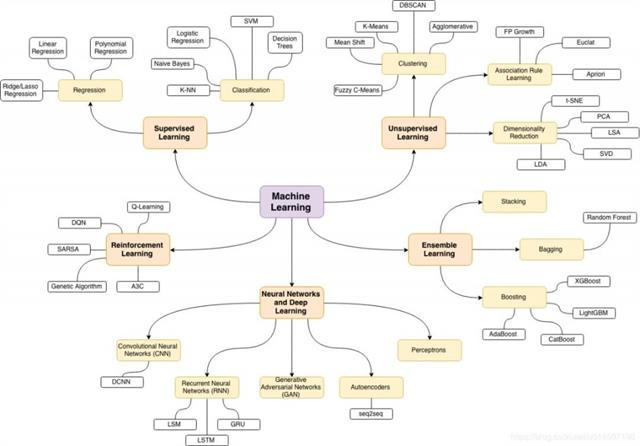
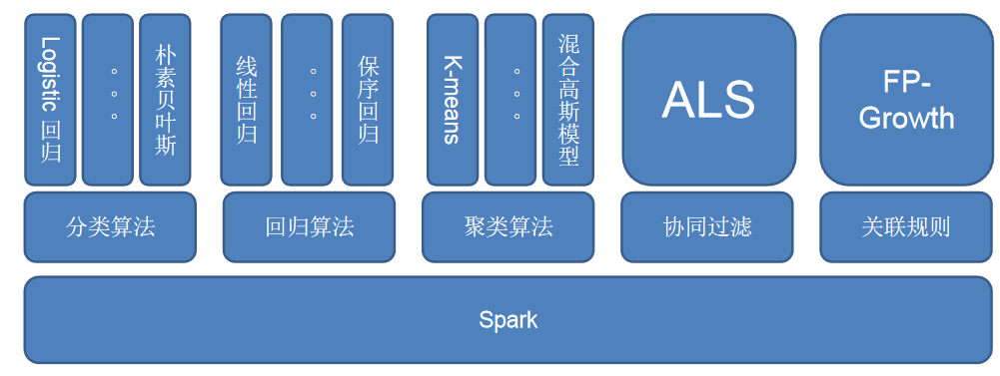
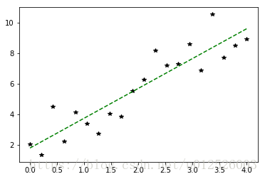
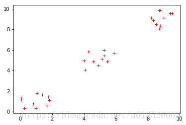
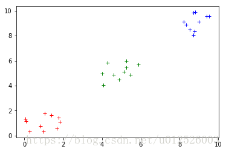
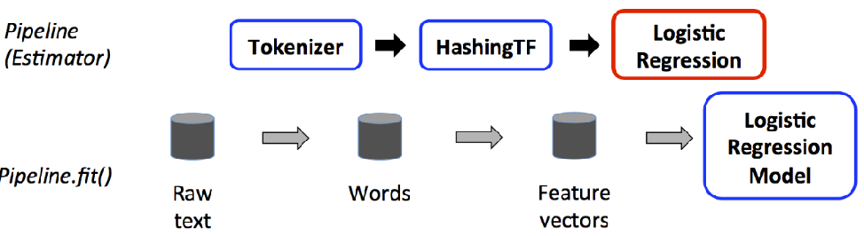

# Spark机器学习

## 1. 介绍

### 1.1 机器学习常用算法



参考文献：https://m.baidu.com/ala/c/www.360doc.cn/mip/814245361.html

### 1.2 Spark机器学习库官方介绍

官方文档：http://spark.apache.org/docs/latest/ml-guide.html

MLlib is Spark’s machine learning (ML) library. Its goal is to make practical machine learning scalable and easy. At a high level, it provides tools such as:

- ML Algorithms: common learning algorithms such as classification, regression, clustering, and collaborative filtering
- Featurization: feature extraction, transformation, dimensionality reduction, and selection
- Pipelines: tools for constructing, evaluating, and tuning ML Pipelines
- Persistence: saving and load algorithms, models, and Pipelines
- Utilities: linear algebra, statistics, data handling, etc.

### 1.3 Spark机器学习库构成

Spark 机器学习库目前分为两个包：spark.mllib、spark.ml。


spark.mllib 包含基于 RDD 的机器学习 API。Spark MLlib 由来已久，在 1.0 以前的版本就已经包含，提供的算法丰富稳定，目前处于维护状态，不再添加新功能。

该包涉及数据科学任务的众多方面，其核心功能如下。

数据准备：包括用于特征提取和变换、分类特征的散列和导入预言模型标记语言构建的模型。

常见算法：包括流行的回归、频繁模式挖掘、分类和聚类算法。

实用功能：实现了常用的统计方法和模型评估方法。


spark.ml 则提供了基于 DataFrames 高层次的 API，可以用来构建机器学习工作流（PipeLine）。

机器学习 Pipeline 弥补了 MLlib 库的不足，用户可以使用 SQL/DataFrame 查询，Tungsten 和 Catalyst优化以及提供跨语言的统一 API。其核心功能如下。

机器学习算法：回归、分类和聚类等。

特征化方法：特征提取、转换、降维和选择等。

管道方法：包括创建、评估和优化管道等。

持久化方法：包括保存和加载算法、模型和管道等。

实用功能：如线性代数、统计相关的计算实现

### 1.4 ml和mllib的主要区别和联系

- ml和mllib都是Spark中的机器学习库，目前常用的机器学习功能2个库都能满足需求。

- spark官方推荐使用ml, 因为ml功能更全面更灵活，未来会主要支持ml，mllib很有可能会被废弃(据说可能是在spark3.0中deprecated）。

- ml主要操作的是DataFrame, 而mllib操作的是RDD，也就是说二者面向的数据集不一样。相比于mllib在RDD提供的基础操作，ml在DataFrame上的抽象级别更高，数据和操作耦合度更低。

  - DataFrame和RDD什么关系？DataFrame是Dataset的子集，也就是Dataset[Row], 而DataSet是对RDD的封装，对SQL之类的操作做了很多优化。

- 相比于mllib在RDD提供的基础操作，ml在DataFrame上的抽象级别更高，数据和操作耦合度更低。

- ml中的操作可以使用pipeline, 跟sklearn一样，可以把很多操作(算法/特征提取/特征转换)以管道的形式串起来，然后让数据在这个管道中流动。大家可以脑补一下Linux管道在做任务组合时有多么方便。

- ml中无论是什么模型，都提供了统一的算法操作接口，比如模型训练都是`fit`；不像mllib中不同模型会有各种各样的`trainXXX`。

- mllib在spark2.0之后进入`维护状态`, 这个状态通常只修复BUG不增加新功能。

## 2.mllib库

### 2.1 MLlib库组成

官方文档：http://spark.apache.org/docs/latest/api/python/pyspark.mllib.html

- **mllib.classification** - **spark.mllib** 包支持二进制分类，多类分类和回归分析的各种方法。分类中一些最流行的算法是 **随机森林，朴素贝叶斯，决策树** 等。

- **mllib.clustering** - 聚类是一种无监督的学习问题，您可以根据某些相似概念将实体的子集彼此分组。

- **mllib.fpm** - 频繁模式匹配是挖掘频繁项，项集，子序列或其他子结构，这些通常是分析大规模数据集的第一步。 多年来，这一直是数据挖掘领域的一个活跃的研究课题。

- **mllib.linalg** - 线性代数的MLlib实用程序。

- **mllib.recommendation** - 协同过滤通常用于推荐系统。 这些技术旨在填写用户项关联矩阵的缺失条目。

- **mllib.regression** - 线性回归属于回归算法族。 回归的目标是找到变量之间的关系和依赖关系。使用线性回归模型和模型摘要的界面类似于逻辑回归案例。

  

### 2.2 MLlib基本使用

#### 2.2.1 基本概念

MLib其实就是将数据以RDD的形式进行表示，在分布式数据集上调用各种算法。

#### 2.2.2 使用方法

MLlib中包含能够在集群上运行良好的并行算法，如kmeans、分布式RF、交替最小二乘等，这能够让MLib中的每个算法都能够适用于大规模数据集
也可以将同一算法的不同参数列表通过parallelize()，在不同节点上运行，最终找到性能最好的一组参数，这可以节省小规模数据集上参数选择的时间。


#### 2.2.3 对垃圾邮件进行分类

https://napsterinblue.github.io/notes/spark/machine_learning/spam_classifier_mllib/

使用基于SGD的LR完成分类任务

```python
from pyspark.mllib.regression import LabeledPoint
from pyspark.mllib.feature import HashingTF
from pyspark.mllib.classification import LogisticRegressionWithSGD

spamFp = "file:///home/hadoop/code/spark/files/spam.txt"
normalFp = "file:///home/hadoop/code/spark/files/normal.txt"
spam= sc.textFile(spamFp)
normal= sc.textFile(normalFp)

# 将每个单词作为一个单独的特征

tf = HashingTF(numFeatures=10000)
spamFeatures = spam.map( lambda email : tf.transform(email.split(" ")) )
normalFeatures = normal.map( lambda email : tf.transform(email.split(" ")) )

# 构建LabelPoint，即每个向量都有它的label，之后联合构成整个训练集

positiveExamples = spamFeatures.map( lambda features : LabeledPoint(1, features) )
negativeExamples = normalFeatures.map( lambda features : LabeledPoint(0, features) )
trainingData = positiveExamples.union(negativeExamples  )

# SGD是迭代算法，因此在这里缓存数据集，加快运行速度

trainingData.cache()

# 训练

model = LogisticRegressionWithSGD.train( trainingData )

# 预测

posTest = tf.transform( "O M G Get cheap stuff by sending money to ...".split(" ") )
negTest = tf.transform( "I just want to play tennis now".split(" ") )

print( "Prediction for positive test example : %g" % model.predict(posTest) )
print( "Prediction for negative test example : %g" % model.predict(negTest) )
```

#### 2.2.4 MLlib中的数据类型

Vector：在mllib.linalg.vectors中，既支持稠密向量，也支持稀疏向量
LabeledPoint：在mllib.regression中，用于监督学习算法中，表示带有标签的数据点
Rating：在mllib.recommendation中，用于产品推荐，表示用户对一个产品的打分
各种Label类：每个Model都是训练算法的结果，可以用train进行训练，用predict进行预测

#### 2.2.5 Vectors

对于denseVector，MLlib可以通过Vectors.dense直接创建，也可以直接将numpy.array传递给Vectors，生成dense Vector
对于sparseVector，首先设置其大小，然后传入一个包含index和value的dict或者是2个列表，分别表示indexes与value
sparseVector与denseVector都可以转化为array，array可以转化为denseVector，sparseVector不能直接转化为denseVector。
需要注意：array与denseVector都不能直接转化为sparseVector
参考链接：http://www.cnblogs.com/zhangbojiangfeng/p/6115263.html

```python
import numpy as np
from pyspark.mllib.linalg import Vectors

denseVec1 = np.array( [1, 2, 3] )
denseVec2 = Vectors.dense( [4,5,6] )
print( denseVec2 )
denseVec2 = denseVec1
print( denseVec2 )

# print( Vectors.sparse(denseVec2) ) # 会出错，因为无法直接转换

sparseVec1 = Vectors.sparse(4, {0:1.0, 2:2.0})
sparseVec2 = Vectors.sparse( 4, [0,2], [1.0, 3.0] )
print( sparseVec1.toArray() ) # 可以转化为array，也支持下标访问
```

```
[4.0,5.0,6.0] 
[1 2 3] 
[1. 0. 2. 0.]
```

#### 2.2.6 特征提取

特征提取主要是在mllib.feature中

**TF-IDF(词频-逆文档频率)**
TFIDF是一种从文本文档生成特征向量的简单方法，文档中的词有2个统计值：TF与IDF，TF指的是每个词在文档中出现的次数，IDF用于衡量一个词在整个文档语料库中出现的(逆)频繁程度
HashingTF用于计算TF，IDF用于IDF，hashingTF用的是哈希的方法，生成稀疏向量
hashingTF可以一次只运行在一个文档中，也可以运行于整个RDD中

```python
from pyspark.mllib.feature import HashingTF
from pyspark import SparkContext

sc = SparkContext()
sentence = "hello world hello test"
words = sentence.split(" ")
tf = HashingTF(10000)  # 构建一个向量，S=10000
vec1 = tf.transform(words)
print(vec1)

rdd = sc.wholeTextFiles("datas").map(lambda content: content[1].split(" "))
vec2 = tf.transform(rdd)  # 对整个RDD对象进行转换，生成TF
print(vec2.collect())
```

**注意：在上面的转换中，由于wholeTextFiles中的每个元素val是一个tuple，`val[0]`是文件名，`val[1]`是文件内容，因此在map的时候，需要注意lambda表达式的写法**

```python
from pyspark.mllib.feature import HashingTF, IDF
from pyspark import SparkContext

sc = SparkContext()
rdd = sc.wholeTextFiles("datas").map(lambda content: content[1].split(" "))
tf = HashingTF()

# 因为这里的tfVec使用了2次，因此可以cache一下
tfVec = tf.transform(rdd).cache()  # collect()

idf = IDF()
idfModel = idf.fit(tfVec)
tfIdfVec = idfModel.transform(tfVec)
print(tfIdfVec.take(2))
```

**注意：使用cache可以将RDD对象放入内存中(sotrage level是StorageLevel.MEMORY_ONLY)，使用persist可以指定storage level**

#### 2.2.7 对数据进行缩放

可以使用StandScaler对数据进行缩放，下面的example是将数据的所有特征的平均值转化为0，方差转化为1。
mllib中将每一行视作一个特征，即每次操作时，都是对矩阵中的每一行的数据进行缩放

```python
from pyspark.mllib.feature import StandardScaler
from pyspark import SparkContext
from pyspark.mllib.linalg import Vectors

sc = SparkContext()
vec = Vectors.dense([[-1, 5, 1], [2, 0, 1]])
print(vec)
dataset = sc.parallelize(vec)
scaler = StandardScaler(withMean=True, withStd=True)
model = scaler.fit(dataset)
result = model.transform(dataset).collect()
print(result)

输出：
[[-1.  5.  1.],[2. 0. 1.]]
[DenseVector([-0.7071, 0.7071, 0.0]), DenseVector([0.7071, -0.7071, 0.0])]
```

使用Normalizer可以使得数据的L-p范数转化为1，这个在归一化以及预测概率等时常用，默认是L2范数，也可以自己指定
```python
from pyspark.mllib.feature import Normalizer
from pyspark import SparkContext
from pyspark.mllib.linalg import Vectors

sc = SparkContext()
vec = Vectors.dense([[3, 4], [5, 5], [6, 8]])
data = sc.parallelize(vec)
normalizer = Normalizer()
result = normalizer.transform(data)
print(result.collect())

输出：
[DenseVector([0.6, 0.8]), DenseVector([0.7071, 0.7071]), DenseVector([0.6, 0.8])]
```
#### 2.2.8 统计

mllib提供了很多广泛的统计函数，统计函数是对每一列进行处理

```python
from pyspark.mllib.stat import Statistics
from pyspark import SparkContext
from pyspark.mllib.linalg import Vectors

sc = SparkContext()
vec = Vectors.dense([[3, 4], [5, 5], [6, 8]])
data = sc.parallelize(vec)
stat = Statistics.colStats(data)
print(stat.mean(), stat.variance())

输出：
[4.66666667 5.66666667] [2.33333333 4.33333333]
```

#### 2.2.9 线性回归

在mllib.regression
对于这种问题，最好需要将其归一化，否则SGD求解很容易发散。对于下面的例子，如果将X，即特征的范围取得非常大(比如下面range里面设置最大值为20之类的)，则求得的解很有可能就会发散。
除此之外，也有Lasso等加入正则化方法的线性回归

```python
import matplotlib.pyplot as plt
import random as rnd
import numpy as np
from pyspark.mllib.regression import LabeledPoint, LinearRegressionWithSGD, LassoWithSGD
from pyspark import SparkContext

x = np.linspace(0, 4, 20)
y = 2 * x + 2 + 4 * np.random.random(x.shape) - 2

sc = SparkContext()
data = sc.parallelize(np.column_stack((x, y)))

labeledData = data.map(lambda d: LabeledPoint(d[1], d[0:1]))
model = LinearRegressionWithSGD.train(labeledData, iterations=100, intercept=True)
y_pred = model.predict(np.array(x).reshape(1, -1))

#获取特征权重，及干扰特征
print("weights : %s, intercept : %s" % (model.weights, model.intercept))

plt.plot(x, y, 'k*', label="real")
plt.plot(x, y_pred, 'g--', label="pred with intercept")
plt.show()

输出：
weights : [1.960302173749138], intercept : 1.7728141318262047
```


#### 2.2.10 Logistic Regression

LR用于监督式分类问题，可以使用SGD等方法对LR进行训练，
clearThreshold之后，LR会输出原始概率，也可以设置概率阈值，直接输出分类结果

```python
from pyspark.mllib.classification import LogisticRegressionWithSGD
from pyspark.mllib.regression import LabeledPoint
from pyspark import SparkContext

sc = SparkContext()
data = [LabeledPoint(0.0, [0.0, 1.0]), LabeledPoint(1.0, [1.0, 0.0])]
lrm = LogisticRegressionWithSGD.train(sc.parallelize(data), iterations=20)
print(lrm.predict([1, 0]))
lrm.clearThreshold()
print(lrm.predict([1, 0]))
lrm.setThreshold(0.5)
print(lrm.predict([1, 0]))

输出：
1
0.7763929145707635
1
```

#### 2.2.11 聚类任务

MLlib中包含kmeans以及kmeans||两种算法，后者可以为并行化环境提供更好的初始化策略。除了聚类的目标数量K之外，还包括以下几个超参数
initializationMode：初始化聚类中心的方法，可以是kmeans||或者random。kmeans||的效果一般更好，但是更加耗时
maxIterations：最大迭代次数，默认为100
runs：算法并发运行的数目，mllib的kmeans支持从多个起点并发执行，然后选择最佳的结果。
下面的代码中，首先训练一个kmeans模型，然后对其分类结果进行可视化

```python
from pyspark.mllib.clustering import KMeans
import matplotlib.pyplot as plt
import numpy as np
from pyspark import SparkContext

data = 2 * np.random.random((30, 2))
data[10:20, :] = data[10:20, :] + 4
data[20:, :] = data[20:, :] + 8

plt.plot(data[:, 0], data[:, 1], 'r+')
plt.show()

sc = SparkContext()
rddData = sc.parallelize(data)
model = KMeans.train(rddData, 3, maxIterations=100, initializationMode="kmeans||",
                     seed=50, initializationSteps=5, epsilon=1e-4)
```




```python
result = np.zeros((data.shape[0], ))
for ii in range( data.shape[0] ):
    result[ii] = model.predict( data[ii,:] )
colors = ["r+", "b+", "g+"]
for ii in range(3):
    plt.plot( data[result == ii, 0], data[result == ii, 1], colors[ii] )

plt.show()
```




## 3.ml库

### 3.1 ml介绍和组成

官方文档：http://spark.apache.org/docs/latest/api/python/pyspark.ml.html

ML API包含三个主要的抽象类：Transformer（转换器），Estimator（预测器）和Pipline（管道）

转换器：是一种算法,可以将一个DataFrame转换成另一个DataFrame。
预测器：是一个算法,可以基于DataFrame产出一个转换器。是学习算法或者其他算法的抽象，用来训练数据。

管道：链接多个转换器和预测器生成一个机器学习工作流。管道被指定为一系列阶段,每个阶段是一个转换器或一个预测器。



### 3.2 ml库的使用

在本节中我们将使用ml中的函数方法来预测婴儿生存率，数据可从[births_transformed.csv.gz](datas/births_transformed.csv.gz)下载(或者在github上下载：https://github.com/edyoda/pyspark-tutorial/blob/master/births_transformed.csv.gz)。

#### 3.2.1 加载数据

```python
import pyspark.sql.types as typ
from pyspark.ml import Pipeline
import pyspark.ml.classification as cl
import pyspark.ml.evaluation as ev
import pandas as pd
import numpy as np
import os

labels = [('INFANT_ALIVE_AT_REPORT', typ.IntegerType()),
          ('BIRTH_PLACE', typ.StringType()),
          ('MOTHER_AGE_YEARS', typ.IntegerType()),
          ('FATHER_COMBINE_AGE', typ.IntegerType()),
          ('CIG_BEFORE', typ.IntegerType()),
          ('CIG_1_TRI', typ.IntegerType()),
          ('CIG_2_TRI', typ.IntegerType()),
          ('CIG_3_TRI', typ.IntegerType()),
          ('MOTHER_HEIGHT_IN', typ.IntegerType()),
          ('MOTHER_PRE_WEIGHT', typ.IntegerType()),
          ('MOTHER_DELIVERY_WEIGHT', typ.IntegerType()),
          ('MOTHER_WEIGHT_GAIN', typ.IntegerType()),
          ('DIABETES_PRE', typ.IntegerType()),
          ('DIABETES_GEST', typ.IntegerType()),
          ('HYP_TENS_PRE', typ.IntegerType()),
          ('HYP_TENS_GEST', typ.IntegerType()),
          ('PREV_BIRTH_PRETERM', typ.IntegerType())
          ]

schema = typ.StructType([
    typ.StructField(e[0], e[1], False) for e in labels
])

births = spark.read.csv(
    '/Users/shexuan/Downloads/births_transformed.csv.gz', header=True, schema=schema)

births.show(3)
```

在这里我们指定DataFrame的schema，限制数据集只有17列。

#### 3.2.2 创建转换器

在使用模型对数据集进行评估预测前，先要对数据做一些特征转换。

```python
# 创建转换器、评估器
import  pyspark.ml.feature as ft

births = births.withColumn('BIRTH_PLACE_INT', births['BIRTH_PLACE']\
    .cast(typ.IntegerType()))

# birth place使用one-hot编码
encoder = ft.OneHotEncoder(inputCol='BIRTH_PLACE_INT',
                           outputCol='BIRTH_PLACE_VEC')

# 创建单一的列将所有特征整合在一起
featuresCreator = ft.VectorAssembler(
    inputCols=[col[0] for col in labels[2:]] + [encoder.getOutputCol()],
    outputCol='features'
)

# 创建一个评估器
import pyspark.ml.classification as cl

logistic = cl.LogisticRegression(maxIter=10,
                                regParam=0.01,
                                featuresCol=featuresCreator.getOutputCol(),
                                labelCol='INFANT_ALIVE_AT_REPORT')
```

#### 3.2.3 创建一个管道、拟合模型

在前面我们已经创建了数据转换器和评估器，现在我们可以通过管道将他们串联起来并方便的进行模型拟合了。

```python
# 创建一个管道
from pyspark.ml import Pipeline

pipeline = Pipeline(stages=[encoder, featuresCreator, logistic])

# 拟合模型
birth_train, birth_test = births.randomSplit([0.7,0.3],seed=123)

model = pipeline.fit(birth_train)
test_model = model.transform(birth_test)
```

#### 3.2.4 评估模型

在前面我们将数据分为了两部分并通过管道方便的对训练集进行了拟合以及对测试集进行了测试。现在我们可以通过测试集的结果来对模型拟合效果进行评估了。

```python
# 评估模型性能
import pyspark.ml.evaluation as ev

evaluator = ev.BinaryClassificationEvaluator(
    rawPredictionCol='probability',
    labelCol='INFANT_ALIVE_AT_REPORT'
)

print(evaluator.evaluate(test_model, {evaluator.metricName:'areaUnderROC'}))
print(evaluator.evaluate(test_model, {evaluator.metricName:'areaUnderPR'}))
```

#### 3.2.5 保存模型

PySpark不仅允许保存训练好的模型，还可以保存管道结构及所有转换器和评估器的定义。

```python
# 保存模型pipeline
pipelinePath = './infant_oneHotEncoder_Logistic_Pipeline'
pipeline.write().overwrite().save(pipelinePath)

# 重载模型pipeline
loadedPipeline = Pipeline.load(pipelinePath)
loadedPipeline.fit(birth_train).transform(birth_test).take(1)

# 保存模型
from pyspark.ml import PipelineModel

modelPath = './infant_oneHotEncoder_LogisticPipelineModel'
model.write().overwrite().save(modelPath)

# 载入模型
loadedPipelineModel = PipelineModel.load(modelPath)
test_reloadedModel = loadedPipelineModel.transform(birth_test)
test_reloadedModel.take(1)
```

#### 3.2.6 超参调优

我们的第一个模型几乎不可能是最好的模型。利用超参调优能帮我们找到模型的最佳参数，如逻辑回归模型所需的最佳迭代次数或决策树的最大深度。

在超参调优时PySpark提供了两种验证方法：K-Fold交叉验证和train-validation（相当于1-Fold）交叉验证。

```python
# 超参调优：grid search和train-validation splitting 

# 网格搜索
import pyspark.ml.tuning as tune

logistic = cl.LogisticRegression(labelCol='INFANT_ALIVE_AT_REPORT')
grid = tune.ParamGridBuilder()\
    .addGrid(logistic.maxIter, [5,10,50])\
    .addGrid(logistic.regParam, [0.01,0.05,0.3])\
    .build()

evaluator = ev.BinaryClassificationEvaluator(
    rawPredictionCol='probability',
    labelCol='INFANT_ALIVE_AT_REPORT'
)

# 使用K-Fold交叉验证评估各种参数的模型
cv = tune.CrossValidator(
    estimator=logistic,
    estimatorParamMaps=grid,
    evaluator=evaluator,
    numFolds=3
)

# 创建一个构建特征的pipeline
pipeline = Pipeline(stages=[encoder, featuresCreator])
birth_train, birth_test = births.randomSplit([0.7,0.3],seed=123) # 重新打开数据进行处理
data_transformer = pipeline.fit(birth_train)
data_test = data_transformer.transform(birth_test)


# cvModel 返回估计的最佳模型
cvModel = cv.fit(data_transformer.transform(birth_train))
results = cvModel.transform(data_test)

print(evaluator.evaluate(results, {evaluator.metricName:'areaUnderROC'}))
print(evaluator.evaluate(results, {evaluator.metricName:'areaUnderPR'}))
```

使用下面的代码可以查看模型最佳参数：

```python
# 查看最佳模型参数
param_maps = cvModel.getEstimatorParamMaps()
eval_metrics = cvModel.avgMetrics

param_res = []

for params, metric in zip(param_maps, eval_metrics):
    param_metric = {}
    for key, param_val in zip(params.keys(), params.values()):
        param_metric[key.name]=param_val
    param_res.append((param_metric, metric))

sorted(param_res, key=lambda x:x[1], reverse=True)
```

上面使用的使用K-Fold来进行超参调优，K-Fold交叉验证往往非常耗时，使用1-Fold的交叉验证（即将数据集按比例分为训练集合验证集）能大大缩短时间。

```python
# Train-validation划分

# 使用卡方检验选择特征
selector = ft.ChiSqSelector(
    numTopFeatures=5,
    featuresCol=featuresCreator.getOutputCol(),
    outputCol='selectedFeatures',
    labelCol='INFANT_ALIVE_AT_REPORT'
)

logistic = cl.LogisticRegression(labelCol='INFANT_ALIVE_AT_REPORT',
                                featuresCol='selectedFeatures')

pipeline = Pipeline(stages=[encoder, featuresCreator, selector])
data_transformer = pipeline.fit(birth_train)

tvs = tune.TrainValidationSplit(estimator=logistic,
                               estimatorParamMaps=grid,
                               evaluator=evaluator,
                                trainRatio=0.75
                               )

tvsModel = tvs.fit(data_transformer.transform(birth_train))
data_test = data_transformer.transform(birth_test)
results = tvsModel.transform(data_test)

print(evaluator.evaluate(results, {evaluator.metricName:'areaUnderROC'}))
print(evaluator.evaluate(results, {evaluator.metricName:'areaUnderPR'}))
```

## 4.实验

https://www.cnblogs.com/mrchige/p/6346601.html?utm_source=itdadao

## 5.参考文献

1. MLlib基本使用：https://blog.csdn.net/u012526003/article/details/79706051

2. MLlib婴儿生存率预测：https://blog.csdn.net/weixin_39599711/article/details/79085329 

   源代码：https://github.com/edyoda/pyspark-tutorial/blob/master/PySpark-MlLib.ipynb

3. pySpark 机器学习库ml入门：https://www.jianshu.com/p/20456b512fa7

4. ml婴儿生存率预测：https://github.com/edyoda/pyspark-tutorial/blob/master/PySpark-ML.ipynb