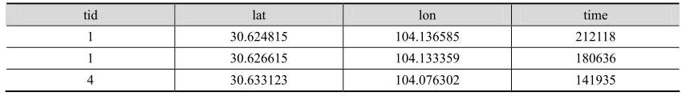
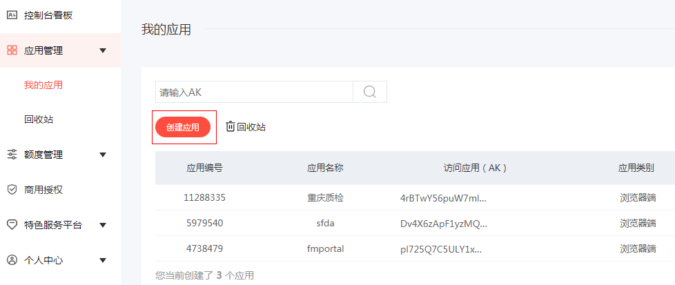
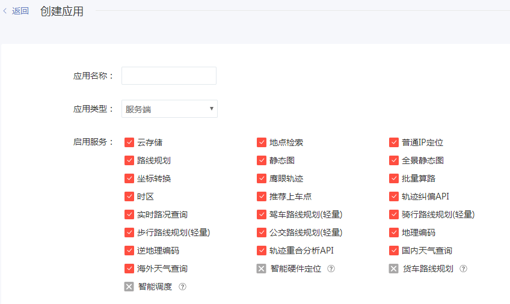
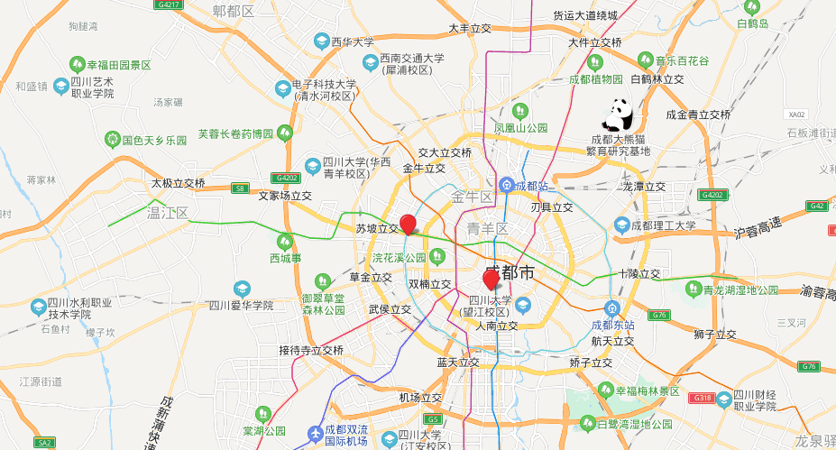

# 出租车数据分析

出租车是我们经常乘坐的交通工具，但是经常会遇到打车难的问题，给我们生活和工作带来诸多不便。本章介绍 Spark 在人们打车出行生活中的应用，该应用把某地区各出租车实时的并带有地理坐标的 GPS（Global Positioning System）点作为分析对象，使用 Kmeans 聚类方法把出租车轨迹点按簇分类，通过该分类方法找到出租车出现密集的地方，并用地图的方式进行可视化展示，为人们的出行提供新的思路。

本章主要内容如下。
（1）准备数据并对数据特点进行分析。
（2）从文本文件创建 Spark DataFrame。
（3）使用 Spark 的机器学习库 Kmeans 进行聚类。
（4）使用百度地图对聚类的结果进行可视化。

## 1.数据处理

一般情况下，在进行分析之前需要对数据的分布、状态等有一个整体的了解，从而确定数据使用哪种方法进行分析，进而对数据进行预处理。本章使用文本数据，打开数据观察发现，数据集合中存在缺失项或是 GPS 定位点坐标无效的情况，因此需要对此种情况进行处理。因为出租车点上传的速率非常快并且密度大，所以可以把其中缺失和无效的数据进行删除，对数据分析不会造成较大的影响。



其中，tid：出租车编号；lat：纬度；lon：经度；time：时间戳；tid 的值相同表示相同的车在不同的时间所处的位置。

## 2.数据分析

在上一节整理的数据的基础上，使用 Spark 从文本创建 DataFrame，并结合 Kmeans 机器学习聚类方法，实现对出租车在空间位置上的聚类。Kmeans 聚类可根据设定的聚类个数找出若干个聚类中心，对于出租车来讲就是出租车经常出现位置点坐标。

### 2.1创建 DataFrame

```python
from pyspark.sql import SparkSession
from pyspark import SparkContext
from pyspark.ml.linalg import Vectors

sc = SparkContext("local[4]", "taxi")
taxi_data = sc.textFile("datas/taxi.csv")
taxi_rdd = taxi_data.map(lambda line: line.split(','))

# 创建矢量 RDD，矢量的两个参数分别为纬度和经度。下面的聚类函数需要 RDD 进行聚类。
taxi_row = taxi_rdd.map(lambda x: (Vectors.dense(x[1], x[2]),))
#显示数据的前五行
print(taxi_row.collect()[:5])
sqlsc = SparkSession.builder.getOrCreate()
taxi_df = sqlsc.createDataFrame(taxi_row, ["features"])
```

### 2.2KMeans 聚类分析

KMeans 是最常用的聚类算法之一，它将数据点聚类成预定义的簇数。Spark MLlib 实现了包括一个并行化的 k-means++，称为 kmeans||.。

```python
from pyspark.ml.clustering import KMeans  # 引入聚类包

kmeans = KMeans(k=3, seed=1)  # 聚成 3 类
model = kmeans.fit(taxi_df)  # 注意，传入的 DataFrame 是矢量名称为 features 的集合
centers = model.clusterCenters()  # 产生聚类集合
# 聚类的结果是一系列的点集，这些点集也就是出租车聚集的地区，上述代码中将数据聚类成 3 类，如图 9-2 所示。
print(centers)
```

## 3.百度地图可视化

通过 Spark 提供的 Kmeans 聚类方法已经找到了出租车聚集的地图坐标，但是并不能清楚地看到具体的位置，因此需要通过可视化的方法把数据在地图上进行展示。百度地图是国内顶级的地图服务提供商之一，在提供了基于位置服务的同时也提供了在不同平台下的对外开放接口，允许用户自定义地图并根据相应业务逻辑开发自己的地理信息应用。本节利用百度地图为开发者提供的第三方开发接口，并对聚类结果进行可视化，让结果的展现更直接。

### 3.1申请地图 key

在使用百度地图接口之前需要，通过百度地图的一个认证，用户要在百度地图开发平台中申请一个密钥 key。读者可以登录百度地图官网，注册个人账号，然后选择申请 key，申请界面如图：

申请地址：http://lbsyun.baidu.com/

地图Api控制台：http://lbsyun.baidu.com/apiconsole/center#/home





### 3.2聚类结果可视化

html文件要在apache或者ngnix服务器中运行，因为百度地图API中设置了白名单。

```html
<!DOCTYPE html>
<html>

<head>
    <meta http-equiv="Content-Type" content="text/html; charset=utf-8" />
    <meta name="viewport" content="initial-scale=1.0, user-scalable=no" />
    <style type="text/css">
        body,
        html,
        #allmap {
            width: 100%;
            height: 100%;
            overflow: hidden;
            margin: 0;
            font-family: "微软雅黑";
        }
    </style>
    <script type="text/javascript" src="http://api.map.baidu.com/api?v=2.0&ak=Dv4X6zApF1yzMQNFoEypNfLX"></script>
    <title>Kmeans 聚类可视化</title>
</head>

<body>
    <div id="allmap"></div>
</body>

</html>
<script type="text/javascript">
    // 百度地图API功能
    var map = new BMap.Map("allmap");    // 创建Map实例

    map.enableScrollWheelZoom(); // 允许滑轮进行放大缩小
    map.centerAndZoom(new BMap.Point(104.01741982, 30.67598985), 13);// 初始位置与范围
    map.addControl(new BMap.NavigationControl());//  添加平移缩放控件
    map.addControl(new BMap.ScaleControl());//  添加比例尺控件
    var myP1 = new BMap.Point(104.01741982, 30.67598985); // 声明点对象
    var myP2 = new BMap.Point(103.65063611, 30.89504347);
    var myP3 = new BMap.Point(104.07063581, 30.64562312);
    map.clearOverlays(); // 清空地图中的对象
    var marker1 = new BMap.Marker(myP1); // 定义点样式，默认为红色水滴形状
    var marker2 = new BMap.Marker(myP2);
    var marker3 = new BMap.Marker(myP3);
    map.addOverlay(marker1); // 添加点到地图
    map.addOverlay(marker2);
    map.addOverlay(marker3);
</script>
```

