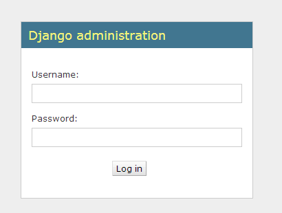
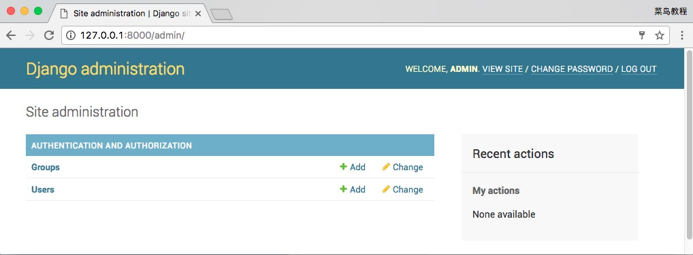
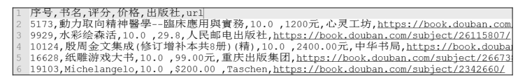
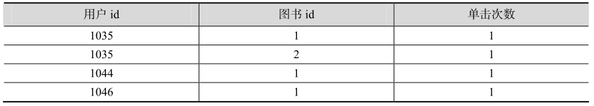

# 图书推荐系统

## 1.Django简介

参照Django菜鸟教程：https://www.runoob.com/django/django-tutorial.html

```shell
pip install django
```

### 1.1.ORM 模型

对象关系映射 ORM（Object Relational Mapping）是一种在面向对象编程语言里实现不同类型系统数据之间转换的程序技术。

```
class user(models.Model):
    #name 字段 max_length 为字段长度， default 为默认值
    name=model.CharFiled(max_length=50 ， default=‘‘)
    email=model.EmailField()
    password=model.CharField(max_length=8 ， default=‘‘)
```

### 1.2.Template 模板

Django 的模板引擎为定义应用程序面向用户的层提供了一种强大的迷你语言，使应用程序和前端逻辑分离。模板由 HTML 和模板语法关键词组成，并不需要用到 Python 的知识。

Django 模板采用前端模块化的思路，可以将模块的前端和后端进行封装，用继承和包含的方法实现模块的重用。HTML 之间可以通过 extends 关键字和 block 关键字进行相互嵌套。

1．base.html

<!DOCTYPE html>
<head>
<meta charset="UTF-8">
<title>demo</title>
</head>
<body>
<<<<<<< HEAD
<!-- 头部导航区域 -->


<!-- 中部内容区域 -->


<!-- 底部区域 -->
=======
<!— 头部导航区域 -->


<!— 中部内容区域 -->


<!— 底部区域 -->
>>>>>>> 89a3860aea4b6d0a5c922e42b0fa82d52f28fd10


</body>
</html>
<<<<<<< HEAD
```

2．top.html

```html


<div><h1> 此处为顶部导航界面 </h1></div>

```

3．content.html

```html


<div><h1> 此处为中部内容界面 </h1></div>

```

4．bottom.html

```html


<div><h1> 此处为底部内容界面 </h1></div>

```
=======

>>>>>>> 89a3860aea4b6d0a5c922e42b0fa82d52f28fd10

接下来我们需要向Django说明模板文件的路径，修改settings.py，修改 TEMPLATES 中的 DIRS 为**[BASE_DIR+"/templates",]**，如:

```python
TEMPLATES = [
    {
        'BACKEND': 'django.template.backends.django.DjangoTemplates',
        'DIRS': [BASE_DIR + "/templates", ],
        'APP_DIRS': True,
        'OPTIONS': {
            'context_processors': [
                'django.template.context_processors.debug',
                'django.template.context_processors.request',
                'django.contrib.auth.context_processors.auth',
                'django.contrib.messages.context_processors.messages',
            ],
        },
    },
]
```

### 1.3 View 视图

Django 是一种基于 MVT（model，view，template）模型的 Web 开发框架。前端请求的后台响应是通过 view.py 文件中对应的处理函数进行接收请求进行处理。示例代码如下所示。

```python
def index(request):
    book_list= book.objects.all()
    usr=request.session.get('user' ， None) # 获取当前登录用户名称
    userid=request.session.get('userid' ， None) # 获取当前登录用户的唯一标识 id
    return render(request ， 'home/index.html' ， locals()) # 渲染主页并向模板传递数据
```

## 2.Django 项目搭建

### 2.1 项目创建

```shell
django-admin.py startproject testdjango # startproject ：创建项目 film ：项目名称
```


- **testdjango:** 项目的容器。
- **manage.py:** 一个实用的命令行工具，可让你以各种方式与该 Django 项目进行交互。
- **testdjango/__init__.py:** 一个空文件，告诉 Python 该目录是一个 Python 包。
- **testdjango/asgi.py:** 一个 ASGI 兼容的 Web 服务器的入口，以便运行你的项目。
- **testdjango/settings.py:** 该 Django 项目的设置/配置。
- **testdjango/urls.py:** 该 Django 项目的 URL 声明; 一份由 Django 驱动的网站"目录"。
- **testdjango/wsgi.py:** 一个 WSGI 兼容的 Web 服务器的入口，以便运行你的项目。

```shell
python manage.py runserver 0.0.0.0:8000
```


### 2.2 视图和 URL 配置

在先前创建的 testdjango目录下的 testdjango目录新建一个 views.py 文件，并输入代码：

```python
from django.http import HttpResponse
 
def hello(request):
    return HttpResponse("Hello world ! ")
```

接着，绑定 URL 与视图函数。打开 urls.py 文件，删除原来代码，将以下代码复制粘贴到 urls.py 文件中：

```python
from django.urls import path
 
from . import views
 
urlpatterns = [
    path('hello/', views.hello),
]
```

### 2.3 创建应用

Django 规定，如果要使用模型，必须要创建一个 app。我们使用以下命令创建一个 TestModel 的 app:

```shell
django-admin.py startapp TestModel
```


### 2.4 创建模型

我们修改 TestModel/models.py 文件，代码如下：

```python
from django.db import models


# Create your models here.
class user(models.Model):
    name = models.CharField(max_length=50, default='')  # 用户名
    email = models.EmailField()  # 邮箱地址
    password = models.CharField(max_length=6, default='admin')  # 密码

    def __str__(self):
        return self.name

    class Meta:
        verbose_name = "用户管理"  # 修改 Admin 后台 App 名称
        verbose_name_plural = "用户管理"


class hits(models.Model):
    userid = models.IntegerField(default=0)
    bookid = models.IntegerField(default=0)
    hitnum = models.IntegerField(default=0)

    def __str__(self):
        return str(self.userid)

    class Meta:
        verbose_name = "单击量"
        verbose_name_plural = "单击量"


class book(models.Model):
    id = models.CharField(max_length=50, blank=False, verbose_name="ID", default='', primary_key=True)
    name = models.CharField(max_length=50, blank=False, verbose_name="书名", default='')
    price = models.CharField(max_length=50, blank=False, verbose_name="价格", default='')
    cover = models.ImageField(verbose_name="封面", upload_to='upload', default='img/default.png')
    introduction = models.TextField(verbose_name="介绍", blank=True, default='')
    url = models.URLField(verbose_name='URL', blank=True, default='')
    publish = models.CharField(verbose_name=' 出版社 ', max_length=50, default='', blank=True)
    rating = models.CharField(verbose_name=' 评分 ', max_length=5, default='0')

    def __str__(self):
        return self.name

    class Meta:
        verbose_name = " 图书管理 "
        verbose_name_plural = " 图书管理 "
```

接下来在 settings.py 中找到INSTALLED_APPS这一项，如下：

```python
INSTALLED_APPS = (
    'django.contrib.admin',
    'django.contrib.auth',
    'django.contrib.contenttypes',
    'django.contrib.sessions',
    'django.contrib.messages',
    'django.contrib.staticfiles',
    'TestModel',               # 添加此项
)
```

在命令行中运行：

```shell
$ python manage.py migrate   # 创建表结构

$ python manage.py makemigrations TestModel  # 让 Django 知道我们在我们的模型有一些变更
$ python manage.py migrate TestModel   # 创建表结构
```

### 2.5 Admin 管理工具

Django 提供了基于 web 的管理工具。

Django 自动管理工具是 django.contrib 的一部分。你可以在项目的 settings.py 中的 INSTALLED_APPS 看到它：

```python
INSTALLED_APPS = (
    'django.contrib.admin',
    'django.contrib.auth',
    'django.contrib.contenttypes',
    'django.contrib.sessions',
    'django.contrib.messages',
    'django.contrib.staticfiles',
)
```

通常我们在生成项目时会在 urls.py 中自动设置好，我们只需去掉注释即可。

```python
from django.contrib import admin
from django.urls import path

urlpatterns = [
    path('admin/', admin.site.urls),
]
```

你可以通过命令 **python manage.py createsuperuser** 来创建超级用户，如下所示：

```shell
# python manage.py createsuperuser
```

启动开发服务器，然后在浏览器中访问 http://127.0.0.1:8000/admin/，得到如下界面：



之后输入用户名密码登录，界面如下：



## 3.推荐引擎设计

### 3.1导入数据

本章实验数据来自 GitHub 共享者 moverzp 提供的 GoodBooks 数据集，读者可以在 GitHub中搜索 moverzp 即可找到该贡献者的仓库。 该数据集抓取自豆瓣图书网站，一共有 5 万多条，主要包含序号、书名、评分、价格、出版社、爬取链接的地址，数据格式如图:



为了在网页前端界面上进行展示，并对图书信息进行查看，需要先将图书信息导入到数据库中。该实验主要使用的 Django 自动生成的 SQLite 数据库进行数据存储，通过 Python 脚本把 csv格式文件导入到数据库中。其主要思路是通过在前端单击浏览按钮选择图书表格上传到后台，后台接收到 csv 文件后进行解析，通过 Python 代码打开文件并逐条将数据写入到数据库中，核心代码如下。

```python
# 上传图书数据到服务器端并入库
def handle_upload_file(name, file):
    path = os.path.join(settings.BASE_DIR, 'uploads')  # 服务器上传地址
    fileName = path + '/' + name  # 文件名
    with open(fileName, 'wb') as destination:  # 接收数据并保存到服务器端
        for chunk in file.chunks():
            destination.write(chunk)
    insertToSQL(fileName)  # 将数据插入到数据库中


def insertToSQL(fileName):
    txtfile = open(fileName, 'r', encoding='UTF-8')
    for line in txtfile.readlines():  # 逐行读取数据
        try:
            bookinfo = line.split('，')  # 数据按照逗号切分获取各个字段
            id = bookinfo[0].decode().encode('utf-8')  # 图书编号
            name = bookinfo[1].decode().encode('utf-8')  # 图书名称
            rating = bookinfo[2].decode().encode('utf-8')  # 图书评分得分
            price = bookinfo[3].decode().encode('utf-8')  # 图书价格
            publish = bookinfo[4].decode().encode('utf-8')  # 出版社
            url = bookinfo[5].decode().encode('utf-8')  # 豆瓣链接
            try:
                # 创建图书对象
                bk_entry = book(name=name, price=price, url=url, publish=publish, rating=rating)
                bk_entry.save()  # 插入数据到数据库
            except:
                print('save error' + id)
        except:
            print('read error ' + id)


def importBookData(request):
    if request.method == 'POST':
        file = request.FILES.get('file', None)  # 获取上传的文件信息
        if not file:
            return HttpResponse('None File uploads !')
        else:
            name = file.name
            handle_upload_file(name, file)
            return HttpResponse('success')
    return render(request, 'upload.html')
```

### 3.2训练模型

因为用户在访问图书网站的时候不一定会对图书进行评分，所以不根据用户评分来进行训练模型，而根据用户的浏览记录进行相似性推荐。在项目的后台业务逻辑中会收集用户的单击事件，记录下用户 id、图书 id 以及单击的次数等信息，数据格式如表：



因为不根据用户评分进行训练，所以在训练时候采用隐式评分模型，核心代码如下：

```python
from pyspark import SparkContext
from pyspark.sql import SparkSession, Row
from pyspark.mllib.recommendation import ALS
import os
import shutil

sc = SparkContext()  # 获取 Spark 上下文
txt = sc.textFile('datas/hit.txt')  # 读取本地用户浏览记录文件
ratingsRDD = txt.flatMap(lambda x: x.split()).map(lambda x: x.split(','))  # 用户记录转换为 RDD
sqlContext = SparkSession.builder.getOrCreate()  # 创建 sqlContext

user_row = ratingsRDD.map(lambda x: Row(  # 将 RDD 转换成行数据
    userid=int(x[0]), bookid=int(x[1]), hitnum=int(x[2])
))
user_df = sqlContext.createDataFrame(user_row)
user_df.registerTempTable('test')  # 登录临时表
datatable = sqlContext.sql("select userid, bookid, sum(hitnum) as hitnum from test group by userid , bookid")  # 统计用户单击过得图书次数
bookrdd = datatable.rdd.map(lambda x: (x.userid, x.bookid, x.hitnum))
model = ALS.trainImplicit(bookrdd, 10, 10, 0.01)  # 训练模型

if os.path.exists('recommendModel'):  # 判断是否存在模型文件夹
    shutil.rmtree('recommendModel')  # 递归删除文件夹
model.save(sc, 'recommendModel')  # 保存模型到本地
```

### 3.3图书推荐

模型训练完毕后，可以通过 MatrixFactorizationModel 类的 load 方法加载模型，该方法有两个参数，第一个参数 spark 初始化上下文，第二个参数为用户的编号，可以通过 recommendProducts函数对用户进行图书推荐，该函数有两个参数，第一个参数为用户编号，第二个编号为推荐的图书数量，可以通过前端请求灵活设定推荐的数目。对用户推荐的结果存到 Redis 内存数据库中，后台定时执行该训练代码更新数据库，随着用户浏览量的增加和系统用户量的增加，推荐会越来越准确。

## 4.系统设计与实现

### 4.1BootStrap介绍与使用

Bootstrap 是 Twitter 推出的一个用于前端开发的开源工具包。它由 Twitter 的设计师 Mark Otto和 Jacob Thornton 合作开发，是一个 CSS/HTML 框架。

BootStrap中文网：https://www.bootcss.com/

Bootstrap 教程：https://www.runoob.com/bootstrap/bootstrap-tutorial.html

Bootstrap 已经定义了包括按钮、表单、表格等基本元素在内的多种不同的样式，不需要开发者再去重新写 css 样式去控制外观。同时 Bootstrap 还提供了栅格布局结构，可以通过简单的 class设置即可实现响应式布局以适应不同屏幕尺寸的终端。

bootstrap除了包含一个css文件之外还包含有BootStrap.min.js文件，因为js文件是基于JQuery开发的，所以在引用 bootstrap 时候需要先引入 jquery，引用方式如下。

```html
<link rel="stylesheet" href="https://cdn.bootcss.com/bootstrap/3.3.7/css/bootstrap.min.css">
<script src="https://cdn.bootcss.com/jquery/2.1.1/jquery.min.js"></script>
<script src="https://cdn.bootcss.com/bootstrap/3.3.7/js/bootstrap.min.js"></script>
```

注：使用 cdn 时候，如果网络连接断开会导致样式访问不到，网站排版错乱。

### 4.2Redis数据库安装与使用

Redis教程：https://www.runoob.com/redis/redis-tutorial.html

Python redis 使用介绍：https://www.runoob.com/w3cnote/python-redis-intro.html

```shell
pip3 install redis
```

简单实例：

```python
import redis   # 导入redis 模块

r = redis.Redis(host='localhost', port=6379, decode_responses=True)  
r.set('name', 'runoob')  # 设置 name 对应的值
print(r['name'])
print(r.get('name'))  # 取出键 name 对应的值
print(type(r.get('name')))  # 查看类型
```

连接池：

```python
import redis    # 导入redis 模块

pool = redis.ConnectionPool(host='localhost', port=6379, decode_responses=True)
r = redis.Redis(host='localhost', port=6379, decode_responses=True)  
r.set('name', 'runoob')  # 设置 name 对应的值
print(r.get('name'))  # 取出键 name 对应的值
```

### 4.3视图与路由设计

视图views.py需要应用的包：

```python
from django.shortcuts import render
from django.http import HttpResponse, HttpResponseRedirect
import os

from testdjango import settings
from .models import *
from utils import tools
import redis
```

（1）创建用户登录视图

```python
def login(request):
    if request.method == 'POST':  # 相应前台的 POST 事件
        name = request.POST.get('name')  # 接收前台传递的用户名
        password = request.POST.get('password')  # 接收前台传递的密码
        userEntry = user.objects.filter(name=name, password=password)  # 查询数据库
        if userEntry.exists():  # 判断是否存在用户
            request.session['user'] = name  # 用户名写入到 session 会话
            request.session['userid'] = userEntry[0].id
        return HttpResponseRedirect('/')
    return render(request, 'login.html')
```

（2）创建用户注册视图，核心代码如下

```python
def register(request):
    if request.method == 'POST':
        name = request.POST.get('name')
        password = request.POST.get('password')
        userEntry = user(name=name, password=password)
        userEntry.save()
        return HttpResponseRedirect('login.html')
    return render(request, 'register.html', locals())
```

（3）创建用户单击视图，核心代码如下

```python
def getBookInfo(request):
    id = request.GET.get('id')
    bk = book.objects.get(id=id)
    # 设置单击量
    username = request.session.get('user', None)
    currentuser = user.objects.get(name=username)
    try:
        hit = hits.objects.get(userid=currentuser.id, bookid=id)
        hit.hitnum += 1
        hit.save()
    except:
        hit = hits()
        hit.bookid = id
        hit.hitnum = 1
        hit.userid = currentuser.id
        hit.save()
    data = str(currentuser.id) + ',' + str(id) + ',' + str(1)
    tools.writeToLocal('datas/hit.txt', data)
    return render(request, 'detail.html', locals())
```

（4）创建主页，核心代码如下

```python
def index(request):
    book_list = book.objects.all()
    usr = request.session.get('user', None)
    userid = request.session.get('userid', None)
    return render(request, 'index.html', locals())
```

（5）创建推荐视图，核心代码如下

```python
pool = redis.ConnectionPool(host='localhost', port=6379)
redis_client = redis.Redis(connection_pool=pool)

def getRecommendBook(request):
    userid = request.GET.get('userid')
    recommendbook = redis_client.get(int(userid))
    booklist = str(recommendbook).split('|')
    bookset = []
    for bk in booklist[:-1]:
        bookid = bk.split(',')[1]
        bk_entry = book.objects.get(id=bookid)
        bookset.append(bk_entry)
    return render(request, 'recommend.html', locals())

```

（6）路由设计，核心代码如下

```python
from django.contrib import admin
from django.urls import path
from TestModel import views

urlpatterns = [
    path('admin/', admin.site.urls),
    path('hello/', views.hello),
    path('/', views.index),
    path('importBookData/', views.importBookData),
    path('login/', views.login),
    path('register/', views.register),
    path('getBookInfo/', views.getBookInfo),
    path('getRecommendBook/', views.getRecommendBook),
]
```

（7）在项目的根路径下新建utils包，并新建tools.py，内容如下：

```python
def writeToLocal(filepath, str):
    ft = open(filepath, "a+")
    ft.writelines(str)
    ft.close()
```

### 4.4界面设计

在项目的路径下新增templates目录，分别新建下面的文件：

（1）base.html

```html
<!DOCTYPE html>
<html lang="en">
<head>
    <meta charset="UTF-8">
    <title>图书推荐系统</title>
    <link rel="stylesheet" href="https://cdn.bootcss.com/bootstrap/3.3.7/css/bootstrap.min.css">
</head>
<body>
    <!-- 中部内容区域 -->
    <div class="container">
        <div class="row" >
            <div class="col-md-6">
                
                
            </div>
        </div>
    </div>
    <script src="https://cdn.bootcss.com/jquery/2.1.1/jquery.min.js"></script>
    <script src="https://cdn.bootcss.com/bootstrap/3.3.7/js/bootstrap.min.js"></script></body>
</html>
```

（2）login.html

```html


    <form action="/login/" method="post">
        
        <div class="form-group">
            <label for="name">用户名</label>
            <input type="text" class="form-control" id="name" name="name" placeholder="请输入用户名">
        </div>
        <div class="form-group">
            <label for="name">密码</label>
            <input type="password" class="form-control" id="password" name="password" placeholder="请输入密码">
        </div>
        <button type="submit" class="btn btn-default">登录</button>
        <a href="/register/" class="btn btn-primary">注册</a>
    </form>

```

（3）register.html

```html


    <form action="/register/" method="post">
        
        <div class="form-group">
            <label for="name">用户名</label>
            <input type="text" class="form-control" id="name" name="name" placeholder="请输入用户名">
        </div>
        <div class="form-group">
            <label for="password">密码</label>
            <input type="password" class="form-control" id="password" name="password" placeholder="请输入密码">
        </div>
        <button type="submit" class="btn btn-default">注册</button>
    </form>

```

（4）index.html

```html


    <table class="table">
        <caption>基本的表格布局</caption>
        <thead>
        <tr>
            <th>ID</th>
            <th>名称</th>
            <th>价格</th>
        </tr>
        </thead>
        <tbody>
        
            <tr><td><a href="/getBookInfo/?id={{ book.id }}">{{ book.id }}</a></td><td>{{ book.name }}</td><td>{{ book.price }}</td></tr>
        
        </tbody>
    </table>

```

（5）detail.html

```html


    <form>
        <div class="form-group">
            <label for="name">书名</label>
            <input type="text" class="form-control" id="name" name="name" value="{{ bk.name }}" disabled>
        </div>
        <div class="form-group">
            <label for="name">出版社</label>
            <input type="text" class="form-control" id="publish" name="publish" value="{{ bk.publish }}" disabled>
        </div>
        <div class="form-group">
            <label for="name">价格</label>
            <input type="text" class="form-control" id="price" name="price" value="{{ bk.price }}" disabled>
        </div>
        <div class="form-group">
            <label for="name">评分</label>
            <input type="text" class="form-control" id="name" name="name" value="{{ bk.rating }}" disabled>
        </div>
        <div class="form-group">
            <label for="name">URL</label>
            <input type="text" class="form-control" id="url" name="url" value="{{ bk.url }}" disabled>
        </div>
        <a href="/" class="btn btn-primary">返回</a>
    </form>

```

（6）upload.html

```html


    <form action="/importBookData/" method="post" enctype="multipart/form-data">
        
        <label> 请选择上传的文件： </label>
        <input class="form-control" type="file" name="file">
        <button class="btn btn-primary" type="submit"> 上传 </button>
    </form>

```

## 5.Issue

1.django.template.exceptions.TemplateDoesNotExist: upload.html

解决方案：

- 在项目的目录下面新增templates目录
- 在settings.py的TEMPLATES中修改DIRS设置，添加模板路径

2.RuntimeError: You called this URL via POST, but the URL doesn't end in a slash and you have APPEND_SLASH set

解决方案：在settings.py中设置APPEND_SLASH = False

3.Forbidden (CSRF token missing or incorrect.)

解决方案：https://blog.csdn.net/weixin_42694291/article/details/86165884

确认settings.py中MIDDLEWARE的有：django.middleware.csrf.CsrfViewMiddleware

html中的form添加模板标签

## 6.参考文档

1. Django教程 https://www.runoob.com/django/django-tutorial.html
2. 基于Spark ALS算法的个性化推荐：https://www.cnblogs.com/wheng/p/11795268.html
3. Redis教程：https://www.runoob.com/redis/redis-tutorial.html
4. BootStrap中文网：https://www.bootcss.com/
5. Bootstrap 教程：https://www.runoob.com/bootstrap/bootstrap-tutorial.html

