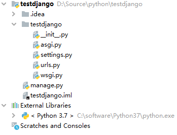
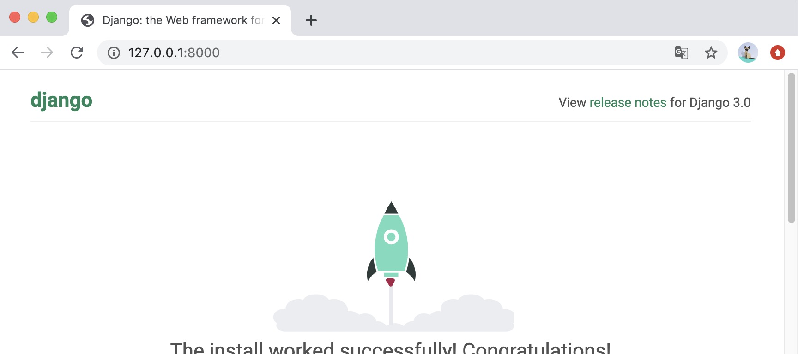
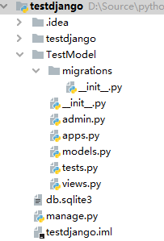

# 图书推荐系统

## 1.Django简介

参照Django菜鸟教程：https://www.runoob.com/django/django-tutorial.html

```shell
pip install django
```

### 1.1.ORM 模型

对象关系映射 ORM（Object Relational Mapping）是一种在面向对象编程语言里实现不同类型系统数据之间转换的程序技术。

```
class user(models.Model):
    #name 字段 max_length 为字段长度， default 为默认值
    name=model.CharFiled(max_length=50 ， default=‘‘)
    email=model.EmailField()
    password=model.CharField(max_length=8 ， default=‘‘)
```

### 1.2.Template 模板

Django 的模板引擎为定义应用程序面向用户的层提供了一种强大的迷你语言，使应用程序和前端逻辑分离。模板由 HTML 和模板语法关键词组成，并不需要用到 Python 的知识。

Django 模板采用前端模块化的思路，可以将模块的前端和后端进行封装，用继承和包含的方法实现模块的重用。HTML 之间可以通过 extends 关键字和 block 关键字进行相互嵌套。

1．接下来我们先创建之前项目的 templates 目录中添加 base.html 文件，代码如下：

```html
<!DOCTYPE html>
<html>
<head>
<meta charset="utf-8">
<title>菜鸟教程(runoob.com)</title>
</head>
<body>
    <h1>Hello World!</h1>
    <p>菜鸟教程 Django 测试。</p>
    
       <p>original</p>
    
</body>
</html>
```

2．runoob.html 中继承 base.html，并替换特定 block，runoob.html 修改后的代码如下：

```html

 

<p>继承了 base.html 文件</p>

```

接下来我们需要向Django说明模板文件的路径，修改settings.py，修改 TEMPLATES 中的 DIRS 为**[BASE_DIR+"/templates",]**，如:

```python
TEMPLATES = [
    {
        'BACKEND': 'django.template.backends.django.DjangoTemplates',
        'DIRS': [BASE_DIR + "/templates", ],
        'APP_DIRS': True,
        'OPTIONS': {
            'context_processors': [
                'django.template.context_processors.debug',
                'django.template.context_processors.request',
                'django.contrib.auth.context_processors.auth',
                'django.contrib.messages.context_processors.messages',
            ],
        },
    },
]
```

### 1.3 View 视图

Django 是一种基于 MVT（model，view，template）模型的 Web 开发框架。前端请求的后台响应是通过 view.py 文件中对应的处理函数进行接收请求进行处理。示例代码如下所示。

```python
def index(request):
    book_list= book.objects.all()
    usr=request.session.get('user' ， None) # 获取当前登录用户名称
    userid=request.session.get('userid' ， None) # 获取当前登录用户的唯一标识 id
    return render(request ， 'home/index.html' ， locals()) # 渲染主页并向模板传递数据
```

## 2.Django 项目搭建

### 2.1 项目创建

```shell
django-admin.py startproject testdjango # startproject ：创建项目 film ：项目名称
```



- **testdjango:** 项目的容器。
- **manage.py:** 一个实用的命令行工具，可让你以各种方式与该 Django 项目进行交互。
- **testdjango/__init__.py:** 一个空文件，告诉 Python 该目录是一个 Python 包。
- **testdjango/asgi.py:** 一个 ASGI 兼容的 Web 服务器的入口，以便运行你的项目。
- **testdjango/settings.py:** 该 Django 项目的设置/配置。
- **testdjango/urls.py:** 该 Django 项目的 URL 声明; 一份由 Django 驱动的网站"目录"。
- **testdjango/wsgi.py:** 一个 WSGI 兼容的 Web 服务器的入口，以便运行你的项目。

```shell
python manage.py runserver 0.0.0.0:8000
```



### 2.2 视图和 URL 配置

在先前创建的 testdjango目录下的 testdjango目录新建一个 views.py 文件，并输入代码：

```python
from django.http import HttpResponse
 
def hello(request):
    return HttpResponse("Hello world ! ")
```

接着，绑定 URL 与视图函数。打开 urls.py 文件，删除原来代码，将以下代码复制粘贴到 urls.py 文件中：

```python
from django.urls import path
 
from . import views
 
urlpatterns = [
    path('hello/', views.hello),
]
```

### 2.3 创建应用

Django 规定，如果要使用模型，必须要创建一个 app。我们使用以下命令创建一个 TestModel 的 app:

```shell
django-admin.py startapp TestModel
```



### 2.4 创建模型

我们修改 TestModel/models.py 文件，代码如下：

```python
from django.db import models


# Create your models here.
class user(models.Model):
    name = models.CharField(max_length=50, default='')  # 用户名
    email = models.EmailField()  # 邮箱地址
    password = models.CharField(max_length=6, default='admin')  # 密码

    def __str__(self):
        return self.name

    class Meta:
        verbose_name = "用户管理"  # 修改 Admin 后台 App 名称
        verbose_name_plural = "用户管理"


class hits(models.Model):
    userid = models.IntegerField(default=0)
    bookid = models.IntegerField(default=0)
    hitnum = models.IntegerField(default=0)

    def __str__(self):
        return str(self.userid)

    class Meta:
        verbose_name = "单击量"
        verbose_name_plural = "单击量"


class book(models.Model):
    name = models.CharField(max_length=50, blank=False, verbose_name="书名", default='')
    price = models.FloatField(blank=False, verbose_name="价格", default=0)
    cover = models.ImageField(verbose_name="封面", upload_to='upload', default='img/default.png')
    introduction = models.TextField(verbose_name="介绍", blank=True, default='')
    url = models.URLField(verbose_name='URL', blank=True, default='')
    publish = models.CharField(verbose_name=' 出 版 社 ', max_length=50, default='', blank=True)
    rating = models.CharField(verbose_name=' 评分 ', max_length=5, default='0')

    def __str__(self):
        return self.name

    class Meta:
        verbose_name = " 图书管理 "
        verbose_name_plural = " 图书管理 "
```

接下来在 settings.py 中找到INSTALLED_APPS这一项，如下：

```python
INSTALLED_APPS = (
    'django.contrib.admin',
    'django.contrib.auth',
    'django.contrib.contenttypes',
    'django.contrib.sessions',
    'django.contrib.messages',
    'django.contrib.staticfiles',
    'TestModel',               # 添加此项
)
```

在命令行中运行：

```shell
$ python manage.py migrate   # 创建表结构

$ python manage.py makemigrations TestModel  # 让 Django 知道我们在我们的模型有一些变更
$ python manage.py migrate TestModel   # 创建表结构
```

## 3.推荐引擎设计


## 5.Issue

1.django.template.exceptions.TemplateDoesNotExist: upload.html

解决方案：

- 在项目的目录下面新增templates目录
- 在settings.py的TEMPLATES中修改DIRS设置，添加模板路径

2.RuntimeError: You called this URL via POST, but the URL doesn't end in a slash and you have APPEND_SLASH set

解决方案：在settings.py中设置APPEND_SLASH = False

3.Forbidden (CSRF token missing or incorrect.)

解决方案：https://blog.csdn.net/weixin_42694291/article/details/86165884

确认settings.py中MIDDLEWARE的有：django.middleware.csrf.CsrfViewMiddleware

html中的form添加模板标签

