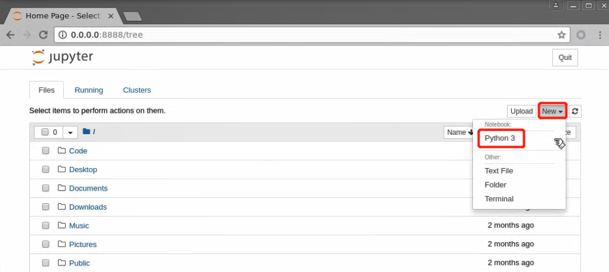

### 实验名称

TextRNN_文本预测

### 实验目的

本实验主要通过Tensorflow库的RNN（循环神经网络）模型对文本数据出现的下一个单词进行预测的学习与实践，要求学生：

1.掌握RNN循环神经网络模型的原理

2.掌握TensorFlow库中RNN模型的基本使用

3.掌握用TensorFlow库中的RNN模型实现简单的文本预测

### 实验背景

TextRNN指的是利用RNN循环神经网络解决文本分类和预测问题，文本分类和预测是自然语言处理的一个基本任务，试图推断出给定文本(句子、文档等)的标签或标签集合。本实验要求学生掌握使用Tensorflow的基本RNN模型来进行简单句子的文本预测。实验数据是程序中三个简单的英文句子。

### 实验原理

在一些自然语言处理任务中，当对序列进行处理时，我们一般会采用循环神经网络RNN，尤其是它的一些变种，如LSTM（更常用），GRU。当然我们也可以把RNN运用到文本分类和预测任务中。

这里的文本可以一个句子，文档（短文本，若干句子）或篇章（长文本），因此每段文本的长度都不尽相同。在对文本进行分类时，我们一般会指定一个固定的输入序列/文本长度：该长度可以是最长文本/序列的长度，此时其他所有文本/序列都要进行填充以达到该长度；该长度也可以是训练集中所有文本/序列长度的均值，此时对于过长的文本/序列需要进行截断，过短的文本则进行填充。总之，要使得训练集中所有的文本/序列长度相同，该长度除之前提到的设置外，也可以是其他任意合理的数值。在测试时，也需要对测试集中的文本/序列做同样的处理。

假设训练集中所有文本/序列的长度统一为n，我们需要对文本进行分词，并使用词嵌入得到每个词固定维度的向量表示。对于每一个输入文本/序列，我们可以在RNN的每一个时间步长上输入文本中一个单词的向量表示，计算当前时间步长上的隐藏状态，然后用于当前时间步骤的输出以及传递给下一个时间步长并和下一个单词的词向量一起作为RNN单元输入，然后再计算下一个时间步长上RNN的隐藏状态，以此重复...直到处理完输入文本中的每一个单词，由于输入文本的长度为n，所以要经历n个时间步长。

### 实验环境

ubuntu 16.04

Python 3.6.5

tensorflow 1.5.0

numpy 1.18.3

### 建议课时

1课时

### 实验步骤

一、环境准备

本实验在jupyter notebook进行开发。

打开终端：


终端执行：

```shell
jupyter notebook
```


创建python3文件，进行代码的编辑：



在新建的jupyter notebook中进行实验：


二、代码编写

1、导包

```python
#导入实验所需包
%matplotlib inline
import tensorflow as tf
import numpy as np
```

2、准备数据并做数据预处理

```python
# 默认重置全局
tf.reset_default_graph()

# 用于预测的3个简单英文句子
sentences = ["i like dog", "i love coffee", "i hate milk"]
# 把3句子合并成一个句子并拆分为单词
word_list = " ".join(sentences).split()
# 把word_list先转为集合除去重复单词，然后转成列表
word_list = list(set(word_list))
# w:i 单词对应序号键值对
word_dict = {w: i for i, w in enumerate(word_list)}
# i:w 单词序号对应单词键值对
number_dict = {i: w for i, w in enumerate(word_list)}
# 单词的数量
n_class = len(word_dict)
```

3、设置TextRNN模型网络参数

```python
# TextRNN网络参数
# 根据前2个单词预测第3个单词
n_step = 2
# 每个cell中的隐藏状态神经元数
n_hidden = 5

# 准备数据
def make_batch(sentences):
    # 用于存放输入的单词，模拟预测的结果
    input_batch = []
    target_batch = []

    # 对sentences中的每个句子
    for sen in sentences:
        word = sen.split()
        input = [word_dict[n] for n in word[:-1]]
        target = word_dict[word[-1]]

        # 将分离出的结果放入列表中存好
        # 输入批目标类别数以单位矩阵的形式输出
        input_batch.append(np.eye(n_class)[input])
        # 目标批类别数以单位矩阵的形式输出
        target_batch.append(np.eye(n_class)[target])

    # 返回输入批和目标批
    return input_batch, target_batch
```

4、模型处理

```python
# 定义输入批，阶层和类别
X = tf.placeholder(tf.float32, [None, n_step, n_class])
# 定义类别
Y = tf.placeholder(tf.float32, [None, n_class])

# 将正态分布的隐藏值与类别数初始化
W = tf.Variable(tf.random_normal([n_hidden, n_class]))
# 将正态分布的类别数初始化
b = tf.Variable(tf.random_normal([n_class]))

# 定义隐藏单元
cell = tf.nn.rnn_cell.BasicRNNCell(n_hidden)
# 计算经过RNN之后最后一次输出和每一层最后的输出
outputs, states = tf.nn.dynamic_rnn(cell, X, dtype=tf.float32)

outputs = tf.transpose(outputs, [1, 0, 2])
outputs = outputs[-1]
model = tf.matmul(outputs, W) + b

cost = tf.reduce_mean(tf.nn.softmax_cross_entropy_with_logits_v2(logits=model, labels=Y))
optimizer = tf.train.AdamOptimizer(0.001).minimize(cost)

prediction = tf.cast(tf.argmax(model, 1), tf.int32)
```

5、训练及测试

```python
# 训练及测试
# 网络初始化
init = tf.global_variables_initializer()
# 激活程序
sess = tf.Session()
# 获取运算结果
sess.run(init)

input_batch, target_batch = make_batch(sentences)

# 运算5000个回合
for epoch in range(5000):
    # 计算损失和占位符
    _, loss = sess.run([optimizer, cost], feed_dict={X: input_batch, Y: target_batch})
    if (epoch + 1) % 1000 == 0:
        # 回合和损失结果
        print('Epoch:', '%04d' % (epoch + 1), 'cost =', '{:.6f}'.format(loss))

# 输出数据
input = [sen.split()[:2] for sen in sentences]

# 预测结果
predict = sess.run([prediction], feed_dict={X: input_batch})
print([sen.split()[:2] for sen in sentences], '->', [number_dict[n] for n in predict[0]])
```

运行效果如下：


### 实验总结

以上我们以简单数据集和网络结构实现TextRNN，训练集中包括3个句子，用每个句子的前两个单词去预测最后一个单词，目的是便于大家更好的理解该网络的原理和TextRNN模型建立，网络参数设置，模型训练及测试，达到文本预测的目的。

